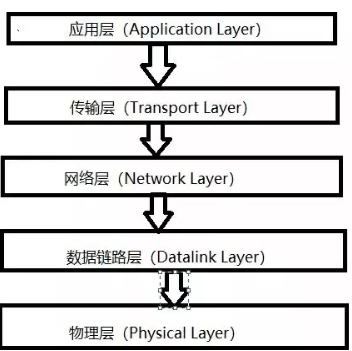

# 计算机基础

### 网络数据传输

天各一方的两台计算机是如何通信的呢？在成千上万的计算机中，为什么一台计算机能够准确着寻找到另外一台计算机，并且把数据发送给它呢？

可能很多人都听说过网络通信的 5 层模型，但是可能并不是很清楚为什么需要五层模型，五层模型负责的任务也有可能经常混淆。下面是网络通信的五层模型



说实话，五层模型的具体内容还是极其复杂的，不过今天这篇文章，我将用最简洁的模式，通过网络通信的五层模型来讲解**一台计算机是如何找到另外一台计算机并且把数据发送给另一台计算机的**，就算你没学过计算机网络，也能够听的懂。

1. **物理层**

一台计算机与另一台计算机要进行通信，第一件要做的事是什么？当然是要把这台计算机与另外的其他计算机连起来啊，这样，我们才能把数据传输过去。例如可以通过光纤啊，电缆啊，双绞线啊等介质把他们连接起来，然后才能进行通信。

也就是说，物理层负责把两台计算机连起来，然后在计算机之间通过高低电频来传送0,1这样的电信号。

**2. 数据链路层**

前面说了，物理层它只是单纯着负责把计算机连接起来，并且在计算机之间传输0，1这样的电信号。如果这些0，1组合的传送毫无规则的话，计算机是解读不了的。一大堆0，1谁知道是什么鬼啊。


因此，我们需要制定一套规则来进行0，1的传送。例如多少个电信号为一组啊，每一组信号应该如何标识才能让计算机读懂啊等等。

于是，有了以太网协议。

**2.1. 以太网协议**

以太网协议规定，一组电信号构成一个数据包，我们把这个数据包称之为**帧**。每一个桢由标头(Head)和数据(Data)两部分组成。即：**一组电信号  = 一个数据包 = 帧**

帧的大小一般为 64 - 1518 个字节。假如需要传送的数据很大的话，就分成多个桢来进行传送。

对于表头和数据这两个部分，他们存放的都是一些什么数据呢？我猜你眯着眼睛都能想到他们应该放什么数据。毫无疑问，我们至少得知道这个桢是谁发送，发送给谁的等这些信息吧？所以标头部分主要是一些说明数据，例如发送者，接收者等信息。而数据部分则是这个数据包具体的，想给接收者的内容。

大家想一个问题，一个桢的长度是 64~1518 个字节，也就是说桢的长度不是固定的，那你觉得标头部分的字节长度是固定的吗？它当然是固定的啊，假如不是固定的，每个桢都是单独发的，那计算机怎么知道标头是几个字节，数据是几个字节呢。所以标头部分的字节是固定的，并且固定为18个字节。

把一台计算的的数据通过物理层和链路层发送给另一台计算机，究竟是谁发给谁的，计算机与计算机之间如何区分，，你总得给他们一个唯一的标识吧？

于是，MAC 地址出现了。

**2.2 MAC 地址**

连入网络的每一个计算机都会有网卡接口，每一个网卡都会有一个唯一的地址，这个地址就叫做 MAC 地址。计算机之间的数据传送，就是通过 MAC 地址来唯一寻找、传送的。**MAC地址 = 网卡接口地址**

MAC地址 由 48 个字节所构成，在网卡生产时就被唯一标识了。(那么帧的head只有16字节，应该是不包含mac地址的)。

**2.3. 广播与ARP协议**

**(1). 广播**


如图，假如计算机 A 知道了计算机 B 的 MAC 地址，然后计算机 A 想要给计算机 B 传送数据，虽然计算机 A 知道了计算机 B 的 MAC 地址，可是它要怎么给它传送数据呢？计算机 A 不仅连着计算机 B，而且计算机 A 也还连着其他的计算机。虽然计算机 A 知道计算机 B 的 MAC 地址，可是计算机 A 却不知道知道计算机 B 是分布在哪边路线上，为了解决这个问题，于是，有了**广播**的出现。

在同一个**子网**中，计算机 A 要向计算机 B 发送一个数据包，这个数据包会包含接收者的 MAC 地址。当发送时，计算机 A 是通过**广播**的方式发送的，这时同一个子网中的计算机 C, D 也会收到这个数据包的，然后收到这个数据包的计算机，会把数据包的 MAC 地址取出来，与自身的 MAC 地址**对比**，如果两者相同，则**接受**这个数据包，否则就**丢弃**这个数据包。这种发送方式我们称之为广播,就像我们平时在广场上通过广播的形式呼叫某个人一样，如果这个名字是你，你就理会一下，如果不是你，你就当作听不见。

**(2). ARP 协议**。

那么问题来了，计算机 A 是如何知道计算机 B 的 MAC 地址的呢？这个时候就得由 ARP 协议这个家伙来解决了，不过 ARP 协议会涉及到IP地址，我们下面才会扯到IP地址。因此我们先放着，就当作是有这么一个 ARP 协议，通过它我们可以知道子网中其他计算机的 MAC 地址。将IP地址解析成MAC地址


3. **网络层**

上面我们有说到子网这个关键词，实际上我们所处的网络，是由无数个子网络构成的。广播的时候，也只有同一个子网里面的计算机能够收到。

假如没有子网这种划分的话，计算机 A 通过广播的方式发一个数据包给计算机 B , 其他所有计算机也都能收到这个数据包，然后进行对比再舍弃。世界上有那么多它计算机，每一台计算机都能收到其他所有计算机的数据包，那就不得了了。那还不得奔溃。因此产生了**子网**这么一个东西。

那么问题来了，我们如何区分哪些 MAC 地址是属于同一个子网的呢？假如是同一个子网，那我们就用广播的形式把数据传送给对方，如果不是同一个子网的，我们就会把数据发给**网关**，让网关进行转发。

为了解决这个问题，于是，有了 IP 协议。

**3.1. IP协议**

IP协议，它所定义的地址，我们称之为**IP地址**。IP协议有两种版本，一种是 IPv4,另一种是 IPv6。不过我们目前大多数用的还是 IPv4，我们现在也只讨论 IPv4 这个版本的协议。

这个 IP 地址由 32 位的二进制数组成，我们一般把它分成4段的十进制表示，地址范围为0.0.0.0~255.255.255.255。

每一台想要联网的计算机都会有一个IP地址。这个IP地址被分为两部分，前面一部分代表**网络部分**，后面一部分代表**主机部分**。并且网络部分和主机部分所占用的二进制位数是不固定的。

假如两台计算机的网络部分是一模一样的，我们就说这两台计算机是处于同一个子网中。例如 192.168.43.1 和 192.168.43.2, 假如这两个 IP 地址的网络部分为 24 位，主机部分为 8 位。那么他们的网络部分都为 192.168.43，所以他们处于同一个子网中。

可是问题来了，你怎么知道网络部分是占几位，主机部分又是占几位呢？也就是说，单单从两台计算机的IP地址，我们是无法判断他们的是否处于同一个子网中的。

这就引申出了另一个关键词————**子网掩码**。子网掩码和IP地址一样也是 32 位二进制数，不过它的网络部分规定全部为 1，主机部分规定全部为 0.也就是说，假如上面那两个IP地址的网络部分为 24 位，主机部分为 8 位的话，那他们的子网掩码都为 11111111.11111111.11111111.00000000，即255.255.255.0。

那有了子网掩码，如何来判断IP地址是否处于同一个子网中呢。显然，知道了子网掩码，相当于我们知道了网络部分是几位，主机部分是几位。我们只需要把 IP 地址与它的子网掩码做**与(and)运算**，然后把各自的结果进行比较就行了，如果比较的结果相同，则代表是同一个子网，否则不是同一个子网。

例如，192.168.43.1和192.168.43.2的子码掩码都为255.255.255.0，把IP与子码掩码相与，可以得到他们都为192.168.43.0，进而他们处于同一个子网中。

**3.2. ARP协议**

有了上面IP协议的知识，我们回来讲一下ARP协议。

有了两台计算机的IP地址与子网掩码，我们就可以判断出它们是否处于同一个子网之中了。

假如他们处于同一个子网之中，计算机A要给计算机B发送数据时。我们可以通过ARP协议来得到计算机B的MAC地址。

ARP协议也是通过广播的形式给同一个子网中的每台电脑发送一个数据包(当然，这个数据包会包含接收方的IP地址)。对方收到这个数据包之后，会取出IP地址与自身的对比，如果相同，则把自己的MAC地址回复给对方，否则就丢弃这个数据包。这样，计算机A就能知道计算机B的MAC地址了。


可能有人会问，知道了MAC地址之后，发送数据是通过**广播**的形式发送，询问对方的MAC地址也是通过广播的形式来发送，那其他计算机怎么知道你是要传送数据还是要询问MAC地址呢？其实在询问MAC地址的数据包中，在对方的MAC地址这一栏中，填的是一个**特殊的MAC地址**，其他计算机看到这个特殊的MAC地址之后，就能知道广播想干嘛了。

假如两台计算机的IP不是处于同一个子网之中，这个时候，我们就会把数据包发送给网关，然后让网关让我们进行转发传送

**3.3. DNS服务器**

这里再说一个问题，我们是如何知道对方计算机的IP地址的呢？这个问题可能有人会觉得很白痴，心想，当然是计算机的操作者来进行输入了。这没错，当我们想要访问某个网站的时候，我们可以输入IP来进行访问，但是我相信绝大多数人是输入一个网址域名的，例如访问百度是输入 www.baidu.com 这个域名。其实当我们输入这个域名时，会有一个叫做DNS服务器的家伙来帮我们解析这个域名，然后返回这个域名对应的IP给我们的。

**因此，网络层的功能就是让我们在茫茫人海中，能够找到另一台计算机在哪里，是否属于同一个子网等。**找到目标计算机所在的子网。

**4. 传输层**

通过物理层、数据链路层以及网络层的互相帮助，我们已经把数据成功从计算机A传送到计算机B了，可是，计算机B里面有各种各样的应用程序，计算机该如何知道这些数据是给谁的呢？

这个时候，**端口(Port)**这个家伙就上场了，也就是说，我们在从计算机A传数据给计算表B的时候，还得指定一个端口，以供特定的应用程序来接受处理。其实目的地址是： **IP地址 + 端口号**

也就是说，传输层的功能就是建立**端口到端口**的通信。相比网络层的功能是建立**主机到主机**的通信。

也就是说，只有有了IP和端口，我们才能进行准确的通信。这个时候可能有人会说，我输入IP地址的时候并没有指定一个端口啊。其实呢，对于有些传输协议，已经有设定了一些**默认端口**了。例如http的传输默认端口是80，这些端口信息也会包含在数据包里的。

传输层最常见的两大协议是 TCP 协议和 UDP 协议，其中 TCP 协议与 UDP 最大的不同就是 TCP 提供可靠的传输，而 UDP 提供的是不可靠传输。

**5.  应用层**

终于说到应用层了，应用层这一层最接近我们用户了。

虽然我们收到了传输层传来的数据，可是这些传过来的数据五花八门，有html格式的，有mp4格式的，各种各样。你确定你能看的懂？

因此我们需要指定这些数据的格式规则，收到后才好解读渲染。例如我们最常见的 Http 数据包中，就会指定该数据包是 什么格式的文件了。

使用应用来解析数据，提供给用户。

五层模型至此讲到这里。对于有些层讲的比较简洁，就随便概况了一下。因为如果我说的详细一点的话，篇幅肯定会特别特别长，我已经是尽最大的努力以最简洁的方式来讲的了。如果你想详细去了解，可以去买计算机网络相应的资料，强烈推荐《计算机网络：自顶向下》这本书。希望我的讲解能让你对计算机之间数据的传输有个大概的了解。


### 字符编码笔记

今天中午，我突然想搞清楚 Unicode 和 UTF-8 之间的关系。

**一、ASCII 码**

我们知道，计算机内部，所有信息最终都是一个二进制值。每一个二进制位（bit）有`0`和`1`两种状态，因此八个二进制位就可以组合出256种状态，这被称为一个字节（byte）。也就是说，一个字节一共可以用来表示256种不同的状态，每一个状态对应一个符号，就是256个符号，从`00000000`到`11111111`。

上个世纪60年代，美国制定了一套字符编码，对英语字符与二进制位之间的关系，做了统一规定。这被称为 ASCII 码，一直沿用至今。

ASCII 码一共规定了128个字符的编码，比如空格`SPACE`是32（二进制`00100000`），大写的字母`A`是65（二进制`01000001`）。这128个符号（包括32个不能打印出来的控制符号），只占用了一个字节的后面7位，最前面的一位统一规定为`0`。

**二、非 ASCII 编码**

英语用128个符号编码就够了，但是用来表示其他语言，128个符号是不够的。比如，在法语中，字母上方有注音符号，它就无法用 ASCII 码表示。于是，一些欧洲国家就决定，利用字节中闲置的最高位编入新的符号。比如，法语中的`é`的编码为130（二进制`10000010`）。这样一来，这些**欧洲国家使用的编码体系**，可以表示最多256个符号。

但是，这里又出现了新的问题。不同的国家有不同的字母，因此，哪怕它们都使用256个符号的编码方式，代表的字母却不一样。比如，130在法语编码中代表了`é`，在希伯来语编码中却代表了字母`Gimel` (`ג`)，在俄语编码中又会代表另一个符号。但是不管怎样，所有这些编码方式中，**0--127表示的符号是一样的，不一样的只是128--255的这一段。**

至于亚洲国家的文字，使用的符号就更多了，汉字就多达10万左右。一个字节只能表示256种符号，肯定是不够的，就必须使用多个字节表达一个符号。比如，简体中文常见的编码方式是 GB2312，使用两个字节表示一个汉字，所以理论上最多可以表示 256 x 256 = 65536 个符号。

中文编码的问题需要专文讨论，这篇笔记不涉及。这里只指出，虽然都是用多个字节表示一个符号，但是GB类的汉字编码与后文的 Unicode 和 UTF-8 是毫无关系的。

**三. Unicode**

正如上一节所说，世界上存在着多种编码方式，同一个二进制数字可以被解释成不同的符号。因此，要想打开一个**文本文件**，就必须知道它的编码方式，否则**用错误的编码方式解读，就会出现乱码**。为什么电子邮件常常出现乱码？就是因为发信人和收信人使用的**编码方式不一样**。

可以想象，如果有一种编码，将世界上所有的符号都纳入其中。**每一个符号都给予一个独一无二的编码**，那么乱码问题就会消失。这就是 Unicode，就像它的名字都表示的，这是一种所有符号的编码。

Unicode 当然是一个很大的集合，现在的规模可以容纳100多万个符号。每个符号的编码都不一样，比如，`U+0639`表示阿拉伯字母`Ain`，`U+0041`表示英语的大写字母`A`，`U+4E25`表示汉字`严`。具体的符号对应表，可以查询[unicode.org](http://www.unicode.org/)，或者专门的[汉字对应表](http://www.chi2ko.com/tool/CJK.htm)。

**四、Unicode 的问题**

需要注意的是，Unicode 只是一个符号集，它只规定了符号的二进制代码，却没有规定这个二进制代码应该如何存储。

**Unicode只规定了映射规则，即一个二进制代表什么字符，至于这个二进制如何存储就没用规定了。**

比如，汉字`严`的 Unicode 是十六进制数`4E25`，转换成二进制数足足有15位（`100111000100101`），也就是说，这个符号的表示至少需要2个字节。表示其他更大的符号，可能需要3个字节或者4个字节，甚至更多。

这里就有两个严重的问题，第一个问题是，如何才能区别 Unicode 和 ASCII ？计算机怎么知道三个字节表示一个符号，而不是分别表示三个符号呢？第二个问题是，我们已经知道，英文字母只用一个字节表示就够了，如果 Unicode 统一规定，每个符号用三个或四个字节表示，那么每个英文字母前都必然有二到三个字节是`0`，这对于存储来说是极大的浪费，文本文件的大小会因此大出二三倍，这是无法接受的。

它们造成的结果是：1）出现了 Unicode 的**多种存储方式**，也就是说有许多种不同的二进制格式，可以用来表示 Unicode。2）Unicode 在很长一段时间内无法推广，直到互联网的出现。

**五、UTF-8**

互联网的普及，强烈要求出现一种统一的编码方式。UTF-8 就是在互联网上**使用最广的一种 Unicode 的实现方式。**其他实现方式还包括 UTF-16（字符用两个字节或四个字节表示）和 UTF-32（字符用四个字节表示），不过在互联网上基本不用。**重复一遍，这里的关系是，UTF-8 是 Unicode 的实现方式之一。**

UTF-8 最大的一个特点，就是它是一种**变长的编码方式**。它可以**使用1~4个字节表示一个符号**，根据不同的符号而变化字节长度。

UTF-8 的编码规则很简单，只有二条：

1）对于单字节的符号，字节的第一位设为`0`，后面7位为这个符号的 Unicode 码。因此对于英语字母，UTF-8 编码和 ASCII 码是相同的。

2）对于`n`字节的符号（`n > 1`），第一个字节的前`n`位都设为`1`，第`n + 1`位设为`0`，后面字节的前两位一律设为`10`。剩下的没有提及的二进制位，全部为这个符号的 Unicode 码。

下表总结了编码规则，字母`x`表示可用编码的位。

```
Unicode符号范围     |        UTF-8编码方式
(十六进制)        |              （二进制）
----------------------+---------------------------------------------
0000 0000-0000 007F | 0xxxxxxx
0000 0080-0000 07FF | 110xxxxx 10xxxxxx
0000 0800-0000 FFFF | 1110xxxx 10xxxxxx 10xxxxxx
0001 0000-0010 FFFF | 11110xxx 10xxxxxx 10xxxxxx 10xxxxxx
```

跟据上表，解读 UTF-8 编码非常简单。如果一个字节的第一位是`0`，则这个字节单独就是一个字符；如果第一位是`1`，则连续有多少个`1`，就表示当前字符占用**多少个字节**。

下面，还是以汉字`严`为例，演示如何实现 UTF-8 编码。

`严`的 Unicode 是`4E25`（`100_1110_0010_0101`），根据上表，可以发现`4E25`处在第三行的范围内（`0000 0800 - 0000 FFFF`）/ 等价于(0800 - FFFF)，因此`严`的 UTF-8 编码需要三个字节，即格式是`1110xxxx 10xxxxxx 10xxxxxx`。然后，从`严`的最后一个二进制位开始，依次从后向前填入格式中的`x`，**多出的位补**`0`。这样就得到了，`严`的 UTF-8 编码是`11100100 10111000 10100101`，转换成十六进制就是`E4B8A5`。

**6 Unicode 与 UTF-8 之间的转换**

通过上一节的例子，可以看到`严`的 Unicode码 是`4E25`，UTF-8 编码是`E4B8A5`，两者是不一样的。它们之间的转换可以通过程序实现。

Windows平台，有一个最简单的转化方法，就是使用内置的记事本小程序`notepad.exe`。打开文件后，点击`文件`菜单中的`另存为`命令，会跳出一个对话框，在最底部有一个`编码`的下拉条。

里面有四个选项：`ANSI`，`Unicode`，`Unicode big endian`和`UTF-8`。

1）`ANSI`是默认的编码方式。对于英文文件是`ASCII`编码，对于简体中文文件是`GB2312`编码（只针对 Windows 简体中文版，如果是繁体中文版会采用 Big5 码）。

2）`Unicode`编码这里指的是`notepad.exe`使用的 UCS-2 编码方式，即直接用两个字节存入字符的 Unicode 码，这个选项用的 little endian 格式。

3）`Unicode big endian`编码与上一个选项相对应。我在下一节会解释 little endian 和 big endian 的涵义。

4）`UTF-8`编码，也就是上一节谈到的编码方法。

选择完"编码方式"后，点击"保存"按钮，文件的编码方式就立刻转换好了。

**七、Little endian 和 Big endian**

上一节已经提到，UCS-2 格式可以存储 Unicode 码（码点不超过`0xFFFF`）。以汉字`严`为例，Unicode 码是`4E25`，需要用两个字节存储，一个字节是`4E`，另一个字节是`25`。存储的时候，`4E`在前，`25`在后，这就是 Big endian 方式；`25`在前，`4E`在后，这是 Little endian 方式。

这两个古怪的名称来自英国作家斯威夫特的《格列佛游记》。在该书中，小人国里爆发了内战，战争起因是人们争论，吃鸡蛋时究竟是从大头(Big-endian)敲开还是从小头(Little-endian)敲开。为了这件事情，前后爆发了六次战争，一个皇帝送了命，另一个皇帝丢了王位。

**第一个字节在前**，就是"大头方式"（Big endian），第二个字节在前就是"小头方式"（Little endian）。

那么很自然的，就会出现一个问题：计算机怎么知道某一个文件到底采用哪一种方式编码？

Unicode 规范定义，每一个文件的最前面分别加入一个表示编码顺序的字符，这个字符的名字叫做"零宽度非换行空格"（zero width no-break space），用`FEFF`表示。这正好是两个字节，而且`FF`比`FE`大`1`。

如果一个文本文件的头两个字节是`FE FF`，就表示该文件采用大头方式；如果头两个字节是`FF FE`，就表示该文件采用小头方式。

**八、实例**

下面，举一个实例。

打开"记事本"程序`notepad.exe`，新建一个文本文件，内容就是一个`严`字，依次采用`ANSI`，`Unicode`，`Unicode big endian`和`UTF-8`编码方式保存。

然后，用文本编辑软件[UltraEdit 中](http://www.google.cn/search?aq=t&oq=UltraEdit&complete=1&hl=zh-CN&newwindow=1&rlz=1B3GGGL_zh-CNCN216CN216&q=ultraedit+%E4%B8%8B%E8%BD%BD&btnG=Google+%E6%90%9C%E7%B4%A2&meta=)的"十六进制功能"，观察该文件的内部编码方式。

1）ANSI：文件的编码就是两个字节`D1 CF`，这正是`严`的 GB2312 编码，这也暗示 GB2312 是采用大头方式存储的。

2）Unicode：编码是四个字节`FF FE 25 4E`，其中`FF FE`表明是小头方式存储，真正的编码是`4E25`。

3）Unicode big endian：编码是四个字节`FE FF 4E 25`，其中`FE FF`表明是大头方式存储。

4）UTF-8：编码是六个字节`EF BB BF E4 B8 A5`，前三个字节`EF BB BF`表示这是UTF-8编码，后三个`E4B8A5`就是`严`的具体编码，它的**存储顺序与编码顺序是一致的**。

计算机对字符展示的时候，是使用Unicode来进行解析映射，存储的时候使用UTF-8，那么读取的过程是从文件中读取UTF-8编码的二进制序列，转换成Unicode编码，显示；文件写入过程是根据字符的unicode编码，将其转换为UTF-8编码，然后写入存储介质。


参考：

<http://www.ruanyifeng.com/blog/2007/10/ascii_unicode_and_utf-8.html>


### IaaS、PaaS和SaaS的区别

这其实是云计算的三个分层，假设有这么一加技术超一流的公司，根本就不需要别人来提供服务，自己拥有基础设施、应用等等，可以把他们分为三层：**基础设施**（infrastructure）、**平台**（platform）和软件（software）。基础施舍在最末端，平台在中间，软件则在顶层，分别是:

Infrastructure-as-a-Service(IaaS)、

Platform-as-a-Service(PaaS)、

Software-as-a-Service(SaaS)，

而别的一些“层”可以在它们之上继续添加。

基础设施主要包括网络系统（networking）、存储设备（storage）、服务器（servers）、虚拟化技术（virtualization）。

而平台则在基础设施之上，还包括操作系统（OS）、中间件（middleware）以及运行库（runtime）。

最后是软件，则在平台的基础上，还添加了数据（date）与应用（application）。

![Characteristics of different platform models  Product Positioning  laaS —  PaaS -  Infrastructure as a  Platform as a Service  Service  Q) Host  Build  Applications  Applications  Data  Data  Runtime  Runtime  Middleware  Middleware  Virtualization  Virtualization  Storage  Storage  Servers  Servers  Networking  Networking  Restricted O Siemens AG 2018  SIEMENS  SaaS -  Software as a Service  Consume  Applications  Data  Runtime  Middleware  Virtualization  Storage  Servers  Networking  LIE  P rouider ](assets/clip_image001.png)

它们有什么区别呢？ 用做披萨来看IaaS、PaaS和SaaS

IBM 的软件架构师 Albert Barron 曾经使用披萨作为比喻，解释这个问题。David Ng 进一步引申，让它变得更准确易懂。

请设想你是一个餐饮业者，打算做披萨生意。

你可以从头到尾，自己生产披萨，但是这样比较麻烦，需要准备的东西多，因此你决定外包一部分工作，采用他人的服务。你有三个方案。

（1）方案一：IaaS 

他人提供厨房、炉子、煤气，你使用这些**基础设施**，来烤你的披萨。 

（2）方案二：PaaS

除了基础设施，他人还提供披萨饼皮。

你只要把自己的配料洒在饼皮上，让他帮你烤出来就行了。也就是说，你要做的就是设计披萨的味道（海鲜披萨或者鸡肉披萨），他人提供**平台服务**，让你把自己的设计实现。

（3）方案三：SaaS

他人直接做好了披萨，不用你的介入，到手的就是一个成品。你要做的就是把它卖出去，最多再包装一下，印上你自己的 Logo。

**这几种服务是一个层级的关系，越往上，用户需要做的事情就越少。** IaaS对用户来说，需要他搭建平台，设计搭建和部署应用软件，而Paas的话，用户只需要设计和部署应用软件就可以了，而对SaaS来说，用户什么都不需要做，他们已经提供了应用软件，用户直接用就行了。

IaaS也就是基础设施即服务（Infrastructure-as-a-Service），拥有了IaaS，就可以将引荐外包到别的地方去。IaaS公司会提供场外服务器，存储和网络硬件，也可以选择租用。节省了维护成本和办公场地，公司可以在任何时候利用这些硬件来运行其应用。

目前比较知名的IaaS公司有亚马逊、Bluelock、CSC、GoGrid、IBM等。

PaaS即软件即服务（Platform-as-a-Service），某些时候也被叫作中间件。所有的开发都可以在这一层进行，节省时间与资源。PaaS公司可以提供各种开发和分发应用的解决方案，比如虚拟服务器和操作系统等，可以节省硬件上的费用。 

PaaS公司与IaaS公司有许多重叠，除了上面列出的那些之外，还有Google、Microsoft Azure、Force.com、,Heroku、Engine Yard等。

最后则是SaaS，软件即服务（Software-as-a-Service），也是我们目前普通用户接触最多的层面，**在网络上任意一个远程服务器上的应用都是属于SaaS**。比如现在阿里的钉钉、JIBUU以及苹果的iCloud都属于这一类。

假如有一天，这家公司的老板觉得，只是吃顿饺子而已，有必要又是买灶台，又是买蒸屉，何必非要自己做呢？于是这个时候，就要准备寻找一家云服务提供商，那么这家提供商需要有哪些服务呢？

主要提供的云服务也就是云计算的三个分层，IaaS、PaaS和SaaS，就像是饺子店给你提供的三种服务，打包、外卖和去店里面吃。 


1.直接在configuration中排除 
configurations {
​    compile.exclude module: 'commons'
​    all*.exclude group: 'org.gradle.test.excludes', module: 'reports'
}

2.在具体的某个dependency中排除
dependencies {
​    compile("org.gradle.test.excludes:api:1.0") {
​        exclude module: 'shared'
​    }

}

<https://stackoverflow.com/questions/27312491/rest-jax-rs-javax-ws-rs-processingexception/29560463#29560463>

<https://blog.csdn.net/ashencode/article/details/82078308>


### URI和URL区别

URL（Uniform Resource Locator，统一资源定位符），使用 **Web 浏览器**等访问 Web 页面时需要输入的网页地址，比如 <https://www.google.com/> 。

URI 是 Uniform Resource Identifier 的缩写，这三个单词分别表示：

- Uniform，规定统一的格式可方便处理多种不同类型的资源，而不用根据上下文环境来识别资源指定的访问方式。另外，加入新增的协议方案（如 http: 或 ftp:）也更容易；
- Resource，资源的定义是“可标识的任何东西”。除了文档文件、图像或服务（例如当天的天气预报）等能够区别于其他类型的，全都可作为资源。另外，资源不仅可以是单一的，也可以是多数的集合体；
- Identifier，表示可标识的对象。也称为标识符；

综上所述，URI 就是由**某个协议方案**表示的资源的定位标识符。协议方案是指访问资源所使用的协议类型名称。采用 HTTP 协议时，协议方案就是 http。URI 用**字符串标识某一互联网资源**，而 URL表示资源的地点（互联网上所处的位置），**可见 URL是 URI 的子集**。

**URI：**Uniform Resource Identifier，统一资源标识符
**URL：**Uniform Resource Location统一资源定位符

**URI**是一个用于标识互联网资源名称的字符串。 该种标识允许用户对网络中（一般指[万维网](https://link.jianshu.com?t=https://zh.wikipedia.org/wiki/%E4%B8%87%E7%BB%B4%E7%BD%91)）的资源通过特定的[协议](https://link.jianshu.com?t=https://zh.wikipedia.org/wiki/%E5%8D%8F%E8%AE%AE)进行交互操作。URI的最常见的形式是[统一资源定位符](https://link.jianshu.com?t=https://zh.wikipedia.org/wiki/%E7%BB%9F%E4%B8%80%E8%B5%84%E6%BA%90%E5%AE%9A%E4%BD%8D%E7%AC%A6)（URL），经常指定为非正式的网址。更罕见的用法是[统一资源名称](https://link.jianshu.com?t=https://zh.wikipedia.org/wiki/%E7%BB%9F%E4%B8%80%E8%B5%84%E6%BA%90%E5%90%8D%E7%A7%B0)（URN），其目的是通过提供一种途径。用于在特定的命名空间资源的标识，以补充网址。

通俗地说，URL和URN是URI的子集，URI属于URL更高层次的抽象，一种字符串文本标准。

URI是以一种抽象的，高层次概念定义统一资源标识，而URL和URN则是具体的资源标识的方式。

URL代表资源的路径地址，而URI代表资源的名称。

通过URL找到资源是对网络位置进行标识，如：

- **http://example.org/absolute/URI/with/absolute/path/to/resource.txt**
- **ftp://example.org/resource.txt**

通过URI找到资源是通过对名称进行标识，这个名称在某命名空间中，并不代表网络地址，如：

- **urn:issn:1535-3613**


