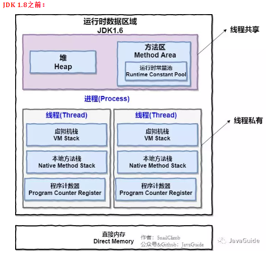
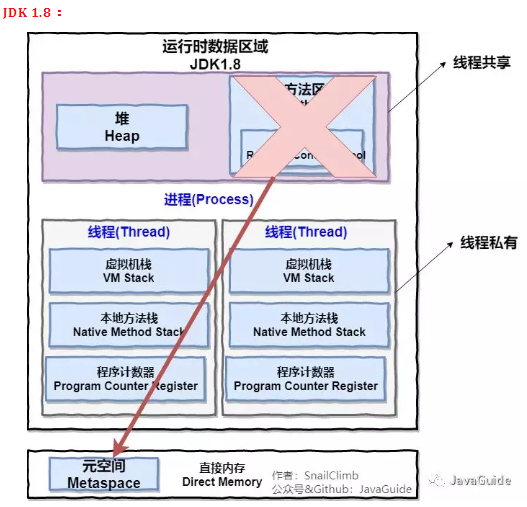
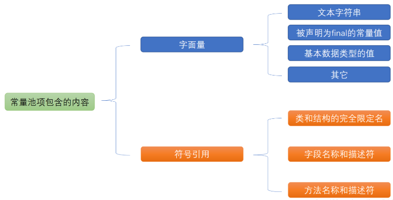
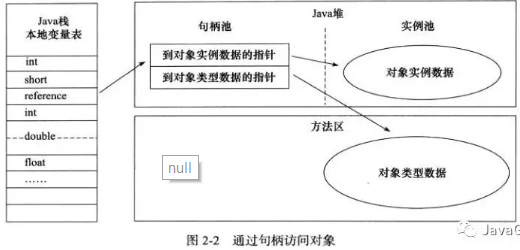
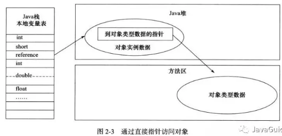

## java笔记

### java基础

1. Main.java文件中的入口类（即包含main方法）的访问权限不一定非要设定为public，不加public也是可以运行的。但main方法必须是public。即包含main方法的类不一定是public,但main方法一定要是public static
2. 以` /**`开头 `*/`结尾的注释可以自动生成文档。
3. java包含8种基本数据类型：4种整型（byte、short、int、long）、2种浮点型（float(有效位6~7)、double(有效位15)）、char、boolean。


              字节数    其他
        byte:  1    
        short: 2
        int:   4       范围正好超过20亿
        long:  8       加L、l后缀
        float: 4       加F、f后缀
        double:8
        char:  2
        boolean: 

十六进制0x开头，八进制以0开头，二进制0b开头，如`0b1001` = 9;
数字之间可以加下划线，如：`123_4567`,`0b1000_0011`。

java的整形数据**没有无符号类型**（unsigned）。
对浮点型数据，有3个特定值：

>Double.POSITVE_INFINITY:正无穷
>
>Double.NEGATIVE_INFINITY:负无穷
>
>Double.NaN：不是一个数字，表示0/0或者负数的平方根的结果。

浮点型不要用 == 比较。应该比较他们的差的绝对值是否小于某一个很小的数。

char类型采用了unicode编码，unicode编码单元可以表示为十六进制，其范围是：\u0000~\uffff。一般char类型的表示方式有3种：

1. 使用单引号:'0','a','B'。
2. 使用转义序列符，针对一些特殊字符： \b,\n,\\,\",\'等
3. 使用十六进制值，如:\u0035='5',\u0008=\b

**局部变量**在使用(**除了对其赋值操作**)之前必须进行**显式的初始化**。且变量的声明尽量靠近第一次使用的地方。

关键字final修饰的变量只能被赋值一次，之后就不能再更改了，习惯上常量名使用全大写。**final修饰的类的成员变量，必须保证在初始化函数之后其已经被赋值，否则编译报错**。全局类常量 `public static final`修饰`。

位运算符：&按位与、|按位或、^按位异或、~按位非

<<左移，低位补0；>>右移，高位用符号位填充；`>>>右移，高位用0填充`

注意对移动运算需要进行模32的操作，如1<<35 = 1<<3

数学函数与常量：Math.sqrt(double)求平方根，幂运算：Math.pow(x,a)求x的a次方。其反函数求对数：Math.exp，Math.log，Math.log10。 常量：Math.PI,Math.E。

----------

**数值转换**
分为自动转换和强制类型转换。

自动转换：编译器不会报警，即**转换后的类型数据范围大于转换前的类型**。
​    无信息丢失的转换：
​    byte->short->int->long
​    char->int->double
​    float->double
​    精度丢失的转换：
​    long->dobule
​    long->float
​    int->float 

这里int转float的精度丢失不太理解，如  
​    int n = 123456789;
​    float f = n;//f is 1.23456792E8

浮点数参考教程：

[http://blog.csdn.net/b2b160/article/details/4492519](http://blog.csdn.net/b2b160/article/details/4492519 "定点数、浮点数")
[http://www.ruanyifeng.com/blog/2010/06/ieee_floating-point_representation.html](http://www.ruanyifeng.com/blog/2010/06/ieee_floating-point_representation.html "浮点数的二进制表示")

[http://www.zengdongwu.com/article1.html](http://www.zengdongwu.com/article1.html "浮点数的二进制详解")

对上面的数值进行二元操作时，遵循如下规则：

1. 如果2个操作数中有一个是double类型，另一个操作数就会转换为double类型
2. 否则，如果2个操作数中有一个是float类型，另一个操作数就会转换为float类型
3. 否则，如果2个操作数中有一个是long类型，另一个操作数就会转换为long类型
4. 否则，**2个操作数都被转换为int类型**

强制类型转换：
**将数据范围大的类型转换为数据范围小的类型**

如 double x = 1.66;
   int nx = (int)x;

如果想四舍五入的转换：int nx = (int)Math.round(x)

        System.out.println("floor:");//地板  取最小 返回double
        System.out.println(Math.floor(5.1));
        System.out.println(Math.floor(5.9));
        System.out.println(Math.floor(-5.1));
        System.out.println(Math.floor(-5.9));
        
        System.out.println("ceil:");//天花板  取最大 返回double
        System.out.println(Math.ceil(5.1));
        System.out.println(Math.ceil(5.9));
        System.out.println(Math.ceil(-5.9));
        System.out.println(Math.ceil(-5.1));
        
        System.out.println("round：");//四舍五人，返回long
        System.out.println(Math.round(5.1));
        System.out.println(Math.round(5.9));
        System.out.println(Math.round(-5.1));
        System.out.println(Math.round(-5.9));
        
        输出：
        floor:
        5.0
        5.0
        -6.0
        -6.0
        ceil:
        6.0
        6.0
        -5.0
        -5.0
        round：
        5
        6
        -5
        -6
如果转换的结果类型超出了目标类型的表示范围，则会截断成一个完全不同的值：（byte）300的实际值为44。

**不要再boolean与任何类型之间转换，会发生错误**，只有极少数才需要将Boolean型转为数值类型，可以使用 `b ? 1 : 0`

枚举类型：

    enum Size {SMALL, MEDIUM, LARGE};
    Size s = Size.SMALL;
Size类型的变量只存储这个枚举类型声明的**某个枚举值或者null**,null表示这个变量没有设置任何值。

**字符串**：

字符串就是Unicode字符序列，String类被定义为final类型，表示字符串是不可被修改的，这样编译器就可以让字符串共享，java的设计者认为**共享带来的高效远远胜过提取、拼接字符串所带来的低效率**。

子串提取：str.subString(a,b)，a表示第一个要提取的字符的位置，b表示第一个不想提取的字符的位置。这样子串的长度就等于b-a。

代码`String str = "hello"；`
中str是字符串**变量**，"hello"是字符串**常量**。实际上在虚拟机中只有字符串常量是共享的，**像+，subString等操作产生的结果是不共享的**。

**字符串格式化**：String.format("%s%d%f%x%c%h%b"，....);   
一些输出格式标志：  
0:数字前补0 %02x,对10 输出 0a  
\#： 添加前缀0x（十六进制）或0（八进制），或者包含小数点。  
输出日期：`System.out.printf("%1$tF %1$tT", new Date());`  
结果:`2016-06-04 19:38:13`，其中t标示日期格式化开始，F表示日期格式，2016-06-04；T标示时间格式19:38:13。1$是参数索引，标示将该格式应用在第几个参数上，以$结尾。索引参数是从1开始，不是0。  

    System.out.printf("%1$x %1$02x %1$#x %1$#X %n",11);
    System.out.printf("%1$tF %1$tT \n", new Date());
    输出  
    b 0b 0xb 0XB 
    2016-08-19 16:09:10 


可以使用Scanner,PrintWriter对文件进行读写操作。
`new Scanner(new File("pathname"))`、`new PrintWriter(new File(pathname))`  

常见String面试题：
>
> 1. String s = new String("abc");创建了几个String对象。
> 2. String s1 = "abc";
> 3. String s2 = "a";
> 4. String s3 = s2 + "bc";
> 5. String s4 = "a" + "bc";
> 6. String s5 = s3.intern();
>
> 请问s1==s3是true还是false，s1==s4是false还是true。s1==s5呢？

1.创建了2个String对象，一个是**字符串字面常数**，在**字符串池**中。一个是new出来的字符串对象，在堆中。

     s3 = s2 + "bc";相当于 
     s3 = new StringBuilder().append(s2).append("bc").toString();

此题注意两点，因为s2是一个变量，所以s3是**运行时**才能计算出来的字符串，是new的，在堆中不在字符串池中。s4是通过**常量表达式计算**出来的，他等同于字符串字面常数，在字符串池中。所以，s1!=s3，s1==s4。再看s5，s5是s3放到字符串池里面返回的对像，所以s1==s5。这里新手要注意的是，s3.intern()方法，是**返回字符串在池中的引用**，**并不会改变s3这个变量的引用**，就是s3还是指向堆中的那个"abc"，并没有因调用了intern()方法而改变，实际上也不可能改变。

Java语言规范第三版，第3.10.5小节，String Literals的最后一段如下：

> 1. Literal strings within the same class (§8) in the same package (§7) represent references to the same String object (§4.3.1).
> 2. Literal strings within different classes in the same package represent references to the same String object.
> 3. Literal strings within different classes in different packages likewise represent references to the same String object.
> 4. Strings computed by constant expressions (§15.28) are computed at compile time and then treated as if they were literals.
> 5. Strings computed by concatenation at run time are newly created and therefore distinct.
> 6. The result of explicitly interning a computed string is the same string as any pre-existing literal string with the same contents.

首先解释下什么是字符串字面常数(String Literals)，字面常数(Literals)就是你写在源代码里面的值，比如说int i = 6; 6就是一个整数形字面常数。String s = "abc"; “abc”就是一个字符串字面常数。Java中，所有的字符串字面常数都放在上文提到的字符串池里面，是可以共享的，就是说，String s1 = "abc"; String s2 = "abc"; s1，s2都引用的同一个字符串对象，而且这个对象在字符串池里面，因此s1==s2。另外，字符串字面常数是什么时候实例化并放到字符串池里面去的呢？答案是**Load Class的时候**。

前面三句基本废话，像绕口令一样，意思就是说任何类任何包，值相同的字符串字面常数(String Literals)都引用同一个对象。

第四句是说，通过常量表达式(constant expressions)计算出来的字符串，也算字符串字面常数，就是说他们也在字符串池中。什么才算**常量表达式**？总结就是，那就是**编译时能确定**的，就算，运行时才能确定的，就不算。以下为例子

- String s = 1 + "23";//算，符合第二条Casts to primitive types and casts to type String
- String s = (2 > 1) + "" ;//算，意味着s=="true"，且这个“true”已经放到字符串池里面去了。
- String s = (o instanceof Object) + "";//不算，instanceof这个操作符决定了不算。s=="true"，但这个"true"对象在堆中。

留意下面的情况。
   final String s2 = "a";
   String s3 = s2 + "bc";//算
注意现在的s2+"bc"也算一个常量表达式，理由是s2是一个**常量变量**(constant variables)，问题又来了，什么是常量变量？规范里也说了，**被final修饰**，并且通过常量表达式初始化的变量，就是常量变量。变量s2被final修饰，他通过常量表达式"a"初始化，所以s2是一个常量变量，所以s3引用的"abc"，也在字符串池里面。

下面这句话不是很明白：
> 再举个反例：
> final String s2 = getA();//s2不是常量变量，但是s2引用的"a"其实还是在常量池中，这两点不矛盾
> public String getA(){return "a"}
> String s3 = s2 + "bc";//此时s3不算常量表达式，因为s2不是常量变量
> 这是时候的s2，就不是常量变量了哦，因为getA()不是一个常量表达式。  

另外char中的代码点和代码单元的概念还没弄懂。  

**大数值类**：
BigInteger:add、subtract、multiply、divide、mod、compareTo、valueOf。
BigDecimal:同BigInteger,除了没有mod方法，进行除法时候，需要设定舍入方式，RoundingMOde.HALF_UP就是四舍五入。

数组创建以后，数字元素初始化为0，boolean为false，对象为null。  
可以初始化：int[] arr = {1,2,3};  
匿名数组 new int[] {1,2,3};  
java允许数组长度为0，即new eleType[0]  
使用好数组的工具Arrays类中的方法，如toString，sort,asList,equal,fill,copyOf,binarySearch。 
要想快速打印二维数组，可以Arrays.deepToString([][])

**类之间的关系**
依赖（uses-a）UML:---->  
聚合（has-a） UML:---->   又称关联  
继承（is-a）  UML ------△  
[http://blog.csdn.net/zhengzhb/article/details/7190158](各种关系分析)
[http://blog.csdn.net/sfdev/article/details/3906243](http://blog.csdn.net/sfdev/article/details/3906243)

1. 依赖的耦合度最弱，表现为局部变量、方法的形参。 
2. 关联一般用成员变量来实现，有时也用方法形参实现。关联可以是双向的，也可以是单向的。
3. 聚合是一种比较强的关联关系，一般使用成员变量来标识，对象之间存在整体与部分的关系。
4. 组合是一种比聚合关系强的关联，它要求普通的聚合关系中代表整体的对象负责代表部分对象的生命周期，组合关系是不能共享的。为了表示组合关系，常常会使用构造方法来达到初始化的目的。

使用**final修饰实例域**，则必须确保在**构造函数执行后这个域的值被设置**。

final修饰符大都应用于基本类型或者不可变的域（类中的每个方法都不会改变其对象，如String）。
`final Date date;`表示date这个引用不能指向别的实例对象，但date指向的对象是可以改变的。

类中域会初始化成默认值，但为了代码的可读性，尽量进行显示地进行初始化。

如果自定义一个类没有提供构造器，那么会使用系统的无参构造器，如果自己至少写了一个构造器，那么系统就不会提供默认的无参构造器了。

在构造器的第一行使用`this（...）`，则会调用当前类的另一构造器，如果是`super(...)`则会调用父类的构造器。且子类在执行构造函数时，**一定要先对父类进行构造，在构造器的第一行**，或者是显示调用`super（...）`中的一个，或是隐式调用`super()`,即父类的无参构造函数，前提是父类要有这种无参的构造函数。  

**类的初始化过程：**  
在类第一次加载的时候，首先会对静态域初始化，如果没有显示地指定值，则默认的初始值是0，false，null。所有的静态初始化语句以及静态初始化块都将按照它们在**类中出现的顺序依次进行初始化**。这种静态初始化只会执行一次。 

构造器的初始化过程：  
1. 所有的数据域被初始化成默认值  
2. 按照在类中声明出现的次序，依次执行所有的初始化语句和初始化块  
3. 如果构造器的第一行调用了其他构造器，则执行其他构造器  
4. 执行这个构造器的主体  
    初始块如果要使用某个域，则该初始化块必须在域的声明之后  

> 总结对象创建的过程：  
> 1. 首次创建对象时(对象声明不加载class文件)，类中的静态方法/静态字段首次被访问时，java解释器必须先查找类路径，以定位.class文件；  
> 2. 然后载入.class(这将创建一个Class对象)，有关静态初始化的所有动作都会执行。因此，静态初始化只在Class对象首次加载的时候进行一次。  
> 3. 当用new XX（）创建对象时，首先在堆上为对象分配足够的存储空间。  
> 4. 这块存储空间会被清0，这就自动地将对象中的所有基本类型数据都设置成了缺省值（对数字来说就是0，对布尔型和字符型也相同），而引用则被设置成了null。  
> 5. 按顺序执行所有出现于字段定义处的初始化动作（非静态对象的初始化）。  
6. 执行构造器。

在类的内部，变量定义的先后顺序决定了初始化的顺序，即使变量定义散布于方法定义之间，它们仍旧会在任何方法（包括构造器）被调用之前得到初始化。

> 继承时，对象的初始化过程   
> 1. 主类的超类由高到低按顺序初始化静态成员，无论静态成员是否为private。   
> 2. 主类静态成员的初始化。   
> 3. 主类的超类由高到低进行默认构造方法的调用。注意，在调用每一个超类的默认构造方法前，先进行对此超类进行非静态成员的初始化。    
> 4. 主类非静态成员的初始化。    
> 5. 调用主类的构造方法。  

import除了能导入类，还可以静态导入：   

    import static java.lang.System.*;  
    out.println("");
    exit（0）；
实际上，这种简写形式不利于代码的清晰度。

##访问权限修饰符
java提供了public、protect、private三种权限修饰符，4种访问权限，从最大权限到最小权限依次是：public、protected、包访问权限(默认，没有关键字)和private。分别是：  
1. public访问权限，即所有的地方均可以访问。  
2. protect访问权限，同一包内和子类可以访问。  
3. friendly访问权限，即default权限，什么修饰符都不加的权限。同一个包内可以访问。  
4. private访问权限，仅在同一类内才可以访问。  

 java最多只允许一个java文件中出现一个public类（该类向外提供接口，并与该java文件的名称完全一致）。  
当一个java文件中无一个Public类时，表明其仅供包内使用，对外界不可见！  

对于类的访问权限只能是：public和什么都不加的包访问权限（但内部类可以是private或protected的）；对于类中的成员的访问权限可以是上述的四种。
一、public修饰的类：


二、无修饰符(默认包访问权限)的类：


主要区别是对default权限的类，其他包的类根本无法访问到此类，更不用说访问其成员了。

其中，对于一个包里面的包访问权限类A，在其他package的类里面import类A的时候就已经出错了。所以，其他package普通类是根本就访问不了类A，其他package的类也成为不了类A的子孙类。

### UML图

在UML类图中，类使用包含类名、属性(field) 和方法(method) 且带有分割线的矩形来表示，比如下图表示一个Employee类，它包含name,age和email这3个属性，以及modifyInfo()方法。


那么属性/方法名称前加的加号和减号是什么意思呢？它们表示了这个属性或方法的可见性，UML类图中表示可见性的符号有三种：

**·** + ：表示public

**·** - ：表示private

**·** #：表示protected（friendly也归入这类）

因此，上图中的Employee类具有3个私有属性和一个公有方法。

实际上，属性的完整表示方式是这样的：

**可见性  名称 ：类型 [ = 缺省值]**              中括号中的内容表示是可选的

上图中我们已经看到了方法的表示形式。实际上，方法的完整表示方式如下：

**可见性  名称(参数列表) [ ： 返回类型]**         同样，中括号中的内容是可选的。


**类之间的关系**

**泛化关系**(generalization)  is-a

其实是继承；类的继承结构表现在UML中为：泛化(generalize)与实现(realize)：

继承关系为 is-a的关系；两个对象之间如果可以用 is-a 来表示，就是继承关系：（..是..)

eg：自行车是车、猫是动物

泛化关系用一条带空心箭头的直接表示；如下图，汽车在现实中有实现，可用汽车定义具体的对象；汽车与SUV之间为泛化关系；suv继承了汽车。


注：最终代码中，泛化关系表现为继承非抽象类；

**实现关系**(realize)

实现关系用一条带空心箭头的虚线表示；

eg：”车”为一个抽象概念，在现实中并无法直接用来定义对象；只有指明具体的子类(汽车还是自行车)，才 可以用来定义对象（”车”这个类在C++中用抽象类表示，在JAVA中有**接口**这个概念，更容易理解）


注：最终代码中，实现关系表现为**继承抽象类**、**接口**；

**关联关系**(association)  has-a

关联关系是用一条直线表示的；它描述不同类的对象之间的结构关系；它是一种静态关系， 通常与运行状态无关，一般由常识等因素决定的；它一般用来定义对象之间静态的、天然的结构； 所以，关联关系是一种“强关联”的关系；

比如，乘车人和车票之间就是一种关联关系；学生和学校就是一种关联关系；

关联关系默认不强调方向，表示对象间相互知道；如果特别强调方向，如下图，表示A知道B，但 B不知道A；


注：在最终代码中，关联对象通常是以**成员变量**的形式实现的；

**依赖关系**(dependency)

依赖关系是用一套带箭头的虚线表示的；如下图表示A依赖于B；他描述一个对象在运行期间会用到另一个对象的关系；


与关联关系不同的是，它是一种临时性的关系，通常在运行期间产生，并且随着运行时的变化； 依赖关系也可能发生变化；

显然，依赖也有方向，双向依赖是一种非常糟糕的结构，我们总是应该保持单向依赖，杜绝双向依赖的产生；

注：在最终代码中，依赖关系体现为**类构造方法及类方法的传入参数**，箭头的指向为调用关系；**依赖关系除了临时知道对方外**，还是“使用”对方的方法和属性；

**聚合关系**(aggregation)

聚合关系用一条带空心菱形箭头的直线表示，如下图表示A聚合到B上，或者说B由A组成；


聚合关系用于表示实体对象之间的关系，表示整体由部分构成的语义；例如一个部门由多个员工组成；

与组合关系不同的是，整体和部分不是强依赖的，即使**整体不存在了，部分仍然存在**；例如， 部门撤销了，人员不会消失，他们依然存在；

**组合关系**(**composition**)

组合关系用一条带实心菱形箭头直线表示，如下图表示A组成B，或者B由A组成；


与聚合关系一样，组合关系同样表示整体由部分构成的语义；比如公司由多个部门组成；

但组合关系是一种强依赖的特殊聚合关系，如果**整体不存在了，则部分也不存在了**；例如， 公司不存在了，部门也将不存在了；

局部不能脱离整体而存在。

**时序图**

为了展示对象之间的交互细节，后续对设计模式解析的章节，都会用到时序图；

时序图（Sequence Diagram）是显示对象之间交互的图，这些对象是按时间顺序排列的。时序图中显示的是参与交互的对象及其对象之间消息交互的顺序。

时序图包括的建模元素主要有：对象（Actor）、生命线（Lifeline）、控制焦点（Focus of control）、消息（Message）等等。

参考：

<https://design-patterns.readthedocs.io/zh_CN/latest/read_uml.html>

<https://www.cnblogs.com/shindo/p/5579191.html>


### java泛型 ###

1.使用 通过尖括号来定义 <>  
泛型类，接口，<>定义在类名后：

    class A<T> {
        
    }
    class B<T,V> {
        
    }
    interface C <T> {
        
    }

泛型方法定义,**<>定义在修饰符后，返回值前**：

```
   
   public <T> void fun(T t) {          
   }
    
    public static <T> T  fun2() {
        T t = null;
        return t;
    }
```

对定义为 `class A<T> {……}` 的类，如果定义时 `A a = new A();`
则T代表的类型使用Object来替代。

泛型类继承：  

    class A<T> { }
    class B extends A { }
    class C<T> extends A<T> { }
    class D extends A<String> { }
    
    class E extends A<T> { } //编译错误  
    //T cannot be resolved to a type

对泛型类传入不同的泛型参数，并不会真正的生成新的类。

    List<String> sList = new ArrayList<>();
    List<Integer> iList = new ArrayList<>();
    //true
    System.out.println(sList.getClass() == iList.getClass());

**在静态方法、静态初始化块、或者静态变量不能使用泛型。**

instanceof运算符后不能使用泛型运算符

    Collection<String> cs = new ArrayList<>();
        
    //Cannot perform instanceof check against parameterized type List<String>. 
    //Use the form List<?> instead since further generic type information
    //will be erased at runtime
    //此处编译错误
    if (cs instanceof List<String>) {
        
    }
    //正确的 使用？通配符
    if (cs instanceof List<?>) {
        
    }

注意Round是Shape的子类，但 `List<Round>`不是`List<Shape>`的子类型。

    public static void main(String[] args) {
        List<Shape> list = new ArrayList<>();
        List<Round> list2 = new ArrayList<>();
        test(list);
        test(list2);//编译错误
        test2(list2);
    }
    
    private static void test(List<Shape> list) {}
    private static void test2(List<? extends Shape> list) {}

设定通配符的上限：
​    `List<? extends Shape> `，表示可以接收的泛型类型是Shape或者其子类。同时List<? extends Shape>也是所有Shape泛型List的父类。

    public void drawAll(List<? extends Shape> shapes) {
        for (Shape shape : shapes) {
            shape.draw();
        }
    }
    
    但是
    public void drawAll(List<? extends Shape> shapes) {
        for (Shape shape : shapes) {
            shape.draw();
        }
        
        //但是
        shapes.add(new Round());//编译错误
        shapes.add(new Shape());//编译错误
        shapes.add(new Object());//编译错误
        shapes.add(null);//编译正确
    }
因为`List<? extends Shape> `表示Shape未知的之类，我们无法准确知道这个类型是什么，所以无法将任何对象加到这个集合中。

设定通配符的下限：<? super Shape>表示Shape本身，或者是Shape的父类。即介于Object和Shape之间的类。

    public void drawAll(List<? super Shape> shapes) {
        for (Object shape : shapes) {
            shape.draw();//编译错误 shape没有该方法
        }
        
        //但是
        shapes.add(new Round());
        shapes.add(new Shape());
        shapes.add(new Object());//shape 父类 编译错误
        shapes.add(null);//编译正确
    }
因为java的继承是从上往下，父类在最上面，故extends，子类以及本身表示上限，super，本身及其父类，表示下限。

**Java 泛型 <? super T> 中 super 怎么 理解？与 extends 有何不同？**

前提：父类引用可以指向其子类，子类引用却不能指向父类。

List<? extends Integer>  list-- ？表示Integer类型或者其子类，list不能写入，因为不确定其存储类型，存入的类型不一定能转成实际的？类。只能保证**读出**的类型可转换成Integer类型。

List<? super Integer>  list-- ？表示Integer类型或者其父类，list不能读取，因为不确定读出来的类型，只能读Object类型。可以写入，Integer类型或者Integer的子类，因为**写入**的类型可以转换成？类型。

PECS原则，Producter使用Extends, 用来读取，程序是生产者，对外生产数据，外部程序读取生产者的内容。

消费者模式使用super,用来写入，程序是消费者，读取外部程序的内容。

    // compile error
    //    List <? extends Fruit> appList2 = new ArrayList();
    //    appList2.add(new Fruit());
    //    appList2.add(new Apple());
    //    appList2.add(new RedApple());
    
    List <? super Fruit> appList = new ArrayList();
    appList.add(new Fruit());
    appList.add(new Apple());
    appList.add(new RedApple());
首先，泛型的出现时为了安全，所有与泛型相关的异常都应该在编译期间发现，因此为了泛型的绝对安全，java在设计时做了相关的限制： 

List<? extends E>表示该list集合中存放的都是E的子类型（包括E自身），由于E的子类型可能有很多，但是我们存放元素时实际上只能存放其中的**一种子类型**（这是为了泛型安全，因为其会在编译期间生成桥接方法`<Bridge Methods>`该方法中会出现强制转换，若出现多种子类型，则会强制转换失败），例子如下：
​    
​    List<? extends Number> list=new ArrayList<Number>();
​        list.add(4.0);//编译错误
​        list.add(3);//编译错误

上例中添加的元素类型不止一种，这样编译器强制转换会失败，为了安全，Java只能将其设计成不能添加元素。

虽然List<? extends E>不能添加元素，但是由于其中的元素都有一个共性--有共同的父类，因此我们在获取元素时可以将他们统一强制转换为E类型，我们称之为**get原则**。

对于List<? super E>其list中存放的都是E的父类型元素（包括E），我们在向其添加元素时，只能向其添加E的子类型元素（包括E类型），这样在编译期间将其强制转换为E类型时是类型安全的，因此可以添加元素，例子如下：
​    
​    List<? super Number> list=new ArrayList<Number>();
​        list.add(2.0);
​        list.add(3.0);

但是，由于该集合中的元素都是E的父类型（包括E），其中的元素类型众多，在获取元素时我们无法判断是哪一种类型，故设计成不能获取元素，我们称之为put原则。

实际上，我们采用extends，super来扩展泛型的目的是为了弥补例如List<E>只能存放一种特定类型数据的不足，将其扩展为List<? extends E> 使其可以接收E的子类型中的任何一种类型元素，这样使它的使用范围更广。

List<? super E>同理。

假设现在有这么一个类的继承树`，Plant -> Fruit -> Apple -> RedApple。`

>List<? extends Fruit> appList2的意思，是一个列表，这个列表里面的元素是Fruit的某个子类T，那么在从appList2中取出一个元素时，编译器会自动把这个元素转型为T。那么现在假设T是RedApple，很显然你往这样一个appList2中add一个Apple类型的元素，取出后转型为RedApple必然会失败；同样的情况如果T是Apple，你add一个Fruit类型的元素，取出后转型为Apple，也会抛出异常。也就是说，编译器会把列表中取出的元素转型为某种类型，但编译器不确定这种转型是不是会成功，即在不保证运行时能顺利进行，因此就不允许你add任何类型的元素。

再来看看List<? super Fruit> appList，这个列表的元素都是Fruit的父类T，也就是说当你从这个列表中get一个元素时，编译器会自动加一句转型为T的代码。好，现在你往appList中add一个Apple类型的元素，取出时转型为T，由于T是Apple的父类，向上转型没有问题；加一个RedApple类型的元素，也一样不会有问题。也就是说，只要保证你往appList中添加的元素是Fruit的子类，编译器就可以保证在转型为T时不会抛出异常。因此第二种写法可以过编译。

>为什么List<? extends Fruit>无法add操作呢，假设Fruit下面还有一个Apple子类，而你的List实例是酱紫的：List<? extends Fruit> list = new ArrayList<Apple>()，这一刻你终于知道了泛型的具体类型是Apple类。
>这样还可以add进Fruit吗？

>而List<? super T>为什么又能add进呢，因为你add进的实例一定会是Fruit及其子类型，而你的List实例的实际泛型参数一定是Fruit及其父类，那么肯定是能add进去的。

>**关于这两个的使用，假设你是想消费这个List就该用List<? extends T>，因为你可以进行get操作，你可以调用T的接口方法；假设你是想被这个List消费就该用List<? super T>，因为你可以进行add操作。**

### java正则表达式 ###
java.util.regex是一个用正则表达式所订制的模式来对字符串进行匹配工作的类库包。它包括两个类：Pattern和Matcher Pattern 一个Pattern是一个**正则表达式经编译**后的表现模式。 Matcher 一个Matcher对象是一个**状态机器**，它依据Pattern对象做为匹配模式对字符串展开**匹配检查**。 首先一个Pattern实例订制了一个所用语法与PERL的类似的正则表达式经编译后的模式，然后一个Matcher实例在这个给定的Pattern实例的模式控制下进行字符串的匹配工作。

Pattern类是用来表达和陈述所要搜索模式的对象，Matcher类是真正影响搜索的对象。另加一个新的例外类，PatternSyntaxException，当遇到不合法的搜索模式时，会抛出例外。

**元字符**

| 代码 | 说明                         |
| ---- | ---------------------------- |
| .    | 匹配除换行符以外的任意字符   |
| \w   | 匹配字母或数字或下划线或汉字 |
| \s   | 匹配任意的空白符             |
| \d   | 匹配数字                     |
| ^    | 匹配字符串的开始             |
| $    | 匹配字符串的结束             |
| \b   | 匹配字符串的结束             |

**重复**

| 代码/语法 | 说明             |
| --------- | ---------------- |
| *         | 重复零次或更多次 |
| +         | 重复一次或更多次 |
| ?         | 重复零次或一次   |
| {n}       | 重复n次          |
| {n,}      | 重复n次或更多次  |
| {n,m}     | 重复n到m次       |

**字符类**

想查找数字，字母或数字，空白是很简单的，因为已经有了对应这些字符集合的元字符，但是如果你想匹配没有预定义元字符的字符集合(比如元音字母a,e,i,o,u),应该怎么办？
很简单，你只需要在方括号里列出它们就行了，像[aeiou]就匹配任何一个英文元音字母，[.?!]匹配标点符号(.或?或!)。
我们也可以轻松地指定一个字符范围，像[0-9]代表的含意与\d就是完全一致的：一位数字；同理[a-z0-9A-Z_]也完全等同于\w（如果只考虑英文的话）。

**分枝条件**

用`|`把不同的规则分别表达。
如：`0\d{2}-\d{8}|0\d{3}-\d{7}`这个表达式能匹配两种以连字号分隔的电话号码：一种是三位区号，8位本地号(如010-12345678)，一种是4位区号，7位本地号(0376-2233445)。

**反义**

| 代码/语法 | 说明                                       |
| --------- | ------------------------------------------ |
| \W        | 匹配任意不是字母，数字，下划线，汉字的字符 |
| \S        | 匹配任意不是空白符的字符                   |
| \D        | 匹配任意非数字的字符                       |
| \B        | 匹配不是单词开头或结束的位置               |
| [^x]      | 匹配除了x以外的任意字符                    |
| [^aeiou]  | 匹配除了aeiou这几个字母以外的任意字符      |

**分组**

重复单个字符直接在字符后面加上限定符就行了，但如果想要**重复多个字符**又该怎么办？你可以用小括号来指定**子表达式**(也叫做**分组**)，然后你就可以指定这个子表达式的重复次数了，你也可以对子表达式进行其它一些操作。
使用小括号指定一个子表达式后，匹配这个子表达式的文本(也就是此分组捕获的内容)可以在表达式或其它程序中作进一步的处理。捕获组可以通过从左到右计算其开括号来编号。例如，在表达式 ((A)(B(C))) 中，存在四个这样的组：

1. ((A)(B(C)))
2. (A)
3. (B(C))
4. (C)

**注释**

小括号的另一种用途是通过语法(?#comment)来包含注释。例如：`2[0-4]\d(?#200-249)|25[0-5](?#250-255)|[01]?\d \d?(?#0-199)`。

**贪婪与懒惰**

当正则表达式中包含能接受重复的限定符时，通常的行为是（在使整个表达式能得到匹配的前提下）匹配尽可
能多的字符。考虑这个表达式：`a.*b`，它将会匹配最长的以a开始，以b结束的字符串。如果用它来搜索aabab的
话，它会匹配整个字符串aabab。这被称为贪婪匹配。
有时，我们更需要懒惰匹配，也就是匹配尽可能少的字符。前面给出的限定符都可以被转化为懒惰匹配模式，
只要在它后面加上一个问号?。这样`.*?`就意味着匹配任意数量的重复，但是在能使整个匹配成功的前提下使用
最少的重复。现在看看懒惰版的例子吧：
`a.*?b`匹配最短的，以a开始，以b结束的字符串。如果把它应用于aabab的话，它会匹配aab（第一到第三个字
符）和ab（第四到第五个字符）。

```java
Pattern pattern = Pattern.compile("\\ba\\w*\\b");
Matcher matcher = pattern.matcher("abcdab cccabcd aaacd");
int index = 0;
while (matcher.find()) {
    String res = matcher.group();
    System.out.println(index + ":" + res);
    index++;
}
```

`\\ba\\w*\\b`表示匹配以字母a为开头的单词。
`Pattern.compile(regex)`表示将给定的正则表达式编译到具有给定标志的模式中。
`matcher(str)`创建匹配给定输入与此模式的匹配器。
`mather.find()`尝试查找与该模式匹配的输入序列的下一个子序列。方法扫描输入序列以查找与该模式匹配的下一个子序列。
此方法从匹配器区域的开头开始，如果该方法的前一次调用成功了并且从那时开始匹配器没有被重置，则从以前匹配操作没有匹配的第一个字符开始。
如果匹配成功，则可以通过 start、end 和 group 方法获取更多信息。
`group()` 返回由以前匹配操作所匹配的输入子序列。

从上例中可以看出，Java中的正则表达式与之前所说不一致（多了一个），在其他语言中`\\`表示我想在正则表达式中插入一个普通的反斜线，请不要给它任何特殊的意义，而在Java中，`\\`的意思是我想要插入一个正则表达式的反斜线，所以其后的字符具有特殊的意义。

如果想表示数字，则是`\\d`。如果要插入普通的反斜线，则是`\\\\`。


 Java 的正则表达式在匹配点(.)  和斜杠(/)，表达式要分别写作 //. 和 //// ，难看些， 不好理解。幸好还有些人记住了，匹配点(.) 或  {、[、(、?、$、^ 和 * 这些特殊符号要要前加双斜框，匹配 / 时要用四斜杠。

Java定义了一些用来格式化输出的特殊字符。Java使用转义符来表示这些特殊字符，该转义符由一个反斜线（\）和一个随后的助记符组成：

    回车            '\r'
    换行            '\n'
    Tab            '\t'
    换页            '\f'
    退格            '\b'
由于一对单引号和反斜线对于字符表示有特殊的意义，所以您必须用转义符来表示它们。

    单引号        '\'
    换码符        '\\'
    双引号        '\'''

参考：

<https://www.cnblogs.com/yw0219/p/8047938.html>


### ThreadLocal ###

ThreadLocal是什么呢？其实ThreadLocal并非是一个线程的本地实现版本，它并不是一个Thread，而是threadlocalvariable(线程局部变量)。也许把它命名为ThreadLocalVar更加合适。

线程局部变量(ThreadLocal)其实的功用非常简单，**就是为每一个使用该变量的线程都提供一个变量值的副本**，是Java中一种较为特殊的线程绑定机制，是每一个线程都可以独立地改变自己的副本，而不会和其它线程的副本冲突。

从线程的角度看，每个线程都保持一个对其线程局部变量副本的隐式引用，只要线程是活动的并且 ThreadLocal 实例是可访问的；在线程消失之后，其线程局部实例的所有副本都会被垃圾回收（除非存在对这些副本的其他引用）。

通过ThreadLocal存取的数据，总是与当前线程相关，也就是说，JVM 为每个运行的线程，绑定了私有的本地实例存取空间，从而为多线程环境常出现的**并发访问问题**提供了一种**隔离机制**。

概括起来说，对于多线程资源共享的问题，同步机制采用了“以时间换空间”的方式，而ThreadLocal采用了“以空间换时间”的方式。前者仅提供一份变量，让不同的线程排队访问，而后者为每一个线程都提供了一份变量，因此可以同时访问而互不影响。
>void set(T value)  
>将此线程局部变量的当前线程副本中的值设置为指定值。许多应用程序不需要这项功能，它们只依赖于 initialValue() 方法来设置线程局部变量的值。  
>T get()  
>返回此线程局部变量的当前线程副本中的值，如果这是线程第一次调用该方法，则创建并初始化此副本。  
>protected  T initialValue()  
>返回此线程局部变量的当前线程的初始值。最多在每次访问线程来获得每个线程局部变量时调用此方法一次，即线程第一次使用 get() 方法访问变量的时候。如果线程先于 get 方法调用 set(T) 方法，则不会在线程中再调用 initialValue 方法。  
>void remove()  
>移除此线程局部变量的值。这可能有助于减少线程局部变量的存储需求。如果再次访问此线程局部变量，那么在默认情况下它将拥有其 initialValue。

>在程序中一般都重写initialValue方法，以给定一个特定的初始值。

**ThreadLocal使用的一般步骤**

1、在多线程的类（如ThreadDemo类）中，创建一个ThreadLocal对象threadXxx，用来保存线程间需要隔离处理的对象xxx。  
2、在ThreadDemo类中，创建一个获取要隔离访问的数据的方法getXxx()，在方法中判断，若ThreadLocal对象为null时候，应该new()一个隔离访问类型的对象，并强制转换为要应用的类型。 
3、在ThreadDemo类的run()方法中，通过getXxx()方法获取要操作的数据，这样可以保证每个线程对应一个数据对象，在任何时刻都操作的是这个对象。

        Integer i=0;
        ThreadLocal<Integer> local = new ThreadLocal<Integer>() {
            @Override
            protected Integer initialValue() {
                return 0;
            }
        };
        
        new Thread(new Runnable() {
            @Override
            public void run() {
                local.set(100);
                while (true) {
                    int i = local.get();
                    System.out.println("task-1 "+ i);
                    i++;
                    local.set(i);
                    try {
                        Thread.sleep(500);
                    } catch (InterruptedException e) {
                        e.printStackTrace();
                    }
                }
            }
        }).start();
        
        new Thread(new Runnable() {
            @Override
            public void run() {
                local.set(0);
                while (true) {
                    int i = local.get();
                    System.out.println("task---2 "+ i);
                    i++;
                    local.set(i);
                    try {
                        Thread.sleep(1000);
                    } catch (InterruptedException e) {
                        e.printStackTrace();
                    }
                }
            }
        }).start();


​        
​    }

另一个例子

    public class ThreadLocalDemo implements Runnable {
        //创建线程局部变量studentLocal，在后面你会发现用来保存Student对象
        private final static ThreadLocal<Student> studentLocal = new ThreadLocal<>();
     
        public static void main(String[] agrs) {
            ThreadLocalDemo td = new ThreadLocalDemo();
            Thread t1 = new Thread(td, "a");
            Thread t2 = new Thread(td, "b");
            t1.start();
            t2.start();
        }
     
        public void run() {
            accessStudent();
        }
     
        /**
         * 示例业务方法，用来测试
         */
        public void accessStudent() {
            //获取当前线程的名字
            String currentThreadName = Thread.currentThread().getName();
            System.out.println(currentThreadName + " is running!");
            //产生一个随机数并打印
            Random random = new Random();
            int age = random.nextInt(100);
            System.out.println("thread " + currentThreadName + " set age to:" + age);
            //获取一个Student对象，并将随机数年龄插入到对象属性中
            Student student = getStudent();
            student.setAge(age);
            System.out.println("thread " + currentThreadName + " first read age is:" + student.getAge());
            try {
                Thread.sleep(500);
            }
            catch (InterruptedException ex) {
                ex.printStackTrace();
            }
            student = getStudent();
            System.out.println("thread " + currentThreadName + " second read age is:" + student.getAge());
        }
     
        protected Student getStudent() {
            //获取本地线程变量并强制转换为Student类型
            Student student = studentLocal.get();
            //线程首次执行此方法的时候，studentLocal.get()肯定为null
            if (student == null) {
                System.out.println(Thread.currentThread().getName()+" create");
                //创建一个Student对象，并保存到本地线程变量studentLocal中
                student = new Student();
                studentLocal.set(student);
            }
            return student;
        }
    }
    
    class Student {
        private int age = 0;   //年龄
     
        public int getAge() {
            return this.age;
        }
     
        public void setAge(int age) {
            this.age = age;
        }
    }

首先，ThreadLocal 不是用来解决共享对象的多线程访问问题的，一般情况下，通过ThreadLocal.set() 到线程中的对象是该线程自己使用的对象，其他线程是不需要访问的，也访问不到的。各个线程中访问的是不同的对象。  

另外，说ThreadLocal使得各线程能够保持各自独立的一个对象，并不是通过ThreadLocal.set()来实现的，而是通过每个线程中的new 对象 的操作来创建的对象，每个线程创建一个，不是什么对象的拷贝或副本。  

通过ThreadLocal.set()将这个新创建的对象的引用保存到各线程的自己的一个map中，每个线程都有这样一个map，执行ThreadLocal.get()时，各线程从自己的map中取出放进去的对象，因此取出来的是各自自己线程中的对象，ThreadLocal实例是作为map的key来使用的。   

如果ThreadLocal.set()进去的东西本来就是多个线程共享的同一个对象，那么多个线程的ThreadLocal.get()取得的还是这个共享对象本身，还是有并发访问问题。 


使用场景：几个子线程要访问具有同一个初始值的变量，在各自的线程中创建该变量的副本，并使用各自的副本。

使用方法：创建一个全局的`ThreadLocal`变量`globalFeild`，一般使用`private static`修饰，在各个子线程通过`globalFeild.get()`方法获取属于各自线程的副本，每个线程使用和修改自己的副本，相互之间不干扰。典型的使用场景如下：比如说DAO的数据库连接，我们知道DAO是单例的，那么他的属性Connection就不是一个线程安全的变量。而我们每个线程都需要使用他，并且各自使用各自的。这种情况，ThreadLocal就比较好的解决了这个问题。 

```
public final class ConnectionUtil {

    private ConnectionUtil() {}

    private static final ThreadLocal<Connection> conn = new ThreadLocal<>();

    public static Connection getConn() {
        Connection con = conn.get();
        if (con == null) {
            try {
                Class.forName("com.mysql.jdbc.Driver");
                con = DriverManager.getConnection("url", "userName", "password");
                conn.set(con);
            } catch (ClassNotFoundException | SQLException e) {
                // ...
            }
        }
        return con;
    }
}
getConn() 会被几个线程访问，每个线程都会创建自己的Connection，并且保存在ThreadLocal变量中
```

ThreadLoal 变量，它的基本原理是，同一个 ThreadLocal 所包含的对象（对ThreadLocal< String >而言即为 String 类型变量），在不同的 Thread 中有不同的副本（实际是不同的实例，后文会详细阐述）。这里有几点需要注意

- 因为每个 Thread 内有自己的实例副本，且该副本只能由当前 Thread 使用。这是也是 ThreadLocal 命名的由来
- 既然每个 Thread 有自己的实例副本，且其它 Thread 不可访问，那就不存在多线程间共享的问题
- 既无共享，何来同步问题，又何来解决同步问题一说？

> 总的来说，ThreadLocal 适用于每个线程需要自己独立的实例且该实例需要在多个方法中被使用，也即变量在线程间隔离而在方法或类间共享的场景。 

**ThreadLocal**的实现原理

每个线程都有自己的一个`HashMap：ThreadLocalMap`，key是ThreadLocal变量本身，value就是变量内部包含的值。
也就是说 ThreadLocal 本身并不存储值，它只是作为一个 key 来让线程从 ThreadLocalMap 获取 value。
读取值的方法：

```
public T get() {
  Thread t = Thread.currentThread();
  ThreadLocalMap map = getMap(t);
  if (map != null) {
    ThreadLocalMap.Entry e = map.getEntry(this);
    if (e != null) {
      @SuppressWarnings("unchecked")
      T result = (T)e.value;
      return result;
    }
  }
  return setInitialValue();
}

public T get() --- 返回当前线程可用的实际value值
	获取当前线程，拿到当前线程的filed:ThreadLocalMap, map的key是threadLocal变量，
	value是实际的值
	如果map为空
		调用ThreadLocal的初始化函数初始化value值
		new一个ThreadLocalMap，并存入一个键值对，key是this，即当前ThreadLocal本身引用
		value是刚才初始化的value值
			注意map的实现方式，内部是一个Entry数组，数组的元素不是链表，
			当key求得的下标冲突时候，使用线性探测发，将下标加一后再判断
			且Entry继承了WeakReference<ThreadLocal<?>>
			包含1个field：value，就是存入的value值.
			key被用在初始化父类构造函数了,
			super(key)，在后面从map读取数据的时候拿来和传入的key比较
  
	如果map不为空
		根据key,拿到entry的值
		返回entry的value值。
```

```
ThreadLocalMap getMap(Thread t) {
  return t.threadLocals;
}

private T setInitialValue() {
  T value = initialValue();
  Thread t = Thread.currentThread();
  ThreadLocalMap map = getMap(t);
  if (map != null)
    map.set(this, value);
  else
    createMap(t, value);
  return value;
}
initialValue()通常被重写。
```

set方法：

```
public void set(T value) {
  Thread t = Thread.currentThread();
  ThreadLocalMap map = getMap(t);
  if (map != null)
    map.set(this, value);
  else
    createMap(t, value);
}
```
参考使用案例：
http://www.jasongj.com/java/threadlocal/

另一个例子：下面的类为每个线程生成不同的ID，当某个线程第一次调用Thread.get()时，会为该线程赋予一个ID，并且在后续的调用中不再改变。

```
import java.util.concurrent.atomic.AtomicInteger;

 public class ThreadId {
     // Atomic integer containing the next thread ID to be assigned
     private static final AtomicInteger nextId = new AtomicInteger(0);

     // Thread local variable containing each thread's ID
     private static final ThreadLocal<Integer> threadId =
         new ThreadLocal<Integer>() {
             @Override protected Integer initialValue() {
                 return nextId.getAndIncrement();
         }
     };

     // Returns the current thread's unique ID, assigning it if necessary
     public static int get() {
         return threadId.get();
     }
 }
```

参考：

http://www.jasongj.com/java/threadlocal/

https://www.cnblogs.com/dreamroute/p/5034726.html


### wait(),notify()和notifyAll() ###
wait(),notify()和notifyAll()都是java.lang.Object的方法：

wait(): Causes the current thread to wait until **another thread** invokes the notify() method or the notifyAll() method for **this object**.

notify(): Wakes up a single thread that is waiting on this object's monitor.

notifyAll(): Wakes up all threads that are waiting on this object's monitor.

使用方法：
>To be able to call notify() you need to synchronize on the same object.

    synchronized (someObject) {
        someObject.wait();
    }
    
    /* different thread / object */
    synchronized (someObject) {
        someObject.notify();
    }

1. 要在某个对象上执行wait，notify，先必须锁定该对象

2. Use the **same object** for calling wait() and notify() method; every object has its own lock so calling wait() on object A and notify() on object B will not make any sense.

3. Use notifyAll instead of notify if you expect that more than one thread will be waiting for a lock.

4. Always call the wait() method in a **loop** because if multiple threads are waiting for a lock and one of them got the lock and reset the condition, then the other threads need to check the condition after they wake up to see whether they need to wait again or can start processing.

        public static void main(String[] args) throws InterruptedException {
            Object obj = new Object();
            obj.wait();
            obj.notifyAll();
        }
        
        public static void main(String[] args) throws InterruptedException {
            Object obj = new Object();
            Object lock = new Object();
            synchronized (lock) {
                obj.wait();
                obj.notifyAll();
            }
        }
    执行以上代码，会抛出java.lang.IllegalMonitorStateException的异常。


**注意对区块内的局部变量，只能使用final修饰符，不能使用static或者volatile.**


匿名内部类的原理：
匿名类的参考：
http://liuzxc.github.io/blog/java-advance-02/
http://www.cnblogs.com/chenssy/p/3390871.html


    public class ThreadPool {
        public static void main(String[] args)  {
            new Bird().fly();
            new Bird() {//匿名内部类
                String getName() {
                    return "bird";
                };
            }.fly();
        }
    }
    
    class Bird {
        String name;
        void fly() {
            System.out.println(getName() + " fly");
        }
        String getName() {
            return name;
        }
    }
    
    输出：
    null fly
    bird fly
  上述匿名内部类的代码相当于：


内部类可以自由访问外部类的成员，因为内部类本身就是外部类的成员。但内部类访问外部类的局部变量时候却是有限制的，即不能直接修改外部类的局部变量，并要求局部变量是final类型的。


### 生产者消费者

生产者和消费者问题是线程模型中的经典问题：生产者和消费者在同一时间段内共用同一个存储空间，生产者往存储空间中添加产品，消费者从存储空间中取走产品，当存储空间为空时，消费者阻塞，当存储空间满时，生产者阻塞。


所以需要对缓冲区进行线程并发同步处理。

```java
import java.util.concurrent.locks.Condition;
import java.util.concurrent.locks.Lock;
import java.util.concurrent.locks.ReentrantLock;

public class ProductConsumerDemo {

	public static void main(String[] args) {
		// TODO Auto-generated method stub
		Resource resource1 = new Resource1();
		Resource resource2 = new Resource2();
		Resource resource3 = new Resource3();
		
		Product product = new Product(resource3, 20);
		Consumer consumer = new Consumer(resource3, 30);
		
		new Thread(product).start();
		new Thread(product).start();
		new Thread(product).start();
		new Thread(consumer).start();
		new Thread(consumer).start();
	}

}

interface Resource {
	void put(String name);
	void get();
}


/**
 * 生产者，传入资源和操作次数
 * @author Administrator
 *
 */
class Product implements Runnable {
	Resource mResource;
	int times ;
	public Product(Resource resource, int times) {
		// TODO Auto-generated constructor stub
		mResource = resource;
		this.times = times;
	}
	public void run() {
		for (int i=0; i<10; i++) {
			mResource.put("bread"+i);
			try {
				Thread.sleep(3);
			} catch (Exception e) {
				// TODO Auto-generated catch block
				e.printStackTrace();
			}
		}
	}
}

/**
 * 消费者，传入资源和操作次数
 * @author Administrator
 *
 */
class Consumer implements Runnable {
	Resource mResource;
	int times;
	public Consumer(Resource resource, int times) {
		// TODO Auto-generated constructor stub
		mResource = resource;
		this.times = times;
	}
	@Override
	public void run() {
		// TODO Auto-generated method stub
		for (int i=0; i<times; i++) {
			mResource.get();
			try {
				Thread.sleep(3);
			} catch (Exception e) {
				// TODO Auto-generated catch block
				e.printStackTrace();
			}
		}
	}
	
}


/**
 * 资源类型：使用synchronized方法，每次生产一个，消费一个。
 * @author Administrator
 *
 */
class Resource1 implements Resource {
	private String name;
	private int count = 1;
	private boolean emptyFlag = true;
	
	public synchronized void put(String n) {
		
		while (emptyFlag == false) { //不为空就等待
			try {
				wait();
			} catch (InterruptedException e) {
				// TODO Auto-generated catch block
				e.printStackTrace();
			}
		}
		
		name = n+count;
		count++;
		System.out.println(Thread.currentThread().getName()+"--put---" + name);
		
		emptyFlag = false;
		notifyAll(); //已经放入，通知消费
	}
	
	public synchronized void get() {
		while (emptyFlag == true) {
			try {
				wait();
			} catch (InterruptedException e) {
				// TODO Auto-generated catch block
				e.printStackTrace();
			}
		}
		
		System.out.println(Thread.currentThread().getName()+"--get---" + name);
		
		emptyFlag = true;
		notifyAll();
	}
}

/**
 * 资源类型：使用ReentrantLock方法，每次生产一个，消费一个。
 * @author Administrator
 *
 */
class Resource2 implements Resource{
	private String name;
	private int count = 1;
	private boolean emptyFlag = true;
	
	private Lock lock = new ReentrantLock();
	private Condition consumerCdt = lock.newCondition();
	private Condition productCdt = lock.newCondition();
	
	
	@Override
	public void put(String n) {
		
		lock.lock();
		
		try {
			while (emptyFlag == false) { //不为空就等待
				try {
					productCdt.await();
				} catch (InterruptedException e) {
					// TODO Auto-generated catch block
					e.printStackTrace();
				}
			}
			
			name = n+count;
			count++;
			System.out.println(Thread.currentThread().getName()+"--put---" + name);
			
			emptyFlag = false;

			consumerCdt.signalAll(); //通知消费者可以消费了
		} finally {
			lock.unlock();
		}
		
		
	}
	
	@Override
	public void get() {
		lock.lock();
		
		try {
			while (emptyFlag == true) {
				try {
					consumerCdt.await();
				} catch (InterruptedException e) {
					// TODO Auto-generated catch block
					e.printStackTrace();
				}
			}
			
			System.out.println(Thread.currentThread().getName()+"--get---" + name);
			
			emptyFlag = true;
			productCdt.signalAll();
		} finally {
			// TODO: handle exception
			lock.unlock();
		}
		
		
	}
}

/**
 * 资源类型：使用ReentrantLock方法，可容纳多个资源。
 * @author Administrator
 *
 */
class Resource3 implements Resource{
	private String name;
	private boolean emptyFlag = true;
	
	private Lock lock = new ReentrantLock();
	private Condition consumerCdt = lock.newCondition();
	private Condition productCdt = lock.newCondition();
	
	String[] table = new String[20];
	int tableId, putId, getId;
	@Override
	public void put(String n) {
		
		lock.lock();
		
		try {
			while (tableId >= table.length - 1) { //满了就等待
				try {
					productCdt.await();
				} catch (InterruptedException e) {
					// TODO Auto-generated catch block
					e.printStackTrace();
				}
			}
			
			tableId++;//第0个下标不放东西
			table[tableId] = new String(n);
			System.out.println(Thread.currentThread().getName()+"--put---" + table[tableId] + " tableId:" +tableId);
			

			emptyFlag = false;

			consumerCdt.signalAll(); //通知消费者可以消费了
		} finally {
			lock.unlock();
		}
		
		
	}
	
	@Override
	public void get() {
		lock.lock();
		
		try {
			while (tableId == 0) {//第0个不取
				try {
					consumerCdt.await();
				} catch (InterruptedException e) {
					// TODO Auto-generated catch block
					e.printStackTrace();
				}
			}
			
			System.out.println(Thread.currentThread().getName()+"--get---" + table[tableId] + " tableId:" +tableId);
			tableId--;


			productCdt.signalAll();
		} finally {
			// TODO: handle exception
			lock.unlock();
		}
		
		
	}
}
```


### 反射和动态代理


### 枚举


### 正则表达式

### 线程相关


### 锁相关


### JVM内存

对于 Java 程序员来说，在虚拟机自动内存管理机制下，不再需要像C/C++程序开发程序员这样为内一个 new 操作去写对应的 delete/free 操作，不容易出现内存泄漏和内存溢出问题。正是因为 Java 程序员把内存控制权利交给 Java 虚拟机，一旦出现内存泄漏和溢出方面的问题，如果不了解虚拟机是怎样使用内存的，那么排查错误将会是一个非常艰巨的任务。

**运行时数据区域**

Java 虚拟机在执行 Java 程序的过程中会把它管理的内存划分成若干个不同的数据区域。JDK. 1.8 和之前的版本略有不同，下面会介绍到。





**线程私有的：**

•程序计数器

•虚拟机栈

•本地方法栈

**线程共享的：**

•堆

•方法区

•直接内存(非运行时数据区的一部分)


2.1 **程序计数器** Program Counter Register

程序计数器是一块较小的内存空间，可以看作是当前线程所执行的**字节码的行号指示器**。字节码解释器工作时通过**改变**这个**计数器的值**来**选取下一条**需要执行的**字节码指令**，分支、循环、跳转、异常处理、线程恢复等功能都需要依赖这个计数器来完。

另外，为了线程切换后能恢复到正确的执行位置，每条线程都需要有一个独立的程序计数器，各线程之间计数器互不影响，独立存储，我们称这类内存区域为“线程私有”的内存。

**从上面的介绍中我们知道程序计数器主要有两个作用：**

•字节码解释器通过改变程序计数器来依次读取指令，从而实现**代码的流程控制**，如：顺序执行、选择、循环、异常处理。

•在多线程的情况下，程序计数器用于记录当前线程执行的位置，从而当**线程被切换**回来的时候能够知道该线程上次运行到哪儿了。

注意：程序计数器是唯一一个不会出现 OutOfMemoryError 的内存区域，它的生命周期随着线程的创建而创建，随着线程的结束而死亡。

2.2 Java **虚拟机栈**

与程序计数器一样，Java虚拟机栈也是线程私有的，它的生命周期和线程相同，描述的是 **Java 方法执行的内存模型**，每次方法调用的数据都是通过栈传递的。

Java 内存可以粗糙的区分为堆内存（Heap）和栈内存(Stack), 其中栈就是现在说的虚拟机栈，或者说是虚拟机栈中**局部变量表**部分。 （实际上，Java虚拟机栈是由一个个栈帧组成，而每个栈帧中都拥有：局部变量表、操作数栈、动态链接、方法出口信息。）

**局部变量表主要存放了编译器可知的各种数据类型**（boolean、byte、char、short、int、float、long、double）、**对象引用**（reference类型，它不同于对象本身，可能是一个指向对象起始地址的引用指针，也可能是指向一个代表对象的句柄或其他与此对象相关的位置）。

Java 虚拟机栈会出现两种异常：StackOverFlowError 和 OutOfMemoryError。

•**StackOverFlowError：** 若Java虚拟机栈的内存大小不允许动态扩展，那么当线程请求栈的深度**超过**当前Java虚拟机栈的**最大深度**的时候，就抛出StackOverFlowError异常。

•**OutOfMemoryError：** 若 Java 虚拟机栈的内存大小允许动态扩展，且当线程请求栈时内存用完了，无法再动态扩展了，此时抛出OutOfMemoryError异常。

Java 虚拟机栈也是线程私有的，每个线程都有各自的Java虚拟机栈，而且随着线程的创建而创建，随着线程的死亡而死亡。

扩展：那么方法/函数如何调用？

Java 栈可用类比数据结构中栈，Java 栈中保存的主要内容是**栈帧**，**每一次函数调用都会有一个对应的栈帧被压入Java栈，每一个函数调用结束后，都会有一个栈帧被弹出。**

Java方法有两种返回方式：

•return 语句。

•抛出异常。

不管哪种返回方式都会导致栈帧被弹出。

2.3 **本地方法栈**

和虚拟机栈所发挥的作用非常相似，区别是： 虚拟机栈为虚拟机执行 Java 方法 （也就是字节码）服务，而本地方法栈则为虚拟机使用到的 **Native 方法服务**。 在 HotSpot 虚拟机中和 Java 虚拟机栈合二为一。

本地方法被执行的时候，在本地方法栈也会创建一个栈帧，用于存放该本地方法的局部变量表、操作数栈、动态链接、出口信息。

方法执行完毕后相应的栈帧也会出栈并释放内存空间，也会出现 StackOverFlowError 和 OutOfMemoryError 两种异常。

**2.4 堆**

Java 虚拟机所管理的**内存中最大的一块**，Java 堆是所有线程共享的一块内存区域，在虚拟机启动时创建。此内存区域的**唯一目的就是存放对象实例**，几乎所有的**对象实例**以及**数组**都在这里分配内存。

Java 堆是垃圾收集器管理的主要区域，因此也被称作GC堆（Garbage Collected Heap）.从垃圾回收的角度，由于现在收集器基本都采用**分代垃圾收集算法**，所以Java堆还可以细分为：新生代和老年代：再细致一点有：Eden空间、From Survivor、To Survivor空间等。**进一步划分的目的是更好地回收内存，或者更快地分配内存。**


上图所示的 eden区、s0区、s1区都属于新生代，tentired 区属于老年代。大部分情况，对象都会首先在 Eden 区域分配，在一次新生代垃圾回收后，如果对象还存活，则会进入 s0 或者 s1，并且对象的年龄还会加 1(Eden区

---> Survivor 区后对象的初始年龄变为1)，当它的年龄增加到一定程度（默认为15岁），就会被晋升到老年代中。对象晋升到老年代的年龄阈值，可以通过参数 `-XX:MaxTenuringThreshold` 来设置。

2.5 **方法区**

方法区与 Java 堆一样，是各个线程共享的内存区域，它用于存储已被虚拟机加载的**类信息、常量、静态变量**、**即时编译器编译后的代码**等数据。虽然Java虚拟机规范把方法区描述为堆的一个逻辑部分，但是它却有一个别名叫做 Non-Heap（非堆），目的应该是与 Java 堆区分开来。

HotSpot 虚拟机中方法区也常被称为 **“永久代”**，本质上两者并不等价。仅仅是因为 HotSpot 虚拟机设计团队用永久代来实现方法区而已，这样 HotSpot 虚拟机的垃圾收集器就可以像管理 Java 堆一样管理这部分内存了。但是这并不是一个好主意，因为这样更容易遇到内存溢出问题。

**相对而言，垃圾收集行为在这个区域是比较少出现的，但并非数据进入方法区后就“永久存在”了。**

JDK 1.8 的时候，方法区被彻底移除了（JDK1.7就已经开始了），取而代之是**元空间**，元空间使用的是直接内存。

我们可以使用参数： `-XX:MetaspaceSize` 来指定元数据区的大小。与永久区很大的不同就是，如果不指定大小的话，随着更多类的创建，虚拟机会耗尽所有可用的系统内存。

2.6 **运行时常量池**

运行时常量池是方法区的一部分。Class 文件中除了有类的版本、字段、方法、接口等描述信息外，还有常量池信息（用于存放编译期生成的各种字面量和符号引用）

既然运行时常量池时方法区的一部分，自然受到方法区内存的限制，当常量池无法再申请到内存时会抛出 OutOfMemoryError 异常。

JDK1.7及之后版本的 JVM 已经将运行时常量池从方法区中移了出来，在 **Java 堆**（Heap）中开辟了一块区域存放运行时常量池。




2.7 **直接内存**

直接内存并不是虚拟机运行时数据区的一部分，也**不是虚拟机规范中定义的内存区域**，但是这部分内存也被频繁地使用。而且也可能导致 OutOfMemoryError 异常出现。

JDK1.4 中新加入的 **NIO(New Input/Output) 类**，引入了一种基于**通道（Channel）** 与**缓存区（Buffer）** 的 I/O 方式，它可以直接使用 Native 函数库直接分配堆外内存，然后通过一个存储在 Java 堆中的 DirectByteBuffer 对象作为这块内存的引用进行操作。这样就能在一些场景中显著提高性能，因为**避免了在 Java 堆和 Native 堆之间来回复制数据**。

本机直接内存的分配不会收到 Java 堆的限制，但是，既然是内存就会受到本机总内存大小以及处理器寻址空间的限制。

Java应用程序执行时会启动一个Java进程，这个进程的用户地址空间可以被分成两份：JVM数据区 + direct memory。

通俗的说，JVM数据区就是Java代码可以直接操作的那部分内存，由heap/stack/pc/method area等组成，GC也工作在这一片区域里。direct memory则是额外划分出来的一段内存区域，无法用Java代码直接操作，GC无法直接控制direct memory，全靠手工维护。

这些direct memory，其实就跟一般的c语言编程里一样，是直接用malloc方法申请的。

JVM会将malloc方法的返回值（申请到的内存空间的首地址）转换成long类型的address变量，然后返还给Java应用程序。

Java应用程序在需要操作direct memory的时候，会调用native方法将address传给JVM，然后JVM就能对这块内存为所欲为了。也就是说，跑在JVM内部的Java代码无法直接操作direct memory里的数据，需要经过Unsafe带来的中间层，而这必然也会带来一定的开销，所以操作direct memory比heap memory要慢一些。

三 HotSpot **虚拟机对象探秘**

通过上面的介绍我们大概知道了虚拟机的内存情况，下面我们来详细的了解一下 HotSpot 虚拟机在 Java 堆中对象分配、布局和访问的全过程。

3.1 **对象的创建**

下图便是 Java 对象的创建过程，我建议最好是能默写出来，并且要掌握每一步在做什么。

类的加载检查 ---> 分配内存 ---> 初始化零值 --->  设置对象头  ---> 执行init方法

**①类加载检查：** 虚拟机遇到一条 new 指令时，首先将去检查这个指令的参数是否能在常量池中定位到这个类的符号引用，并且检查这个符号引用代表的类是否已被加载过、解析和初始化过。如果没有，那必须先执行相应的类加载过程。

**②分配内存：** 在**类加载检查**通过后，接下来虚拟机将为新生对象**分配内存**。对象所需的内存大小在类加载完成后便可确定，为对象分配空间的任务等同于把一块确定大小的内存从 Java 堆中划分出来。分配方式有 **“指针碰撞”** 和 **“空闲列表”** 两种，选择那种分配方式由 Java 堆是否规整决定，而Java堆是否规整又由所采用的垃圾收集器是否带有压缩整理功能决定。

内存分配的两种方式：（补充内容，需要掌握）

选择以上两种方式中的哪一种，取决于 Java 堆内存是否规整。而 Java 堆内存是否规整，取决于 GC 收集器的算法是"标记-清除"，还是"标记-整理"（也称作"标记-压缩"），值得注意的是，复制算法内存也是规整的

**内存分配并发问题（补充内容，需要掌握）**

在创建对象的时候有一个很重要的问题，就是线程安全，因为在实际开发过程中，创建对象是很频繁的事情，作为虚拟机来说，必须要保证线程是安全的，通常来讲，虚拟机采用两种方式来保证线程安全：

•**CAS+失败重试：** CAS 是乐观锁的一种实现方式。所谓乐观锁就是，每次不加锁而是假设没有冲突而去完成某项操作，如果因为冲突失败就重试，直到成功为止。**虚拟机采用 CAS 配上失败重试的方式保证更新操作的原子性。**•**TLAB：** 为每一个线程预先在Eden区分配一块儿内存，JVM在给线程中的对象分配内存时，首先在TLAB分配，当对象大于TLAB中的剩余内存或TLAB的内存已用尽时，再采用上述的CAS进行内存分配

**③初始化零值：** 内存分配完成后，虚拟机需要将分配到的内存空间都初始化为零值（不包括对象头），这一步操作保证了对象的实例字段在 Java 代码中可以不赋初始值就直接使用，程序能访问到这些字段的数据类型所对应的零值。

**④设置对象头：** 初始化零值完成之后，**虚拟机要对对象进行必要的设置**，例如这个对象是那个类的实例、如何才能找到类的元数据信息、对象的哈希吗、对象的 GC 分代年龄等信息。 **这些信息存放在对象头中。** 另外，根据虚拟机当前运行状态的不同，如是否启用偏向锁等，对象头会有不同的设置方式。

**⑤执行 init 方法：** 在上面工作都完成之后，从虚拟机的视角来看，一个新的对象已经产生了，但从 Java 程序的视角来看，对象创建才刚开始，`<init>` 方法还没有执行，所有的字段都还为零。所以一般来说，执行 new 指令之后会接着执行 `<init>` 方法，**把对象按照程序员的意愿进行初始化**，这样一个真正可用的对象才算完全产生出来。

3.2 **对象的内存布局**

在 Hotspot 虚拟机中，对象在内存中的布局可以分为3块区域：**对象头**、**实例数据**和**对齐填充**。

**Hotspot虚拟机的对象头包括两部分信息**，**第一部分用于存储对象自身的自身运行时数据**（哈希码、GC分代年龄、锁状态标志等等），**另一部分是类型指针**，即对象指向它的类元数据的指针，虚拟机通过这个指针来确定这个对象是那个类的实例。

**实例数据部分是对象真正存储的有效信息**，也是在程序中所定义的各种类型的字段内容。

对齐填充部分不是必然存在的，也没有什么特别的含义，仅仅起**占位作用**。 因为Hotspot虚拟机的自动内存管理系统要求对象起始地址必须是**8字节**的整数倍，换句话说就是对象的大小必须是8字节的整数倍。而对象头部分正好是8字节的倍数（1倍或2倍），因此，当对象实例数据部分没有对齐时，就需要通过对齐填充来补全。

3.3 **对象的访问定位**

建立对象就是为了使用对象，我们的Java程序通过**栈上的 reference 数据来操作堆上的具体对象**。对象的访问方式有虚拟机实现而定，目前主流的访问方式有**①使用句柄**和**②直接指针**两种：

•**句柄：** 如果使用句柄的话，那么Java堆中将会划分出一块内存来作为句柄池，reference 中存储的就是对象的句柄地址，而句柄中包含了对象实例数据与类型数据各自的具体地址信息；



**直接指针**：如果使用直接指针访问，那么 Java 堆对象的布局中就必须考虑如何放置访问类型数据的相关信息，而reference 中存储的直接就是对象的地址。



这两种对象访问方式各有优势。使用句柄来访问的最大好处是 reference 中存储的是**稳定的句柄地址**，在对象被移动时只会改变句柄中的实例数据指针，而 reference 本身不需要修改。使用直接指针访问方式最大的好处就是**速度快**，它节省了一次指针定位的时间开销。


String **类和常量池**

1 String 对象的两种创建方式：

```
     String str1 = "abcd";     
     String str2 = new String("abcd");     
     System.out.println(str1==str2);//false
     
     
     String str1 = "str";
     String str2 = "ing";

	 String str3 = "str" + "ing";//常量池中的对象
	 String str4 = str1 + str2; //在堆上创建的新的对象      
	 String str5 = "string";//常量池中的对象
```

这两种不同的创建方法是有差别的，第一种方式是在常量池中拿对象，第二种方式是直接在堆内存空间创建一个新的对象。

记住：只要使用new方法，便需要创建新的对象。

**2 String 类型的常量池比较特殊。它的主要使用方法有两种：**

•直接使用双引号声明出来的 String 对象会直接存储在常量池中。

•如果不是用双引号声明的 String 对象，可以使用 String 提供的 intern 方法。String.intern() 是一个 Native 方法，它的作用是：如果运行时常量池中已经包含一个等于此 String 对象内容的字符串，则返回**常量池**中该字符串的**引用**；如果没有，则在常量池中创建与此 String 内容相同的字符串，并返回常量池中创建的字符串的引用。


8 **种基本类型的包装类和常量池**   

Java 基本类型的包装类的大部分都实现了常量池技术，即Byte,Short,Integer,Long, Character,Boolean；这5种包装类默认创建了数值[-128，127]的相应类型的**缓存数据**，但是超出此范围仍然会去创建新的对象。

•两种浮点数类型的包装类 Float,Double 并没有实现常量池技术。

```
        Integer i1 = 33;        
        Integer i2 = 33;        
        System.out.println(i1 == i2);// 输出true        
        
        Integer i11 = 333;        
        Integer i22 = 333;        
        System.out.println(i11 == i22);// 输出false  
        
        Double i3 = 1.2;        
        Double i4 = 1.2;        
        System.out.println(i3 == i4);// 输出false
```

**Integer 缓存源代码：**

```
/***此方法将始终缓存-128到127（包括端点）范围内的值，并可以缓存此范围之外的其他值。*/    
public static Integer valueOf(int i) {        
    if (i >= IntegerCache.low && i <= IntegerCache.high)            
        return IntegerCache.cache[i + (-IntegerCache.low)];        
    return new Integer(i);    
}
```

**应用场景：**

•Integer i1=40；Java 在编译的时候会直接将代码封装成Integer i1=Integer.valueOf(40);，从而使用常量池中的对象。

•Integer i1 = new Integer(40);这种情况下会创建新的对象。


参考：

<https://mp.weixin.qq.com/s/61CYMWKABzLTb2YIvSWRkw>

<https://www.cnblogs.com/stevenczp/p/7506280.html>


