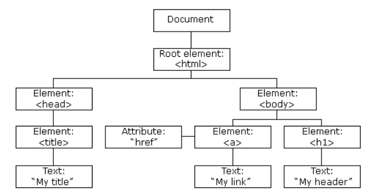

# html笔记


# css笔记


# JavaScript教程

显示日期的demo

```html
<!DOCTYPE html>
<html>
<head>
    <meta charset="UTF-8">
    <meta name="viewport" content="width=device-width, initial-scale=1.0">
    <title>js</title>
    <script>
        function showDate() {
            document.getElementById("date_text").innerHTML = Date();
        }

        function changeColor() {
            t = document.getElementById("date_text")
            c = t.style.color
            t.style.color="#ff0000"
        }
    </script>
</head>
<body>
    <p id="date_text">hello</p>
    <button style="width:50%" onclick="showDate()">显示日期</button>

    <script>
        document.write("<h1>这是一个标题</h1>")
        document.write("<p>这是一个段落</p>")
    </script>

    <button onclick='alert("hello")'>hello</button>
    <button onclick="changeColor()">changeColor</button>
</body>
</html>
```

JavaScript 是一种轻量级的编程语言。

JavaScript 是可插入 HTML 页面的编程代码。

JavaScript 插入 HTML 页面后，可由所有的现代浏览器执行。


HTML 中的脚本必须位于 `<script>和</script>` 标签之间。

脚本可被放置在 HTML 页面的 <body> 和 <head> 部分中。

通常的做法是把函数放入 <head> 部分中，或者放在页面底部。这样就可以把它们安置到同一处位置，不会干扰页面的内容。

也可以把脚本保存到外部文件中。外部文件通常包含被多个网页使用的代码。

外部 JavaScript 文件的文件扩展名是 .js。

如需使用外部文件，请在 <script> 标签的 "src" 属性中设置该 .js 文件：

```html
<!DOCTYPE html>
<html>
<body>
<script src="myScript.js"></script>
</body>
</html>
```

JavaScript 可以通过不同的方式来输出数据：

- 使用 **window.alert()** 弹出警告框。
- 使用 **document.write()** 方法将内容写到 HTML 文档中。
- 使用 **innerHTML** 写入到 HTML 元素。
- 使用 **console.log()** 写入到浏览器的控制台。


**语法**

**数字（Number）字面量** 可以是整数或者是小数，或者是科学计数(e)。

```
3.14
1001
123e5
```

**字符串（String）字面量** 可以使用单引号或双引号

```
"John Doe"

'John Doe'
```

**数组（Array）字面量** 定义一个数组：

```
[40, 100, 1, 5, 25, 10]
```

**对象（Object）字面量** 定义一个对象：

```
{firstName:"John", lastName:"Doe", age:50, eyeColor:"blue"}
```

**函数（Function）字面量** 定义一个函数：

```
function myFunction(a, b) { return a * b;}
```

 在编程语言中，变量用于存储数据值。

JavaScript 使用关键字 **var** 来定义变量， 使用等号来为变量赋值：

```
var x, length

x = 5
length = 6
```

JavaScript 语句向浏览器发出的命令。

语句是用分号分隔：

```
x = 5 + 6;
y = x * 10;
在 JavaScript 中，用分号来结束语句是可选的。
```

数据类型：

```
var length = 16;                                  // Number 通过数字字面量赋值 
var points = x * 10;                              // Number 通过表达式字面量赋值
var lastName = "Johnson";                         // String 通过字符串字面量赋值
var cars = ["Saab", "Volvo", "BMW"];              // Array  通过数组字面量赋值
var person = {firstName:"John", lastName:"Doe"};  // Object 通过对象字面量赋值
```

JavaScript 对大小写是敏感的。

函数 **getElementById** 与 **getElementbyID** 是不同的。

同样，变量 **myVariable** 与 **MyVariable** 也是不同的。

JavaScript 使用 Unicode 字符集。

Unicode 覆盖了所有的字符，包含标点等字符。

JavaScript 可以分批地组合起来。

代码块以左花括号开始，以右花括号结束。

代码块的作用是一并地执行语句序列。

```js
function myFunction()
{
    document.getElementById("demo").innerHTML="你好Dolly";
    document.getElementById("myDIV").innerHTML="你最近怎么样?";
}
```

您可以在文本字符串中使用反斜杠对代码行进行换行。下面的例子会正确地显示：

```js
document.write("你好 \
世界!");
```

单行注释以 // 开头, 多行注释以 /* 开始，以 */ 结尾。

在计算机程序中，经常会声明无值的变量。未使用值来声明的变量，其值实际上是 **undefined**。

在执行过以下语句后，变量 carname 的值将是 undefined：

```
var carname;
```


## **数据类型**

**值类型(基本类型)**：字符串（String）、数字(Number)、布尔(Boolean)、对空（Null）、未定义（Undefined）、Symbol。

**引用数据类型**：对象(Object)、数组(Array)、函数(Function)。

JavaScript 拥有动态类型。这意味着相同的变量可用作不同的类型：

```
var x;               // x 为 undefined
var x = 5;           // 现在 x 为数字
var x = "John";      // 现在 x 为字符串
```

您可以在字符串中使用引号，只要不匹配包围字符串的引号即可：

```js
var answer="It's alright";
var answer="He is called 'Johnny'";
var answer='He is called "Johnny"';
```

对象由花括号分隔。在括号内部，对象的属性以名称和值对的形式 (name : value) 来定义。属性由逗号分隔：

```
var person={firstname:"John", lastname:"Doe", id:5566};

//属性访问
name=person.lastname;
name=person["lastname"];
```

Undefined 这个值表示变量不含有值。

可以通过将变量的值设置为 null 来清空变量。

```
cars=null;
person=null;
```


定义 JavaScript 对象可以跨越多行，空格跟换行不是必须的：

```
var person = {
    firstName:"John",
    lastName:"Doe",
    age:50,
    eyeColor:"blue"
};
```

**对象属性**

但是，我们通常认为 "JavaScript 对象是键值对的容器"。

键值对通常写法为 **name : value** (键与值以冒号分割)。

键值对在 JavaScript 对象通常称为 **对象属性**。JavaScript 对象是变量的容器。


**对象方法**

对象的方法定义了一个函数，并作为对象的属性存储。

对象方法通过添加 () 调用 (作为一个函数)。

该实例访问了 person 对象的 fullName() 方法:

你可以使用以下语法创建对象方法：

```
methodName : function() { code lines }
```

你可以使用以下语法访问对象方法：

```
objectName.methodName()
```

通常 fullName() 是作为 person 对象的一个方法， fullName 是作为一个属性。


**函数**

函数就是包裹在花括号中的代码块，前面使用了关键词 function：

当调用该函数时，会执行函数内的代码。

在调用函数时，您可以向其传递值，这些值被称为参数。

这些参数可以在函数中使用。

您可以发送任意多的参数，由逗号 (,) 分隔：

```js
function functionname()
{
    // 执行代码
}

function myFunction(var1,var2)
{

}

function myFunction(name,job){
    alert("Welcome " + name + ", the " + job);
}

/**
有时，我们会希望函数将值返回调用它的地方。
通过使用 return 语句就可以实现。
在使用 return 语句时，函数会停止执行，并返回指定的值。
**/
function myFunction()
{
    var x=5;
    return x;
}

```

在 JavaScript 函数内部声明的变量（使用 var）是*局部*变量，所以只能在函数内部访问它。（该变量的作用域是局部的）。

您可以在不同的函数中使用名称相同的局部变量，因为只有声明过该变量的函数才能识别出该变量。

只要函数运行完毕，本地变量就会被删除。

在函数外声明的变量是*全局*变量，网页上的所有脚本和函数都能访问它。

JavaScript 变量的生命期从它们被声明的时间开始。

局部变量会在函数运行以后被删除。

全局变量会在页面关闭后被删除

> **如果您把值赋给尚未声明的变量，该变量将被自动作为 window 的一个属性。**

```
carname="Volvo";
```

将声明 window 的一个属性 carname。

非严格模式下给未声明变量赋值创建的全局变量，是全局对象的可配置属性，可以删除。

```js
var var1 = 1; // 不可配置全局属性
var2 = 2; // 没有使用 var 声明，可配置全局属性

console.log(this.var1); // 1
console.log(window.var1); // 1

delete var1; // false 无法删除
console.log(var1); //1

delete var2; 
console.log(delete var2); // true
console.log(var2); // 已经删除 报错变量未定义
```

如果变量在函数内没有声明（没有使用 var 关键字），该变量为全局变量。

以下实例中 carName 在函数内，但是为全局变量。

```js
// 此处可调用 carName 变量
 
function myFunction() {
    carName = "Volvo";
    // 此处可调用 carName 变量
}
```

函数参数只在函数内起作用，是局部变量。

在 HTML 中, 全局变量是 window 对象: 所有数据变量都属于 window 对象。

```js
//此处可使用 window.carName
 
function myFunction() {
    carName = "Volvo";
}
```


**事件**

以下是 HTML 事件的实例：

- HTML 页面完成加载
- HTML input 字段改变时
- HTML 按钮被点击

通常，当事件发生时，你可以做些事情。

在事件触发时 JavaScript 可以执行一些代码。

HTML 元素中可以添加事件属性，使用 JavaScript 代码来添加 HTML 元素。

```
<button onclick="getElementById('demo').innerHTML=Date()">现在的时间是?</button>

//代码将修改自身元素的内容 (使用 this.innerHTML):
<button onclick="this.innerHTML=Date()">现在的时间是?</button>
```


下面是一些常见的HTML事件的列表:

| 事件        | 描述                         |
| ----------- | ---------------------------- |
| onchange    | HTML 元素改变                |
| onclick     | 用户点击 HTML 元素           |
| onmouseover | 用户在一个HTML元素上移动鼠标 |
| onmouseout  | 用户从一个HTML元素上移开鼠标 |
| onkeydown   | 用户按下键盘按键             |
| onload      | 浏览器已完成页面的加载       |

if else / switch / while等类似java:

```js
if (condition)
{
    当条件为 true 时执行的代码
}
else
{
    当条件不为 true 时执行的代码
}

switch(n)
{
    case 1:
        执行代码块 1
        break;
    case 2:
        执行代码块 2
        break;
    default:
        与 case 1 和 case 2 不同时执行的代码
}

for (var i=0;i<cars.length;i++)
{ 
    document.write(cars[i] + "<br>");
}

var person={fname:"John",lname:"Doe",age:25};  
for (x in person)  // x 为属性名
{
    txt=txt + person[x];
}

while (i<5)
{
    x=x + "The number is " + i + "<br>";
    i++;
}
```

你可以使用 typeof 操作符来检测变量的数据类型。

```js
typeof "John"                // 返回 string 
typeof 3.14                  // 返回 number
typeof false                 // 返回 boolean
typeof [1,2,3,4]             // 返回 object
typeof {name:'John', age:34} // 返回 object
```

全局方法 **String()** 可以将数字转换为字符串。

该方法可用于任何类型的数字，字母，变量，表达式：

```js
String(x)         // 将变量 x 转换为字符串并返回
String(123)       // 将数字 123 转换为字符串并返回
String(100 + 23)  // 将数字表达式转换为字符串并返回
```

Number 方法 **toString()** 也是有同样的效果。

```
x.toString()
(123).toString()
(100 + 23).toString()
```

全局方法 **Number()** 可以将字符串转换为数字。

```js
Number("3.14")    // 返回 3.14
Number(" ")       // 返回 0 
Number("")        // 返回 0
Number("99 88")   // 返回 NaN

Number(false)     // 返回 0
Number(true)      // 返回 1

d = new Date();
Number(d)          // 返回 1404568027739

d = new Date();
d.getTime()        // 返回 1404568027739


```

| parseFloat() | 解析一个字符串，并返回一个浮点数。 |
| ------------ | ---------------------------------- |
| parseInt()   | 解析一个字符串，并返回一个整数。   |


当 JavaScript 尝试操作一个 "错误" 的数据类型时，会自动转换为 "正确" 的数据类型。

```
5 + null    // 返回 5         null 转换为 0
"5" + null  // 返回"5null"   null 转换为 "null"
"5" + 1     // 返回 "51"      1 转换为 "1"  
"5" - 1     // 返回 4         "5" 转换为 5
```

当你尝试输出一个对象或一个变量时 JavaScript 会自动调用变量的 toString() 方法：


**正则表达式**

```
/正则表达式主体/修饰符(可选)
var patt = /runoob/i
```

**/runoob/i**  是一个正则表达式。

**runoob**  是一个**正则表达式主体** (用于检索)。

**i**  是一个**修饰符** (搜索不区分大小写)。

在 JavaScript 中，正则表达式通常用于两个字符串方法 : search() 和 replace()。

**search() 方法** 用于检索字符串中指定的子字符串，或检索与正则表达式相匹配的子字符串，并返回子串的起始位置。

**replace() 方法** 用于在字符串中用一些字符替换另一些字符，或替换一个与正则表达式匹配的子串。

```js
var str = "Visit Runoob!"; 
var n = str.search(/Runoob/i);
输出6
```

search 方法可使用字符串作为参数。字符串参数会转换为正则表达式

```js
var str = "Visit Runoob!"; 
var n = str.search("Runoob");
```

使用正则表达式且不区分大小写将字符串中的 Microsoft 替换为 Runoob :

```js
var str = document.getElementById("demo").innerHTML; 
var txt = str.replace(/microsoft/i,"Runoob");

//replace() 方法将接收字符串作为参数
var str = document.getElementById("demo").innerHTML; 
var txt = str.replace("Microsoft","Runoob");
```


当错误发生时，当事情出问题时，JavaScript 引擎通常会停止，并生成一个错误消息。

描述这种情况的技术术语是：JavaScript 将**抛出**一个错误。

```js
try {
    ...    //异常的抛出
} catch(e) {
    ...    //异常的捕获与处理
} finally {
    ...    //结束处理
}

var txt=""; 
function message() 
{ 
    try { 
        adddlert("Welcome guest!"); 
    } catch(err) { 
        txt="本页有一个错误。\n\n"; 
        txt+="错误描述：" + err.message + "\n\n"; 
        txt+="点击确定继续。\n\n"; 
        alert(txt); 
    } 
}
```

finally 语句不论之前的 try 和 catch 中是否产生异常都会执行该代码块。

throw 语句允许我们创建自定义错误。

正确的技术术语是：创建或**抛出异常**（exception）。

```
throw exception
```


变量提升：函数声明和变量声明总是会被解释器悄悄地被"提升"到方法体的最顶部。

"use strict" 指令在 JavaScript 1.8.5 (ECMAScript5) 中新增。

它不是一条语句，但是是一个字面量表达式，在 JavaScript 旧版本中会被忽略。

"use strict" 的目的是指定代码在严格条件下执行。

严格模式下你不能使用未声明的变量。

严格模式通过在脚本或函数的头部添加 "use strict"; 表达式来声明。


在常规的比较中，数据类型是被忽略的，以下 if 条件语句返回 true：

```
var x = 10;
var y = "10";
if (x == y)
```

在严格的比较运算中，=== 为恒等计算符，同时检查表达式的值与类型，以下 if 条件语句返回 false：

```
var x = 10;
var y = "10";
if (x === y)
```

switch 语句会使用恒等计算符(===)进行比较


面向对象语言中 this 表示当前对象的一个引用。

但在 JavaScript 中 this 不是固定不变的，它会随着执行环境的改变而改变。

- 在方法中，this 表示该方法所属的对象。
- 如果单独使用，this 表示全局对象。
- 在函数中，this 表示全局对象。
- 在函数中，在严格模式下，this 是未定义的(undefined)。
- 在事件中，this 表示接收事件的元素。
- 类似 call() 和 apply() 方法可以将 this 引用到任何对象。


使用 var 关键字重新声明变量可能会带来问题。

在块中重新声明变量也会重新声明块外的变量

```
var x = 10;
// 这里输出 x 为 10
{ 
    var x = 2;
    // 这里输出 x 为 2
}
// 这里输出 x 为 2
```

let 关键字就可以解决这个问题，因为它只在 let 命令所在的代码块 **{}** 内有效。

```js
var x = 10;
// 这里输出 x 为 10
{ 
    let x = 2;
    // 这里输出 x 为 2
}
// 这里输出 x 为 10
```


const 用于声明一个或多个常量，声明时必须进行初始化，且初始化后值不可再修改：

```
const PI = 3.141592653589793;
PI = 3.14;      // 报错
PI = PI + 10;   // 报错
```

const 的本质: const 定义的变量并非常量，并非不可变，它定义了一个常量引用一个值。使用 const 定义的对象或者数组，其实是可变的。下面的代码并不会报错：

```js
// 创建常量对象
const car = {type:"Fiat", model:"500", color:"white"};
 
// 修改属性:
car.color = "red";
 
// 添加属性
car.owner = "Johnson";
```


JSON **语法规则**

- 数据为 键/值 对。
- 数据由逗号分隔。
- 大括号保存对象
- 方括号保存数组

```js
"sites":[
    {"name":"Runoob", "url":"www.runoob.com"}, 
    {"name":"Google", "url":"www.google.com"},
    {"name":"Taobao", "url":"www.taobao.com"}
]
```

用 JavaScript 内置函数 JSON.parse() 将字符串转换为 JavaScript 对象:

```js
var text = '{ "sites" : [' +
    '{ "name":"Runoob" , "url":"www.runoob.com" },' +
    '{ "name":"Google" , "url":"www.google.com" },' +
    '{ "name":"Taobao" , "url":"www.taobao.com" } ]}';
    
obj = JSON.parse(text);
document.getElementById("demo").innerHTML = obj.sites[1].name + " " + obj.sites[1].url;
```

```js
//用于将 JavaScript 值转换为 JSON 字符串。
var str = {"name":"菜鸟教程", "site":"http://www.runoob.com"}
str_pretty1 = JSON.stringify(str)
```


当网页被加载时，浏览器会创建页面的文档对象模型（Document Object Model）。

**HTML DOM** 模型被构造为**对象**的树：



通过可编程的对象模型，JavaScript 获得了足够的能力来创建动态的 HTML。

- JavaScript 能够改变页面中的所有 HTML 元素
- JavaScript 能够改变页面中的所有 HTML 属性
- JavaScript 能够改变页面中的所有 CSS 样式
- JavaScript 能够对页面中的所有事件做出反应

在 DOM 中查找 HTML 元素的最简单的方法，是通过使用元素的 id。

```js
var x=document.getElementById("intro");
var x=document.getElementById("main");
var y=x.getElementsByTagName("p");//通过标签名查找
var x=document.getElementsByClassName("intro");//查找 class="intro" 的元素

var element=document.getElementById("header");
element.innerHTML="新标题"; //改变内容
document.getElementById("image").src="landscape.jpg";//改变属性

document.getElementById("p2").style.color="blue";//改变样式
document.getElementById("p2").style.fontFamily="Arial";
document.getElementById("p2").style.fontSize="larger";
```

**鼠标事件**

onmousedown, onmouseup 以及 onclick 构成了鼠标点击事件的所有部分。首先当点击鼠标按钮时，会触发 onmousedown 事件，当释放鼠标按钮时，会触发 onmouseup 事件，最后，当完成鼠标点击时，会触发 onclick 事件。

```html
<!DOCTYPE html>
<html>
<head>
<meta charset="utf-8">
<title>菜鸟教程(runoob.com)</title>
</head>
<body>

<div onmouseover="mOver(this)" onmouseout="mOut(this)" style="background-color:#D94A38;width:120px;height:20px;padding:40px;">Mouse Over Me</div>
<script>
function mOver(obj){
	obj.innerHTML="Thank You"
}
function mOut(obj){
	obj.innerHTML="Mouse Over Me"
}
</script>

</body>
</html>
```


在用户点击按钮时触发监听事件

```
document.getElementById("myBtn").addEventListener("click", displayDate);
element.addEventListener("click", function(){ alert("Hello World!"); });
```

addEventListener() 方法允许向同一个元素添加多个事件，且不会覆盖已存在的事件：

```js
element.addEventListener("click", myFunction);
element.addEventListener("click", mySecondFunction);

element.addEventListener("mouseover", myFunction);
element.addEventListener("click", mySecondFunction);
element.addEventListener("mouseout", myThirdFunction);

//当用户重置窗口大小时添加事件监听
window.addEventListener("resize", function(){
    document.getElementById("demo").innerHTML = sometext;
});

// 当传递参数值时，使用"匿名函数"调用带参数的函数：
element.addEventListener("click", function(){ myFunction(p1, p2); });

element.removeEventListener("mousemove", myFunction);
```


**结点**

```java
<div id="div1">
<p id="p1">这是一个段落。</p>
<p id="p2">这是另外一个段落。</p>
</div>
 
<script> 
//创建并添加结点
var para = document.createElement("p");
var node = document.createTextNode("这是一个新的段落。");
para.appendChild(node);
 
var element = document.getElementById("div1");
var child = document.getElementById("p1");
element.insertBefore(para, child);
</script>


<div id="div1">
<p id="p1">这是一个段落。</p>
<p id="p2">这是另外一个段落。</p>
</div>
 
<script>
//移除结点
var parent = document.getElementById("div1");
var child = document.getElementById("p1");
parent.removeChild(child);
</script>

//替换结点
<script>
var para = document.createElement("p");
var node = document.createTextNode("这是一个新的段落。");
para.appendChild(node);
 
var parent = document.getElementById("div1");
var child = document.getElementById("p1");
parent.replaceChild(para, child);
</script>
```

结点集合

```java
//修改所有 <p> 元素的背景颜色: getElementsByTagName() 方法返回 HTMLCollection 对象。
var myCollection = document.getElementsByTagName("p");
var i;
for (i = 0; i < myCollection.length; i++) {
    myCollection[i].style.backgroundColor = "red";
}

//大部分浏览器的 querySelectorAll() 返回 NodeList 对象
var myNodelist = document.querySelectorAll("p");
var i;
for (i = 0; i < myNodelist.length; i++) {
    myNodelist[i].style.backgroundColor = "red";
}

```


## 对象

JavaScript 中的所有事物都是对象：字符串、数值、数组、函数...

此外，JavaScript 允许自定义对象。

JavaScript 提供多个内建对象，比如 String、Date、Array 等等。 对象只是带有属性和方法的特殊数据类型。

对象只是一种特殊的数据。对象拥有**属性**和**方法**。

创建了对象的一个新实例，并向其添加了四个属性：

```js
person=new Object();
person.firstname="John";
person.lastname="Doe";
person.age=50;
person.eyecolor="blue";

或者
person={firstname:"John",lastname:"Doe",age:50,eyecolor:"blue"};

使用构造器
function person(firstname,lastname,age,eyecolor)
{
    this.firstname=firstname;
    this.lastname=lastname;
    this.age=age;
    this.eyecolor=eyecolor;
}

function person(firstname,lastname,age,eyecolor)
{
    this.firstname=firstname;
    this.lastname=lastname;
    this.age=age;
    this.eyecolor=eyecolor;

    this.changeName=changeName;
    function changeName(name)
    {
        this.lastname=name;
    }
}


```

所有的 JavaScript 对象都会从一个 prototype（原型对象）中继承属性和方法。

所有 JavaScript 中的对象都是位于原型链顶端的 Object 的实例。

JavaScript 对象有一个指向一个原型对象的链。当试图访问一个对象的属性时，它不仅仅在该对象上搜寻，还会搜寻该对象的原型，以及该对象的原型的原型，依次层层向上搜索，直到找到一个名字匹配的属性或到达原型链的末尾。

`Date` 对象, `Array` 对象, 以及 `Person` 对象从 `Object.prototype` 继承。

有的时候我们想要在所有已经存在的对象添加新的属性或方法。

另外，有时候我们想要在对象的构造函数中添加属性或方法。

使用 prototype 属性就可以给对象的构造函数添加新的属性和方法：

```js
function Person(first, last, age, eyecolor) {
  this.firstName = first;
  this.lastName = last;
  this.age = age;
  this.eyeColor = eyecolor;
}
 
Person.prototype.nationality = "English";
Person.prototype.name = function() {
  return this.firstName + " " + this.lastName;
}
```


所有浏览器都支持 window 对象。它表示**浏览器窗口**。

所有 JavaScript 全局对象、函数以及变量均自动成为 window 对象的成员。

全局变量是 window 对象的属性。

全局函数是 window 对象的方法。

甚至 HTML DOM 的 document 也是 window 对象的属性之一：

```
window.document.getElementById("header");
```

与此相同：

```
document.getElementById("header");
```

浏览器的宽高获取

```js
var w=window.innerWidth
|| document.documentElement.clientWidth
|| document.body.clientWidth;

var h=window.innerHeight
|| document.documentElement.clientHeight
|| document.body.clientHeight;

window.open() - 打开新窗口
window.close() - 关闭当前窗口
window.moveTo() - 移动当前窗口
window.resizeTo() - 调整当前窗口的尺寸

screen.availWidth - 可用的屏幕宽度
screen.availHeight - 可用的屏幕高度
screen.availWidth 属性返回访问者屏幕的宽度，以像素计，减去界面特性，比如窗口任务栏。
```

**window.location** 对象在编写时可不使用 window 这个前缀。 一些例子：

一些实例:

- location.hostname 返回 web 主机的域名
- location.pathname 返回当前页面的路径和文件名
- location.port 返回 web 主机的端口 （80 或 443）
- location.protocol 返回所使用的 web 协议（http:// 或 https://）
- location.href 属性返回当前页面的 URL
- location.pathname 属性返回 URL 的路径名。


- **window.history**对象在编写时可不使用 window 这个前缀。

  - history.back() - 与在浏览器点击后退按钮相同
  - history.forward() - 与在浏览器中点击向前按钮相同

    

**弹窗**

**window.alert()** 方法可以不带上window对象，直接使用**alert()**方法。

确认框通常用于验证是否接受用户操作。

当确认卡弹出时，用户可以点击 "确认" 或者 "取消" 来确定用户操作。

当你点击 "确认", 确认框返回 true， 如果点击 "取消", 确认框返回 false。

```
window.confirm("sometext");
```

提示框经常用于提示用户在进入页面前输入某个值。

当提示框出现后，用户需要输入某个值，然后点击确认或取消按钮才能继续操纵。

如果用户点击确认，那么返回值为输入的值。如果用户点击取消，那么返回值为 null。

```js
var person=prompt("请输入你的名字","Harry Potter");
if (person!=null && person!="")
{
    x="你好 " + person + "! 今天感觉如何?";
    document.getElementById("demo").innerHTML=x;
}
```

通过使用 JavaScript，我们有能力做到在一个设定的时间间隔之后来执行代码，而不是在函数被调用后立即执行。我们称之为计时事件。

在 JavaScritp 中使用计时事件是很容易的，两个关键方法是:

- setInterval() - 间隔指定的毫秒数不停地执行指定的代码。
- setTimeout() - 在指定的毫秒数后执行指定代码。

setInterval() 和 setTimeout() 是 HTML DOM Window对象的两个方法。

```js
//每三秒弹出 "hello" 
myVar = setInterval(function(){alert("Hello")},3000);

clearInterval(myVar) 方法用于停止 setInterval() 方法执行的函数代码。

//等待3秒，然后弹出 "Hello":
setTimeout(function(){alert("Hello")},3000);
```


JavaScript 可以使用 **document.cookie** 属性来创建 、读取、及删除 cookie。


JavaScript 高级程序设计（特别是对浏览器差异的复杂处理），通常很困难也很耗时。

为了应对这些调整，许多的 **JavaScript (helper)** 库应运而生。

这些 JavaScript 库常被称为 **JavaScript 框架**。


jQuery 是目前最受欢迎的 JavaScript 框架。

它使用 CSS 选择器来访问和操作网页上的 HTML 元素（DOM 对象）。

jQuery 同时提供 companion UI（用户界面）和插件。


为了引用某个库，请使用 <script> 标签，其 src 属性设置为库的 URL：

```js
<head>
<script src="https://cdn.staticfile.org/jquery/1.8.3/jquery.min.js">
</script>
</head>
```

主要的 jQuery 函数是 $() 函数（jQuery 函数）。如果您向该函数传递 DOM 对象，它会返回 jQuery 对象，带有向其添加的 jQuery 功能。

jQuery 允许您通过 CSS 选择器来选取元素。

在 JavaScript 中，您可以分配一个函数以处理窗口加载事件：

```js
function myFunction()
{
    var obj=document.getElementById("h01");
    obj.innerHTML="Hello jQuery";
}
onload=myFunction;

//jquery实现
function myFunction()
{
    $("#h01").html("Hello jQuery");
}
$(document).ready(myFunction);

function myFunction()
{
    $("#h01").attr("style","color:red").html("Hello jQuery")
}
```

jQuery 允许链接（链式语法）。

链接（Chaining）是一种在同一对象上执行多个任务的便捷方法。