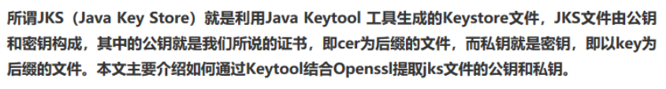

## 1 HTTP

HTTP 协议是Hyper Text Transfer Protocol（超文本传输协议）的缩写，是基于 **TCP/IP 协议**的[**应用层协议**](http://www.ruanyifeng.com/blog/2012/05/internet_protocol_suite_part_i.html)。它不涉及数据包（packet）传输，主要规定了客户端和服务器之间的**通信格式**，默认使用80端口。

HTTP是一个基于TCP/IP通信协议来传递数据（HTML 文件, 图片文件, 查询结果等）。

HTTP协议工作于客户端-服务端架构为上。浏览器作为HTTP客户端通过URL向HTTP服务端即WEB服务器发送所有请求。

Web服务器有：Apache服务器，IIS服务器（Internet Information Services）等。


##### HTTP 0.9介绍

最早版本是1991年发布的0.9版，只有一个命令 `GET /index.html`，表示建立TCP连接后客户端向服务器请求网页 index.html，协议规定只能回应html格式的字符串，服务发送完毕后就关闭TCP连接。

##### HTTP 1.0介绍

1996年 HTTP 1.0版本发布，规定可以传输任何格式的内容，图片、视频、二进制文件；并且引入了POST和HEAD命令；HTTP的请求和回应添加了HTTP header，用来描述一些元数据。还包括状态码，权限，缓存和内容编码等。

下面是1.0版本的请求命令：

```http
GET / HTTP/1.0
User-Agent: Mozilla/5.0 (Macintosh; Intel Mac OS X 10_10_5)
Accept: */*
```

第一行是请求命令，必须要添加协议版本，后面是请求头，描述客户端信息。

服务器回应如下：

```http
HTTP/1.0 200 OK 
Content-Type: text/plain
Content-Length: 137582
Expires: Thu, 05 Dec 1997 16:00:00 GMT
Last-Modified: Wed, 5 August 1996 15:55:28 GMT
Server: Apache 0.84

<html>
  <body>Hello World</body>
</html>
```

回应格式是：头信息 + 一个空行 + 数据；

第一行是协议版本 + 状态码 + 状态描述；

**Content-Type**: 关于字符的编码，1.0版规定，头信息必须是 ASCII 码，后面的数据可以是任何格式。因此，服务器回应的时候，必须告诉客户端，**数据是什么格式**，这就是`Content-Type`字段的作用。

```
text/plain
text/html
text/css
image/jpeg
image/png
image/svg+xml
audio/mp4
video/mp4
application/javascript
application/pdf
application/zip
application/atom+xml
```

这些数据类型总称为`MIME type`，每个值包括**一级类型和二级类型**，之间用斜杠分隔。

除了预定义的类型，厂商也可以自定义类型。

```
application/vnd.debian.binary-package
```

`MIME type`还可以在尾部使用分号，添加参数。

```
Content-Type: text/html; charset=utf-8
```

上面的类型表明，发送的是网页，而且编码是UTF-8。

客户端请求的时候，可以使用`Accept`字段声明自己可以接受哪些数据格式。

```
Accept: */*
```

上面代码中，客户端声明自己可以接受任何格式的数据。

`MIME type`不仅用在HTTP协议，还可以用在其他地方，比如HTML网页。

```
<meta http-equiv="Content-Type" content="text/html; charset=UTF-8" />
<!-- 等同于 -->
<meta charset="utf-8" /> 
```


**Content-Encoding**：字段说明数据的压缩方法，由于发送的数据可以是任何格式，因此可以把数据压缩后再发送。

```
Content-Encoding: gzip
Content-Encoding: compress
Content-Encoding: deflate
```

客户端在请求时，用`Accept-Encoding`字段说明自己可以接受哪些压缩方法。

```
Accept-Encoding: gzip, deflate
```

##### HTTP 1.0的缺点

每个TCP连接只能发送一个请求。发送数据完毕，连接就关闭，如果还要请求其他资源，就必须再新建一个连接。即每个TCP连接只能进行一次HTTP请求应答。

TCP连接的新建成本很高，因为需要客户端和服务器**三次握手**，并且开始时发送速率较慢（**slow star**t）。所以，HTTP 1.0版本的性能比较差。随着网页加载的外部资源越来越多，这个问题就愈发突出了。

为了解决这个问题，有些浏览器在请求时，用了一个非标准的`Connection`字段。

```
Connection: keep-alive
```

这个字段要求服务器不要关闭TCP连接，以便**其他请求复用**。服务器同样回应这个字段。

一个可以复用的TCP连接就建立了，直到**客户端或服务器主动关闭连接。**但是，这不是标准字段，不同实现的行为可能不一致，因此不是根本的解决办法。

##### HTTP/1.1 介绍

1997年1月，HTTP/1.1 版本发布，只比 1.0 版本晚了半年。它进一步完善了 HTTP 协议，一直用到了20年后的今天，直到现在还是**最流行**的版本。

1 、1.1 版的最大变化，就是引入了**持久连接**（persistent connection），即TCP连接默认不关闭，可以被多个请求复用，不用显式声明`Connection: keep-alive`。客户端和服务器发现对方一段时间没有活动，就可以主动关闭连接。不过，规范的做法是，客户端在最后一个请求时，发送`Connection: close`，明确要求服务器关闭TCP连接。

```
Connection: close
```

目前，对于**同一个域名**，大多数浏览器允许**同时建立6个**持久连接。

2、 1.1 版还引入了**管道机制**（pipelining），即在同一个TCP连接里面，客户端可以同时发送多个请求。这样就进一步改进了HTTP协议的效率。客户端可以同时发生多个请求，服务端根据请求顺序依次返回响应。

举例来说，客户端需要请求两个资源。以前的做法是，在同一个TCP连接里面，先发送A请求，然后等待服务器做出回应，收到后再发出B请求。管道机制则是允许浏览器同时发出A请求和B请求，但是服务器还是按照顺序，先回应A请求，完成后再回应B请求。

3、 **Content-Length: **一个TCP连接现在可以传送多个回应，势必就要有一种机制，区分数据包是属于哪一个回应的。这就是`Content-length`字段的作用，声明本次回应的数据长度。

```
Content-Length: 3495
```

上面代码告诉浏览器，**本次回应的长度**是3495个字节，后面的字节就属于下一个回应了。

在1.0版中，`Content-Length`字段不是必需的，因为浏览器发现服务器关闭了TCP连接，就表明收到的数据包已经全了。

**分块传输编码**: 使用`Content-Length`字段的前提条件是，服务器发送回应之前，必须知道回应的数据长度。

对于一些很**耗时**的动态操作来说，这意味着，服务器要等到所有操作完成，才能发送数据，显然这样的效率不高。更好的处理方法是，产生一块数据，就发送一块，采用"**流模式**"（stream）取代"缓存模式"（buffer）。

因此，1.1版规定可以不使用`Content-Length`字段，而使用["分块传输编码"](https://zh.wikipedia.org/wiki/%E5%88%86%E5%9D%97%E4%BC%A0%E8%BE%93%E7%BC%96%E7%A0%81)（chunked transfer encoding）。只要请求或回应的头信息有`Transfer-Encoding`字段，就表明回应将由数量未定的数据块组成。

```
Transfer-Encoding: chunked
```

每个非空的数据块之前，会有一个16进制的数值，表示这个块的长度。最后是一个大小为0的块，就表示本次回应的数据发送完了。下面是一个例子。

```http
HTTP/1.1 200 OK
Content-Type: text/plain
Transfer-Encoding: chunked

25
This is the data in the first chunk

1C
and this is the second one

3
con

8
sequence

0
```

4、 1.1版还新增了许多动词方法：`PUT`、`PATCH`、`HEAD`、 `OPTIONS`、`DELETE`。

另外，客户端请求的头信息新增了`Host`字段，用来指定服务器的域名。

```
Host: www.example.com
```

有了`Host`字段，就可以将请求发往同一台服务器上的不同网站，为虚拟主机的兴起打下了基础。

##### HTTP / 1.1 缺点

虽然1.1版允许复用TCP连接，但是同一个TCP连接里面，所有的数据通信是按次序进行的。

服务器只有处理完一个回应，才会进行下一个回应。

要是前面的回应特别慢，后面就会有许多请求排队等着。这称为["队头堵塞"](https://zh.wikipedia.org/wiki/%E9%98%9F%E5%A4%B4%E9%98%BB%E5%A1%9E)（Head-of-line blocking）。

为了避免这个问题，只有两种方法：一是**减少请求数**，二是**同时多开持久连接**。这导致了很多的网页优化技巧，比如合并脚本和样式表、将图片嵌入CSS代码、域名分片（domain sharding）等等。如果HTTP协议设计得更好一些，这些额外的工作是可以避免的。

##### HTTP 2.0 介绍

2015年，HTTP/2 发布。它不叫 HTTP/2.0，是因为标准委员会不打算再发布子版本了，下一个新版本将是 HTTP/3。

有以下几个改进:

1 二进制协议 : HTTP/1.1 版的头信息肯定是文本（ASCII编码），数据体可以是文本，也可以是二进制。HTTP/2 则是一个彻底的二进制协议，头信息和数据体都是二进制，并且统称为"帧"（frame）：头信息帧和数据帧。


2 多工： 双向 实时通信；HTTP/2 复用TCP连接，在一个连接里，客户端和浏览器都可以同时发送多个请求或回应，而且不用按照顺序一一对应，这样就避免了"队头堵塞"。

举例来说，在一个TCP连接里面，服务器同时收到了A请求和B请求，于是先回应A请求，结果发现处理过程非常耗时，于是就发送A请求已经处理好的部分， 接着回应B请求，完成后，再发送A请求剩下的部分。


3 数据流：因为 HTTP/2 的数据包是不按顺序发送的，同一个连接里面连续的数据包，可能属于不同的回应。因此，必须要对数据包做标记，指出它属于哪个回应。

HTTP/2 将每个请求或回应的所有数据包，称为一个数据流（stream）。每个数据流都有一个独一无二的编号。数据包发送的时候，都必须标记数据流ID，用来区分它属于哪个数据流。另外还规定，客户端发出的数据流，ID一律为奇数，服务器发出的，ID为偶数。


4 头信息压缩：HTTP 协议不带有状态，每次请求都必须附上所有信息。所以，请求的很多字段都是重复的，比如`Cookie`和`User Agent`，一模一样的内容，每次请求都必须附带，这会浪费很多带宽，也影响速度。

HTTP/2 对这一点做了优化，引入了头信息压缩机制（header compression）。一方面，头信息使用`gzip`或`compress`压缩后再发送；另一方面，客户端和服务器同时维护一张头信息表，所有字段都会存入这个表，生成一个索引号，以后就不发送同样字段了，只发送索引号，这样就提高速度了。


5 服务器推送：HTTP/2 允许服务器未经请求，主动向客户端发送资源，这叫做服务器推送（server push）。


##### HTTP 请求

URL(Uniform Resource Locator) 地址用于描述一个网络上的资源,  基本格式如下：

```
schema://host[:port#]/path/.../[?query-string][#anchor]
```

scheme               指定低层使用的协议(例如：http, https, ftp)

host                   HTTP服务器的IP地址或者域名

port#                 HTTP服务器的默认端口是80，这种情况下端口号可以省略。如果使用了别的端口，必须指明，例如 http://www.cnblogs.com:8080/

path                   访问资源的路径

query-string       发送给http服务器的数据

anchor-             锚

```http
http://www.mywebsite.com/sj/test/test.aspx?name=sviergn&x=true#stuff

Schema:                 http
host:                   www.mywebsite.com
path:                   /sj/test/test.aspx
Query String:           name=sviergn&x=true
Anchor:                 stuff
```

http协议是**无状态**的，同一个客户端的这次请求和上次请求是没有对应关系，对http服务器来说，它并不知道这两个请求来自同一个客户端。 为了解决这个问题， Web程序引入了Cookie机制来维护状态.

打开一个网页需要浏览器发送很多次Request:

1. 当你在浏览器输入URL http://www.cnblogs.com 的时候，浏览器发送一个Request去获取 http://www.cnblogs.com 的html.  服务器把Response发送回给浏览器.

2. 浏览器分析Response中的 HTML，发现其中引用了很多其他文件，比如图片，CSS文件，JS文件。

3. 浏览器会自动再次发送Request去获取图片，CSS文件，或者JS文件。

4. 等所有的文件都下载成功后。 网页就被显示出来了。

Request 消息的结构,   Request 消息分为3部分，第一部分叫Request line, 第二部分叫Request header, 第三部分是body.

header和body之间有个**空行**


##### HTTP 响应

Response消息的结构, 和Request消息的结构基本一样。 同样也分为三部分,第一部分叫Response line, 第二部分叫Response header，第三部分是body.

header和body之间也有个空行,  结构如下图


状态码：

Response 消息中的第一行叫做状态行，由HTTP协议版本号， 状态码， 状态消息 三部分组成。

状态码用来**告诉HTTP客户端,HTTP服务器是否产生了预期的Response**.

HTTP/1.1中定义了5类状态码， 状态码由三位数字组成，第一个数字定义了响应的类别

1XX  提示信息 - 表示请求已被成功接收，**继续处理**

2XX  成功 - 表示请求已被**成功**接收，理解，接受

3XX  **重定向** - 要完成请求必须进行更进一步的处理

4XX  **客户端错误** -  请求有语法错误或请求无法实现

5XX  服务器端错误 -   服务器未能实现合法的请求

一些常见的状态码：

200 OK：最常见的就是成功响应状态码200了， 这表明该请求被成功地完成，所请求的资源发送回客户端

302 Found：重定向，新的URL会在response 中的Location中返回，浏览器将会自动使用新的URL发出新的Request

例如在IE中输入， http://www.google.com. HTTP服务器会返回302， IE取到Response中Location header的新URL, 又重新发送了一个Request.

304 Not Modified：代表上次的文档已经被缓存了， 还可以继续使用。

提示：如果你不想使用本地缓存可以用Ctrl+F5 强制刷新页面

400 Bad Request：客户端请求与**语法错误**，不能被服务器所理解

403 Forbidden： 服务器收到请求，但是**拒绝提供服务**

404 Not Found ：请求资源不存在（输错了URL）

500 Internal Server Error ：服务器发生了不可预期的错误

503 Server Unavailable： 服务器**当前不能**处理客户端的请求，一段时间后可能恢复正常


参考：<http://www.ruanyifeng.com/blog/2016/08/http.html>

<https://www.cnblogs.com/TankXiao/archive/2012/02/13/2342672.html>


## 2 Json

JSON是JavaScript Object Notation的缩写，它是一种**轻量级数据交换格式**。

在JSON出现之前，大家一直用XML来传递数据。因为XML是一种纯文本格式，所以它适合在网络上交换数据。XML本身不算复杂，但是，加上DTD、XSD、XPath、XSLT等一大堆复杂的规范以后，任何正常的软件开发人员碰到XML都会感觉头大了，最后大家发现，即使你努力钻研几个月，也未必搞得清楚XML的规范。

终于，在2002年的一天，道格拉斯·克罗克福特（Douglas Crockford）同学为了拯救深陷水深火热同时又被某几个巨型软件企业长期愚弄的软件工程师，发明了JSON这种超轻量级的数据交换格式。

道格拉斯同学长期担任雅虎的高级架构师，自然钟情于JavaScript。他设计的JSON实际上是JavaScript的一个子集。在JSON中，一共就这么几种数据类型：

- number：和JavaScript的`number`完全一致；
- boolean：就是JavaScript的`true`或`false`；
- string：就是JavaScript的`string`；
- null：就是JavaScript的`null`；
- array：就是JavaScript的`Array`表示方式——`[]`；
- object：就是JavaScript的`{ ... }`表示方式。

以及上面的任意组合。

并且，JSON还定死了字符集必须是UTF-8，表示多语言就没有问题了。为了统一解析，JSON的字符串规定必须用双引号`""`，Object的键也必须用双引号`""`。

由于JSON非常简单，很快就风靡Web世界，并且成为ECMA标准。几乎所有编程语言都有解析JSON的库，而在JavaScript中，我们可以直接使用JSON，因为JavaScript内置了JSON的解析。

把任何JavaScript对象变成JSON，就是把这个对象序列化成一个JSON格式的字符串，这样才能够通过网络传递给其他计算机。

如果我们收到一个JSON格式的字符串，只需要把它反序列化成一个JavaScript对象，就可以在JavaScript中直接使用这个对象了。

JSON is built on two structures:

- A collection of **name/value pairs(键值对-类)**. In various languages, this is realized as an *object*, record, struct, dictionary, hash table, keyed list, or associative array.
- An ordered list of values(**数组**). In most languages, this is realized as an *array*, vector, list, or sequence.

An *object* is an unordered set of name/value pairs. An object begins with `{` (left brace) and ends with `}` (right brace). Each name is followed by `:` (colon) and the name/value pairs are separated by  `,` (comma).


An *array* is an ordered collection of values. An array begins with `[` (left bracket) and ends with `]` (right bracket). Values are separated by `,` (comma).

A *value* can be a *string* in double quotes, or a *number*, or `true` or `false` or `null`, or an *object* or an *array*. These structures can be nested.


Json的基础数据类型只有这几种：

true, false, null, 数字, 字符串（字符串只能被""包括）, object, array

object一般是 键值对 key-value，key是字符串，value可以上面的任意类型数据 。{"key" : value}

array 是value的集合， [value,  ... ,value]


java 中解析json的方式，使用第三方库：

```java
import org.json.*;


JSONObject obj = new JSONObject(" .... ");
String pageName = obj.getJSONObject("pageInfo").getString("pageName");

JSONArray arr = obj.getJSONArray("posts");
for (int i = 0; i < arr.length(); i++)
{
    String post_id = arr.getJSONObject(i).getString("post_id");
    ......
}
```


json例子：

```json
{
	"name": "Hans Chan",
	"age": 18,
	"tags": [
		{
			"id": 1,
			"text": "JavaScript"
		},
		{
			"id": 2,
			"text": "Java"
		}
	]
}
```

使用gson解析：

```java
import com.google.gson.Gson;
import com.google.gson.JsonElement;
import com.google.gson.JsonObject;
import com.google.gson.JsonParser;
import java.util.List;

public class JsonDemo {
    public static void main(String[] args) {
        String jsonStr = "{\n"
                + " \"name\": \"Hans Chan\",\n"
                + " \"age\": 18,\n"
                + " \"tags\": [\n"
                + " {\n"
                + " \"id\": 1,\n"
                + " \"text\": \"JavaScript\"\n"
                + " },\n"
                + " {\n"
                + " \"id\": 2,\n"
                + " \"text\": \"Java\"\n"
                + " }\n"
                + " ]\n"
                + " }";
        Gson gson = new Gson();

        //转换成 java类
        Person person = gson.fromJson(jsonStr, Person.class);
        System.out.println(person);

        //转换成json
        System.out.println(gson.toJson(person));
        
        // 获取 "java" 字段
        JsonParser jsonParser = new JsonParser();
        JsonElement element = jsonParser.parse(jsonStr);
        JsonObject object = element.getAsJsonObject();
        String text = object.get("tags").getAsJsonArray().get(1).getAsJsonObject()
            .get("text").getAsString();
        System.out.println(text);
    }
}

class Person {
    String name;
    int age;
    List<Tag> tags;

    @Override
    public String toString() {
        return "Person{" +
                "name='" + name + '\'' +
                ", age=" + age +
                ", tagList=" + tags +
                '}';
    }
}

class Tag {
    int id;
    String text;

    @Override
    public String toString() {
        return "Tag{" +
                "id=" + id +
                ", text='" + text + '\'' +
                '}';
    }
}

输出结果：
Person{name='Hans Chan', age=18, tagList=[Tag{id=1, text='JavaScript'}, Tag{id=2, text='Java'}]}
{"name":"Hans Chan","age":18,"tags":[{"id":1,"text":"JavaScript"},{"id":2,"text":"Java"}]}
Java
```

其中 JsonElement是JsonObject的父类，可以转换成各种json 的 object类以及基础类型数据。

```java
public final class JsonObject extends JsonElement {}
public abstract class JsonElement {
    public JsonObject getAsJsonObject() {}
    public JsonArray getAsJsonArray() {}    
}
```

JsonElement的主要方法：


JsonObject的主要方法：


参考：<https://www.liaoxuefeng.com/wiki/001434446689867b27157e896e74d51a89c25cc8b43bdb3000/001434499490767fe5a0e31e17e44b69dcd1196f7ec6fc6000>

<https://www.json.org/>


## 2.1 Spring注解

**@RequestMapping**：Every HTTP request in a Spring MVC web app is routed through the DispatcherServlet or Front controller.  This servlet is responsible for routing incoming requests to handler methods of controllers.

spring MVC 通过DispatcherServlet or Front controller将实际的request请求分发给对应的controller的处理方法。这里其实是一个路由的功能，分发请求；

We specify the mappings between the requests and handler methods using the `@RequestMapping` annotation.  我们使用@RequestMapping注解来表示这种映射关系

```java
@RequestMapping(value="/orders", method=RequestMethod.GET)
public String getOrders() {
  return "All orders";
}
```

This method will be executed whenever the app receives a GET request at /orders.

这里设置了一个映射关系， URL路径为 `/orders`方法为get的http请求会被getOrders()方法处理。

对URL中的参数我们可以通过@PathVariable 和@RequestParam来提取；

```java
@RequestMapping(value = "/orders/{id}", method = RequestMethod.GET)
@ResponseBody
public String getOrder(@PathVariable("id") final String orderId) {
  return "Order ID: " + orderId;
}
```

当采用URI template 样式映射时，即如：`value="/orders/{id}"`, 这里模板变量通过{} 包裹，表示此处值会被@PathVariable提取。

对于如：`http://localhost:8080/testGet?name=zht&age=18`的参数，在SpringMvc后台进行获取数据，一般是两种。 
1.request.getParameter(“参数名”) 
2.用@RequestParam注解获取

```java
@RequestMapping("/testReqParam")
public String testRequestParam(@RequestParam("name") String userName, 
            @RequestParam(value = "age") int age, Model model) {
    model.addAttribute("name", userName);
    model.addAttribute("age", age);
    return "result";
}
```

它有三个主要的属性：

value：定义参数的名称 key

required：定义参数是否是必须的，默认是true

defaultValue：定义参数的默认值, 如果没有传递该参数，使用此处定义的


@RequestBody注解常用来处理content-type不是默认的application/x-www-form-urlcoded编码的内容，比如说：application/json或者是application/xml等。一般情况下来说常用其来处理application/json类型。

在postman中，使用POST方法，content-type改成application/json，将类的json字符串复制到body中，

```java
@PostMapping("testPost")
public TestEntity testPost(@RequestBody TestEntity entity){
    System.out.println(entity);
    return entity;
}

public class TestEntity {
    private Integer id;
    private String name;
}

json字符串：
{
    "id": 8,
    "name": "lester"
}
```

如果不加@RequestBody注解的话，参数中的entity类会通过解析url中的参数构建，而不是请求的body参数构建。

SpringMVC的请求参数的获取方式：

1. 对于GET请求，这些参数一般是在url中，所以可以直接通过HttpServletRequest提取：

   ```java
   	@GetMapping("get")
       public String getFromRequest(HttpServletRequest request) {
           String name = request.getParameter("name");
           String pwd = request.getParameter("pwd");
           return name + "," + pwd;
       }
   
   http://localhost:8080/get?name=lester&pwd=123
   ```

2. Bean方法获取，对于参数比较复杂的情况，使用这种方法会比较简单，会将url路径中同名的HTTP参数赋值给bean类的field。

   ```java
   http://localhost:8080/get/bean?name=lester&pwd=123
   
   @GetMapping("get/bean")
   public String getFromRequestBean(User user) {
       return  user.toString();
   }	
   
   @Data
   @ToString
   class User {
       String name;
       String pwd;
   }
   ```


**@Controller**和**@RestController**区别

@RestController注解相当于@ResponseBody ＋ @Controller合在一起的作用。
RestController使用的效果是将方法**返回的对象**直接在浏览器上展示成**json格式**，而如果单单使用@Controller会报错，需要ResponseBody配合使用。

@Controller：

如果需要返回到指定页面，则需要用 @Controller配合视图解析器InternalResourceViewResolver才行，方法中返回字符串“index"，会被视图解析返回index.html/jsp页面。

如果只是使用@RestController注解Controller类，则方法无法返回jsp页面，配置的视图解析器InternalResourceViewResolver不起作用，返回的内容就是Return 里的内容。
 例如：本来应该到success.jsp页面的，则其显示success.

这2个都是用来注解类的，如果@Controller注解的类中某个方法需要返回JSON，XML或自定义mediaType内容到页面，则需要在对应的方法上加上@ResponseBody注解。


As you can see, the *DispatcherServlet* plays the role of the *Front Controller* in the architecture.

The diagram is applicable both to typical **MVC controllers** as well as **RESTful controllers** – with some small differences (described below).

In the traditional approach, *MVC* applications are not service-oriented hence there is a V*iew Resolver* that renders final views based on data received from a *Controller*.

RESTful* applications are designed to be service-oriented and return raw data (JSON/XML typically). Since these applications do not do any view rendering, there are no *View Resolvers* – the *Controller* is generally expected to send data directly via the HTTP response.

可以看成@Controller代表传统的SpringMVC风格，java后端返回字符串代表 视图模板，经过视图解析器解析后返回到客户端，而RestController则是Restfull风格的请求，java后端返回的是纯粹的原始数据 json字符串，这样和前端解耦比较好。


参考：<https://blog.hhui.top/hexblog/2018/01/04/SpringMVC%E4%B9%8B%E8%AF%B7%E6%B1%82%E5%8F%82%E6%95%B0%E7%9A%84%E8%8E%B7%E5%8F%96%E6%96%B9%E5%BC%8F/>

<https://www.baeldung.com/spring-controllers>

<https://www.jianshu.com/p/b534b394dc7a>


## 3 RestTemplate

restTemplate 用来实现HTTP请求，在spring-boot-starter-web中已经有了它的依赖。

```
compile group: 'org.springframework', name: 'spring-web', version: '4.3.14.RELEASE'
```

RestTemplate是Spring 调用http的client端核心类．顾名思义，与其它template类如JdbcTemplate一样，它封装了与http server的通信的细节，使调用端无须关心http接口响应的消息是什么格式，统统使用Java pojo来接收请求结果．

它主要做了以下事情：

- 封装并屏蔽了http通信细节
- 组装Http请求参数
- 抽取结果并转成调用端指定的Java pojo对象
- 屏蔽了不同消息格式的差异化处理

在http通信的底层，它默认采用的是Jdk的标准设施，当然你也可以切换成其它的http类库 例如ApacheHttpComponents,Netty, andOkHttp等.

RestTemplate这个类是用在同步调用上的，异步调用请移步AsyncRestTemplate

使用`restTemplate`访问restful接口非常的简单粗暴无脑。`(url, requestMap, ResponseBean.class)`这三个参数分别代表 请求地址、请求参数、HTTP响应转换被转换成的对象类型。

RestTemplate方法的名称遵循命名约定，第一部分指出正在调用什么HTTP方法，第二部分指示返回的内容。本例中调用了`restTemplate.postForObject`方法，`post`指调用了HTTP的post方法，`Object`指将HTTP响应转换为您选择的对象类型。

@requestBody注解常用来处理content-type不是默认的application/x-www-form-urlcoded编码的内容，比如说：application/json或者是application/xml等。一般情况下来说常用其来处理application/json类型。

RestTemplate有两个构造方法，分别是：

```java
public RestTemplate() {
          /**
               ...初始化过程
          */
}
 
public RestTemplate(ClientHttpRequestFactory requestFactory) {
     this();
     setRequestFactory(requestFactory);
}
```

其中，第一个进行默认初始化，没法进行更多的限制和后续处理。如：设置超时时间...。第二个构造方法中可以传入ClientHttpRequestFactory参数,ClientHttpRequestFactory接口的实现类中存在timeout属性等等

```java
SimpleClientHttpRequestFactory requestFactory = new SimpleClientHttpRequestFactory();
requestFactory.setConnectTimeout(15000);
requestFactory.setReadTimeout(10000);

RestTemplate restTemplate = new RestTemplate(requestFactory);
```

RestTemplate主要方法与http方法的对应关系：

```java
DELETE    delete(java.lang.String, java.lang.Object...)

GET     getForObject(java.lang.String, java.lang.Class<T>, java.lang.Object...)

GET      getForEntity(java.lang.String, java.lang.Class<T>, java.lang.Object...)

HEAD    headForHeaders(java.lang.String, java.lang.Object...)

OPTIONS     optionsForAllow(java.lang.String, java.lang.Object...)

POST    postForLocation(java.lang.String, java.lang.Object, java.lang.Object...)

POSt    postForObject(java.lang.String, java.lang.Object, java.lang.Class<T>, java.lang.Object...)

PUT    put(java.lang.String, java.lang.Object, java.lang.Object...)

any    exchange(java.lang.String, org.springframework.http.HttpMethod, org.springframework.http.HttpEntity<?>, java.lang.Class<T>, java.lang.Object...)

any    execute(java.lang.String, org.springframework.http.HttpMethod, org.springframework.web.client.RequestCallback, org.springframework.web.client.ResponseExtractor<T>, java.lang.Object...)
```


使用例子：

构建一个Rest API 请求

```java
TestEntity.java
public class TestEntity {
    private Integer id;
    private String name;

    public Integer getId() {
        return id;
    }

    public void setId(Integer id) {
        this.id = id;
    }

    public String getName() {
        return name;
    }

    public void setName(String name) {
        this.name = name;
    }

    @Override
    public String toString() {
        return "TestEntity{" +
                "id=" + id +
                ", name='" + name + '\'' +
                '}';
    }
}


TestController.java
/**
 * Rest测试类
 */
@RestController
public class TestController {

    /**
     * get方法测试
     * @return
     */
    @GetMapping("testGet")
    public TestEntity testGet() {
        TestEntity testEntity = new TestEntity();
        testEntity.setId(1);
        testEntity.setName("get");
        return testEntity;
    }


    /**
     * post方法
     * 可以直接将参数组装成 TestEntity类
     * @return
     */
    @PostMapping("testPostBody")
    public TestEntity testPostBody(@RequestBody TestEntity entity){
        System.out.println(entity);
        return entity;
    }

    /**
     * post方法
     * @return
     */
    @PostMapping("testPost")
    public TestEntity testPost(){
        TestEntity testEntity = new TestEntity();
        testEntity.setId(1);
        testEntity.setName("post");
        return testEntity;
    }


    /**
     * post 方法传值
     * @param id
     * @param name
     * @return
     */
    @PostMapping("testPostParam")
    public String testPostParam(@RequestParam("id") String id,@RequestParam("name") String name){
        System.out.println("Post id:"+id);
        System.out.println("Post name:"+name);
        return "post succ";
    }


    /**
     * post 方法传值
     * @param id
     * @param name
     * @return
     */
    @PutMapping("testPut")
    public String testPut(@RequestParam("id") String id,@RequestParam("name") String name){
        System.out.println("put id:"+id);
        System.out.println("put name:"+name);
        return "del succ";
    }

    /**
     * del方法传值
     * @param id
     * @return
     */
    @DeleteMapping("testDel")
    public String testDel(@RequestParam("id") String id){
        System.out.println("del id:"+id);
        return "del succ";
    }
}


Demo.java
public class Demo {
    private RestTemplate restTemplate;

    private static String GET_URL = "http://localhost:8080/testGet";
    private static String POST_URL = "http://localhost:8080/testPost";
    private static String POST_PARAM_URL = "http://localhost:8080/testPostParam";
    private static String PUT_URL = "http://localhost:8080/testPut";
    private static String DEL_URL = "http://localhost:8080/testDel";
	private static String POST_BODY_URL = "http://localhost:8080/testPostBody";

    public Demo () {
        restTemplate = restTemplate(simpleClientHttpRequestFactory());
    }

    public RestTemplate restTemplate(ClientHttpRequestFactory factory) {
        return new RestTemplate(factory);
    }

    public ClientHttpRequestFactory simpleClientHttpRequestFactory() {
        SimpleClientHttpRequestFactory factory = new SimpleClientHttpRequestFactory();
        factory.setReadTimeout(5000);//ms
        factory.setConnectTimeout(15000);//ms
        return factory;
    }


    /**
     * 调用Get接口
     * 实现了三种方式调用
     * @throws URISyntaxException
     */
    public void getTestGet() throws URISyntaxException {

        //1、通过getForObject()调用
        TestEntity testEntity1 = this.restTemplate.getForObject(GET_URL, TestEntity.class);
        System.out.println("get testEntity1:"+testEntity1);

        //2、通过getForEntity()调用
        ResponseEntity<TestEntity> responseEntity1 = this.restTemplate.getForEntity(GET_URL, TestEntity.class);
        HttpStatus statusCode = responseEntity1.getStatusCode();
        HttpHeaders header = responseEntity1.getHeaders();
        TestEntity testEntity2 = responseEntity1.getBody();
        System.out.println("get testEntity2:"+testEntity2);
        System.out.println("get statusCode:"+statusCode);
        System.out.println("get header:"+header);

        //3、通过exchange()调用
        RequestEntity requestEntity = RequestEntity.get(new URI(GET_URL)).build();
        ResponseEntity<TestEntity> responseEntity2 = this.restTemplate.exchange(requestEntity, TestEntity.class);
        TestEntity testEntity3 = responseEntity2.getBody();
        System.out.println("get testEntity3:"+testEntity3);
    }

    /**
     * 调用Post接口
     * 实现了三种方式调用
     * @throws URISyntaxException
     */
    public void getTestPost() throws URISyntaxException {
        HttpHeaders headers = new HttpHeaders();
        String data = new String();
        HttpEntity<String> formEntity = new HttpEntity<String>(data, headers);

        //1、通过postForObject()调用
        TestEntity testEntity1 = this.restTemplate.postForObject(POST_URL,formEntity, TestEntity.class);
        System.out.println("post testEntity1:"+testEntity1);

        //2、通过postForEntity()调用
        ResponseEntity<TestEntity> responseEntity1 = this.restTemplate.postForEntity(POST_URL, formEntity,TestEntity.class);
        HttpStatus statusCode = responseEntity1.getStatusCode();
        HttpHeaders header = responseEntity1.getHeaders();
        TestEntity testEntity2 = responseEntity1.getBody();
        System.out.println("post testEntity2:"+testEntity2);
        System.out.println("post statusCode:"+statusCode);
        System.out.println("post header:"+header);

        //3、通过exchange()调用
        RequestEntity requestEntity = RequestEntity.post(new URI(POST_URL)).body(formEntity);
        ResponseEntity<TestEntity> responseEntity2 = this.restTemplate.exchange(requestEntity, TestEntity.class);
        TestEntity testEntity3 = responseEntity2.getBody();
        System.out.println("post testEntity3:"+testEntity3);
    }

    /**
     * 调用Post接口，并传递了参数
     */
    public void getTestPostParam() throws  Exception {
        HttpHeaders headers = new HttpHeaders();
        //  封装参数，千万不要替换为Map与HashMap，否则参数无法传递
        MultiValueMap<String, String> map= new LinkedMultiValueMap<String, String>();
        map.add("id", "100");
        map.add("name", "getTestPostParam");
        HttpEntity<MultiValueMap<String, String>> request = new HttpEntity<MultiValueMap<String, String>>(map, headers);

        String data = restTemplate.postForObject(POST_PARAM_URL,request,String.class);
        System.out.println("getTestPostParam data: "+ data);
        System.out.println("getTestPostParam succ");

        ResponseEntity<String> responseEntity = restTemplate.exchange(POST_PARAM_URL, HttpMethod.POST, request, String.class);
        System.out.println(responseEntity);
    }
    
     /**
     * 调用Post接口，并传递了参数给body
     */
    public void getTestPostBody() throws  Exception {
        HttpHeaders headers = new HttpHeaders();
        //  封装参数，千万不要替换为Map与HashMap，否则参数无法传递
        MultiValueMap<String, String> map= new LinkedMultiValueMap<String, String>();
        map.add("id", "100");
        map.add("name", "getTestPostParam");

        TestEntity entity = new TestEntity();
        entity.setId(99);
        entity.setName("zht");
        HttpEntity<TestEntity> request = new HttpEntity<>(entity, headers);

        restTemplate.postForObject(new URI(POST_BODY_URL), entity, TestEntity.class);
    }
    
    /**
     * 调用Post接口，并传递了参数给body
     */
    public void getTestPostBody2() throws  Exception {
        HttpHeaders headers = new HttpHeaders();
        headers.setContentType(MediaType.APPLICATION_JSON);

        TestEntity entity = new TestEntity();
        entity.setName("lester");
        entity.setId(158);

        HttpEntity<TestEntity> request2 = new HttpEntity<>(entity, headers);

        ResponseEntity<TestEntity> responseEntity = restTemplate.exchange(POST_BODY_URL, HttpMethod.POST, request2, TestEntity.class);
        System.out.println(responseEntity);
    }
    

    /**
     * 调用Put接口
     */
    public void getTestPut(){

        MultiValueMap<String, String> map= new LinkedMultiValueMap<String, String>();
        map.add("id", "101");
        map.add("name", "getTestPut");
        restTemplate.put(PUT_URL,map);
        System.out.println("getTestPut succ");
    }

    /**
     * 调用Del接口
     */
    public void testDel(){
        MultiValueMap<String, String> map= new LinkedMultiValueMap<>();
        map.add("id", "100");
        restTemplate.exchange(DEL_URL, HttpMethod.DELETE, new HttpEntity<>(map, null), String.class);
    }


    public static void main(String[] args) throws Exception {
        Demo demo = new Demo();
        demo.getTestGet();
        demo.getTestPost();
        demo.getTestPostParam();
        demo.getTestPut();
        demo.testDel();
    }
}

```

所以这里注意了，对于HttpEntity，如果body设置为MultiValueMap，那么设置的参数值会被@RequestParam解析，即相等于设置的参数是被组装在了url; 如果body设置为POJO类，那么该类会被@RequestBody解析，即相等于设置的POJO类是被放在了POST方法的body中。

```java
// create request body
JSONObject request = new JSONObject();
request.put("username", name);
request.put("password", password);

// set headers
HttpHeaders headers = new HttpHeaders();
headers.setContentType(MediaType.APPLICATION_JSON);
HttpEntity<String> entity = new HttpEntity<String>(request.toString(), headers);

// send request and parse result
ResponseEntity<String> loginResponse = restTemplate
  .exchange(urlString, HttpMethod.POST, entity, String.class);
if (loginResponse.getStatusCode() == HttpStatus.OK) {
  JSONObject userJson = new JSONObject(loginResponse.getBody());
} else if (loginResponse.getStatusCode() == HttpStatus.UNAUTHORIZED) {
  // nono... bad credentials
}
```

参考：

<https://www.jianshu.com/p/88b77d011c8a>

<https://toutiao.io/posts/mbicwm/preview>


## 4 Spring Security

这是 Spring Security 提供的一个**安全权限控制框架**，可以根据使用者的需要定制相关的角色身份和身份所具有的权限，完成黑名单操作、拦截无权限的操作。配合 Spring Boot 可以快速开发出一套完善的权限系统。

Demo:<https://segmentfault.com/a/1190000013930700>

**权限管理的原理**：

只要有用户参与的系统一般都要有权限管理，权限管理实现对用户访问系统的控制，按照安全规则或者安全策略控制用户可以访问而且只能访问自己被授权的资源。

权限管理包括**用户认证**和**授权**两部分。

用户认证，用户去访问系统，系统要验证用户身份的合法性。最常用的用户身份验证的方法：1、用户名密码方式、2、指纹打卡机、3、基于证书验证方法。。

系统验证用户身份合法，用户方可访问系统的资源。主体在进行身份认证时需要提供身份信息和凭证信息，

通俗的可以理解为用户名和密码

> subject：主体，理解为用户,可能是程序，都要去访问系统的资源，系统需要对subject进行身份认证。
>
> principal：身份信息，通常是唯一的，一个主体还有多个身份信息，但是都有一个主身份信息（primary principal）
>
> credential：凭证信息，可以是密码 、证书、指纹。


用户授权，简单理解为访问控制，在用户认证通过后，系统对用户访问资源进行控制，用户具有资源的访问权限方可访问。


授权的过程理解为：who对what(which)进行how操作。

who：主体即subject，subject在认证通过后系统进行访问控制。

what(which)：资源(**Resource**)，subject必须具备资源的访问权限才可访问该 资源。资源比如：系统用户列表页面、商品修改菜单、商品id为001的商品信息。

how：权限/许可(**permission**) ，针对资源的权限或许可，subject具有permission访问资源，如何访问/操作需要定义permission，权限比如：用户添加、用户修改、商品删除。

RBAC(role  based  access  control)，基于角色的访问控制。其核心是在用户和权限之间引入了角色的概念。取消了用户和权限的直接关联，改为**通过用户关联角色、角色关联权限的方法来间接地赋予用户权限**


 其权限模型：

主体（账号、密码）、资源（资源名称、访问地址）、权限（权限名称、资源id）

角色（角色名称）、角色和权限关系（角色id、权限id）、主体和角色关系（主体id、角色id）

通常企业开发中将资源和权限表合并为一张权限表：

权限（权限名称、资源名称、资源访问地址）


如图，是一种通用的用户权限模型。一般情况下会有5张表，分别是：用户表，角色表，权限表，用户角色关系表，角色权限对应表。

一般，**资源分配时是基于角色的**（即，**资源访问权限赋给角色，用户通过角色进而拥有权限**）；而访问资源的时候是基于资源权限去进行授权判断的。

RBAC(Resource  based  access  control)，基于资源的访问控制。


**Spring Security**致力于为Java应用提供**认证**和**授权**管理。它是一个强大的，高度自定义的认证和访问控制框架。

两个关键词：Authentication（认证）和 Authorization（授权，也叫访问控制）

认证是验证用户身份的合法性，而授权是控制你可以做什么。

简单地来说，认证就是你是谁，授权就是你可以做什么。

 

**json** : 与前端交互的数据交换格式，它的特点是可以促进 web 前后端解耦，提升团队的工作效率。 同时也是跟安卓端和 iOS 端交互的工具。

**jwt** (json web token)：用人话讲就是将用户的身份信息（账号名字）、其他信息（不固定，根据需要增加）在用户**登陆时提取出来**，并且通过加密手段加工成**一串密文**，在用户登陆成功时带在返回结果**发送给用户**。以后用户每次请求时均带上这串密文，服务器根据解析这段密文判断用户是否有权限访问相关资源，并返回相应结果。

需要的依赖：

```xml
<dependency>
	<groupId>org.springframework.boot</groupId>
	<artifactId>spring-boot-starter-security</artifactId>
</dependency>
```

注意一旦这个依赖添加了，如果没有配置的话，请求url时候会被强制跳转到一个内置的login登陆界面。


Spring Security和Apache Shiro是两个应用比较多的权限管理框架。Spring Security依赖Spring，其功能强大，相对于Shiro而言学习难度稍大一些。

Spring的强大是不言而喻的，可扩展性也很强，强大到用Spring家族的产品只要按照其推荐的做法来就非常非常简单，否则，自己去整合过程可能会很痛苦。

目前，我们项目是基于Spring Boot的，而且Spring Boot的权限管理也是推荐使用Spring Security的，所以再难也是要学习的。


先用一个登陆控制Demo初步了解；我们将对`/hello`页面进行权限控制，必须是授权用户才能访问。当没有权限的用户访问后，跳转到登录页面。

```xml
这里使用了视图解析引擎依赖：
<dependency>
      <groupId>org.springframework.boot</groupId>
      <artifactId>spring-boot-starter-thymeleaf</artifactId>
 </dependency>
```

web层实现请求映射：

```java
import org.springframework.stereotype.Controller;
import org.springframework.web.bind.annotation.RequestMapping;
import org.springframework.web.bind.annotation.RequestMethod;
import org.springframework.web.bind.annotation.RestController;

@Controller
public class WebController {

    @RequestMapping(value = "/", method = RequestMethod.GET)
    public String home() {
        return "index";
    }

    @RequestMapping(value = "/hello", method = RequestMethod.GET)
    public String hello() {
        return  "hello";
    }

    @RequestMapping(value = "/login", method = RequestMethod.GET)
    public String login() {
        return "login";
    }
}

```

对应的html页面, 注意要放在src\main\resources\templates\ 目录下：


```html
.\security-demo\src\main\resources\templates\hello.html
<!DOCTYPE html>
<html xmlns="http://www.w3.org/1999/xhtml" xmlns:th="http://www.thymeleaf.org"
      xmlns:sec="http://www.thymeleaf.org/thymeleaf-extras-springsecurity3">
<head>
  <title>Hello World!</title>
</head>
<body>
<h1 th:inline="text">Hello [[${#httpServletRequest.remoteUser}]]!</h1>
<form th:action="@{/logout}" method="post">
  <input type="submit" value="注销"/>
</form>
</body>
</html>

templates/index.html
<!DOCTYPE html>
<html xmlns="http://www.w3.org/1999/xhtml" xmlns:th="http://www.thymeleaf.org" xmlns:sec="http://www.thymeleaf.org/thymeleaf-extras-springsecurity3">
<head>
  <title>Spring Security入门</title>
</head>
<body>
<h1>欢迎使用Spring Security!</h1>
<p>点击 <a th:href="@{/hello}">这里</a> 打个招呼吧</p>
</body>
</html>

templates/login.html
<!DOCTYPE html>
<html xmlns="http://www.w3.org/1999/xhtml"
      xmlns:th="http://www.thymeleaf.org"
      xmlns:sec="http://www.thymeleaf.org/thymeleaf-extras-springsecurity3">
<head>
  <title>Spring Security Example </title>
</head>
<body>
<div th:if="${param.error}">
  username or password is wrong
</div>
<div th:if="${param.logout}">
  login out ok
</div>
<form th:action="@{/login}" method="post">
  <div><label> usr name: <input type="text" name="username"/> </label></div>
  <div><label>password: <input type="password" name="password"/> </label></div>
  <div><input type="submit" value="login"/></div>
</form>
</body>
</html>
```

重点来了，下面配置一个安全控制类；

- 通过`@EnableWebSecurity`注解开启Spring Security的功能
- 继承`WebSecurityConfigurerAdapter`，并重写它的方法来设置一些web安全的细节
- `configure(HttpSecurity http)`方法，通过authorizeRequests()定义哪些URL需要被保护、哪些不需要被保护。例如以上代码指定了/和/home不需要任何认证就可以访问，其他的路径都必须通过身份验证。
- 通过`formLogin()`定义当需要用户登录时候，转到的登录页面。
- `configureGlobal(AuthenticationManagerBuilder auth)`方法，在内存中创建了一个用户，该用户的名称为user，密码为123，用户角色为USER。对密码需要配置加密方式。

```java
@Configuration
@EnableWebSecurity
public class WebSecurityConfig extends WebSecurityConfigurerAdapter {

    @Override
    protected void configure(HttpSecurity http) throws Exception {
        http
            .authorizeRequests()
            .antMatchers("/", "/home").permitAll()
            .anyRequest().authenticated()
            .and()
            .formLogin()
            .loginPage("/login") //这里可以屏蔽掉，这样会使用Security内置的登录界面
            .permitAll()
            .and()
            .logout()
            .permitAll();
    }

    @Autowired
    public void configureGlobal(AuthenticationManagerBuilder auth) throws Exception {
        auth
            .inMemoryAuthentication()
            .withUser("user").password(passwordEncoder().encode("123")).roles("USER");
    }

    @Bean
    public PasswordEncoder passwordEncoder() {
        return new BCryptPasswordEncoder();
    }
}
```

Spring Security提供了一个过滤器来拦截请求并验证用户身份。如果用户身份认证失败，页面就重定向到`/login?error`，并且页面中会展现相应的错误信息。若用户想要注销登录，可以通过访问`/login?logout`请求，在完成注销之后，页面展现相应的成功消息。

启用应用，并访问`http://localhost:8080/`，可以正常访问。但是访问`http://localhost:8080/hello`的时候被重定向到了`http://localhost:8080/login`页面，因为没有登录，用户没有访问权限，通过输入用户名user和密码password进行登录后，跳转到了Hello World页面，再也通过访问`http://localhost:8080/login?logout`，就可以完成注销操作。


通过 @EnableWebSecurity注解开启Spring Security的功能。使用@EnableGlobalMethodSecurity(prePostEnabled = true)这个注解，可以开启security的注解，我们可以在需要控制权限的方法上面使用@PreAuthorize，@PreFilter这些注解。

在WebSecurityConfigurerAdapter类中，configure(HttpSecurity http)方法里面，默认的认证代码是：

```java
   http
   .authorizeRequests()
   .anyRequest().authenticated()
   .and()
   .formLogin().and()
   .httpBasic();
```

默认配置是所有访问页面都需要认证，才可以访问。

如果我们要配置多个用户，多个角色，可以如下：

```java
	@Override
    protected void configure(AuthenticationManagerBuilder auth) throws Exception {
        auth
            .inMemoryAuthentication()
                .withUser("root")
                .password("root")
                .roles("USER")
            .and()
                .withUser("admin").password("admin")
                .roles("ADMIN", "USER")
            .and()
                .withUser("user").password("user")
                .roles("USER");
    }
```

当我们的系统功能模块当需求发展到一定程度时，会不同的用户，不同角色使用我们的系统。这样就要求我们的系统可以做到，能够对不同的系统功能模块，开放给对应的拥有其访问权限的用户使用。

Spring Security提供了Spring EL表达式，允许我们在定义URL路径访问(@RequestMapping)的方法上面添加注解，来控制访问权限。

在标注访问权限时，根据对应的表达式返回结果，控制访问权限：

```
true，表示有权限
fasle，表示无权限
```

在方法上添加@PreAuthorize这个注解，value="hasRole('ADMIN')")是Spring-EL expression，当表达式值为true，标识这个方法可以被调用。如果表达式值是false，标识此方法无权限访问。


参考：

<http://blog.didispace.com/springbootsecurity/>

<https://www.jianshu.com/p/08cc28921fd0>

<http://www.importnew.com/26712.html>

<http://www.spring4all.com/article/428>


## 5 http拦截器与过滤器

先理解一下AOP的概念，AOP不是一种具体的技术，而是一种编程思想。在面向对象编程的过程中，我们很容易通过继承、多态来解决**纵向**扩展。 但是对于横向的功能，比如，在所有的service方法中开启事务，或者统一记录日志等功能，面向对象的是无法解决的。所以AOP——面向切面编程其实是面向对象编程思想的一个补充。

拦截器和过滤器两者的主要区别包括以下几个方面：

​	1、Filter是依赖于Servlet容器，属于Servlet规范的一部分，而拦截器则是独立存在的，可以在任何情况下使用。

　　2、Filter的执行由Servlet容器回调完成，而拦截器通常通过动态代理的方式来执行。

　　3、Filter的生命周期由Servlet容器管理，而拦截器则可以通过IoC容器来管理，因此可以通过注入等方式来获取其他Bean的实例，因此使用会更方便。

简单的说，Filter是通过回调实现，Filter本身就是servlet容器处理流程的一部分；而拦截器Interceptor是独立的一个模块，通过AOP实现，即动态代理嵌入到servlet容器代码的处理流程中。


Filter Demo, 通过过滤器来实现记录请求执行时间的功能，其实现如下：

```java
import javax.servlet.Filter;
import javax.servlet.FilterChain;
import javax.servlet.FilterConfig;
import javax.servlet.ServletException;
import javax.servlet.ServletRequest;
import javax.servlet.ServletResponse;
import javax.servlet.annotation.WebFilter;
import javax.servlet.http.HttpServletRequest;
 
public class LogCostFilter implements Filter {

    @Override
    public void init(FilterConfig filterConfig) throws ServletException {

    }

    @Override
    public void destroy() {

    }

    @Override
    public void doFilter(ServletRequest servletRequest, ServletResponse servletResponse, FilterChain filterChain)
            throws IOException, ServletException {
        long start = System.currentTimeMillis();
        filterChain.doFilter(servletRequest, servletResponse);

        System.out.println(((HttpServletRequest) servletRequest).getRequestURI()); //查看被调用的URL路径
        System.out.println("dur:" + (System.currentTimeMillis() - start));
    }
}
```

有了过滤器类以后还需要一个配置类，用来将过滤器配置到spring boot中， 这里对所有的url请求都进行filter处理。

```java
import org.springframework.boot.web.servlet.FilterRegistrationBean;
import org.springframework.context.annotation.Bean;
import org.springframework.context.annotation.Configuration;

@Configuration
public class FilterCfg {
    @Bean
    public FilterRegistrationBean registFilter() {
        FilterRegistrationBean registration = new FilterRegistrationBean();
        registration.setFilter(new LogCostFilter());
        registration.addUrlPatterns("/*");
        registration.setName("LogCostFilter");
        registration.setOrder(1);
        return registration;
    }
}
```

当然还有另外一种使用注解的方法更简单，@WebFilter就可以进行配置，同样，可以设置url匹配模式，过滤器名称等。这里需要注意一点的是@WebFilter这个注解是Servlet3.0的规范，并不是Spring boot提供的。除了这个注解以外，我们还需在配置类中加另外一个注解：@ServletComponetScan，指定扫描的包。

这个注解将开启扫描Servlet组件功能。那些被标注了@WebFilter，@WebServlet，@WebListener的Bean将会注册到容器中。需要注意的一点是，这个扫描动作只在当我们使用的是嵌入式Servlet容器的时候才起作用。完成Bean注册工作的类是org.springframework.boot.web.servlet.ServletComponentScanRegistrar，它实现了Spring的ImportBeanDefinitionRegistrar接口。

作者：一个会写诗的程序员

链接：https://www.jianshu.com/p/08cc28921fd0

来源：简书

简书著作权归作者所有，任何形式的转载都请联系作者获得授权并注明出处。

```java
@WebFilter(urlPatterns = "/*", filterName = "logFilter")
public class LogCostFilter implements Filter {}

@SpringBootApplication
@ServletComponentScan("com.example.securitydemo")
public class SecurityDemoApplication {}
```


拦截器的使用：

```java
import javax.servlet.http.HttpServletRequest;
import javax.servlet.http.HttpServletResponse;
import org.springframework.web.servlet.HandlerInterceptor;
import org.springframework.web.servlet.ModelAndView;

public class LogInterceptor implements HandlerInterceptor {

    private long start = 0;
    @Override
    public boolean preHandle(HttpServletRequest request, HttpServletResponse response, Object handler) {
        start = System.currentTimeMillis();
        return true;
    }

    @Override
    public void postHandle(HttpServletRequest request, HttpServletResponse response, Object handler, ModelAndView modelAndView) {
        long dur = System.currentTimeMillis() - start;
        System.out.println("interceptor dur:" + dur);
    }

    @Override
    public void afterCompletion(HttpServletRequest request, HttpServletResponse response, Object handler, Exception ex) {

    }
}


import org.springframework.context.annotation.Configuration;
import org.springframework.web.servlet.config.annotation.InterceptorRegistry;
import org.springframework.web.servlet.config.annotation.WebMvcConfigurer;

@Configuration
public class InterceptorCfg implements WebMvcConfigurer {

    @Override
    public void addInterceptors(InterceptorRegistry registry) {
        registry.addInterceptor(new LogInterceptor()).addPathPatterns("/*");
    }
}
```

我们需要实现HandlerInterceptor这个接口，这个接口包括三个方法，preHandle是请求执行前执行的，postHandler是请求结束执行的，但只有preHandle方法返回true的时候才会执行，afterCompletion是视图渲染完成后才执行，同样需要preHandle返回true，该方法通常用于清理资源等工作。

然后对拦截器进行配置，我们实现接口WebMVCConfigurer，在进行静态资源目录配置的时候也要用到这个类。这里我们重写了addInterceptors这个方法，进行拦截器的配置，主要配置项就两个，一个是指定拦截器，第二个是指定拦截的URL。

WebMVCConfigurerAdapter类被废弃，因为java8引入了接口的默认方法，就可以覆盖指定方法。

可以看到，我们通过拦截器实现了同样的功能。不过这里还要说明一点的是，其实这个实现是有问题的，因为**preHandle和postHandle是两个方法**，所以我们这里不得不设置一个共享变量start来存储开始值，但是这样就会存在**线程安全**问题。当然，我们可以通过其他方法来解决，比如通过ThreadLocal就可以很好的解决这个问题。

虽然拦截器在很多场景下优于过滤器，但是在这种场景下，过滤器比拦截器实现起来更简单。

参考：

<https://www.cnblogs.com/paddix/p/8365558.html>

<https://www.cnblogs.com/cjsblog/p/9152455.html>


## 6 spring boot资源目录

**静态资源目录**

做web开发的时候，我们往往会有很多静态资源，如html、图片、css等。那如何向前端返回静态资源呢？以前做过web开发的同学应该知道，我们以前创建的web工程下面会有一个webapp的目录，我们只要把静态资源放在该目录下就可以直接访问。但是，基于Spring boot的工程并没有这个目录，Spring boot默认对/**的访问可以直接访问四个目录下的文件：

> ​	classpath:/public/
>
> 　　classpath:/resources/
>
> 　　classpath:/static/
>
> 　　classpath:/META-INFO/resouces/

我们现在就在资源文件resources目录下建立如下四个目录：


注意蓝色条下的**资源文件夹resources**与类路径下的文件夹classpath:/resources是不同的，蓝色条下的resources代表的是该目录下的文件为资源文件，在打包的时候会将该目录下的文件**全部打包到类路径下**，这个名称是可以改的，在pom.xml指定资源目录即可：

```xml
<resources>
     <resource>
         <directory>src/main/resources</directory>
     </resource>
</resources>
```

而类路径下的resources是spring boot默认的静态资源文件夹之一，和public、static以及MEAT-INFO/resources的功能相同。现在我们重启Spring boot就可以通过

```
　　　　http://localhost:8080/1.html
　　　　http://localhost:8080/2.html
　　　　http://localhost:8080/3.html
　　　　http://localhost:8080/4.html
```

这四个URL访问到四个目录下的静态资源了。


自定义静态资源目录：

```java
import org.springframework.web.servlet.config.annotation.WebMvcConfigurer;

@Configuration
public class InterceptorCfg implements WebMvcConfigurer {
    @Override
    public void addResourceHandlers(ResourceHandlerRegistry registry) {
        registry.addResourceHandler("/img/*")
                .addResourceLocations("classpath:/img/");
    }
}
```

addResourceHandlers就是专门处理静态资源的方法，addResourceHandler()添加url路径，addResourceLocations添加对应的目录；所有/img/**的url访问路径都会访问img目录下的资源，在resources文件夹下新建一个img文件夹，里面放入图片1.png，使用如下url即可访问。

```
http://localhost:8080/img/1.png
```


## gradle学习

Gradle的出现，是技术发展的必然，站在了Ant、maven等**构建工具**的肩膀上，使用了一种强大且具有表达性的基于Groovy的领域特定语言(DSL)，使其拥有易用且灵活的方式去实现定制逻辑、方便扩展，对什么周期有更完全的控制。学习本课程后就能理解，gradle是什么，能干什么，为什么是gradle；并掌握实际使用gradle进行项目构建、测试、打包、发布的能力。Gradle让不可能变得可能，让可能变得简单，让简单变得优雅。

**自动化构建工具**：

项目管理：依赖管理，测试，打包，发布，上传，

机器能干的话，绝不自己动手

Ant:编译、测试、打包

Maven:在Ant基础上提狗了，依赖管理，发布。

Gradle:在Maven的基础上进一步提升，使用groovy语言进行管理，而不是xml，具备更高的灵活性和可扩展性。

gradle是一个开源的**项目自动化构建工具，**建立在ant和maven基础之上，引入了基于groovy的特定领域语言，不再使用xml管理构建脚本。

**gradle**使用准备

1. 检查jdk是否安装， `java -version`
2. 下载<https://gradle.org/>
3. 解压到指定目录，添加环境变量 GRADLE_HOME=    把`%GRADLE_HOME%\bin`目录添加到path。
4. gradle -v  验证是否正确安装

Groovy**语言**

是用于java虚拟机的一种敏捷的动态语言，是一种面向对象语言，也可用作纯粹的脚本语言，代码精简，同时具有闭包和动态语言中的特性。

和Java比较：

1. 完全兼容java语法，在groovy中可以编写java代码，最后也是编译成和java一样的字节码。
2. 结尾的分号是可选的
3. 类、方法 默认是public的
4. 编译器自动给属性添加getter/setter方法，属性也可以直接通过 点号 来获取
5. 在方法体中，最后一个值会作为返回值，如果方法需要返回值，那么最后的return可以省略
6.  == 等同于 equal方法，不会有空指针异常

高效特性：

1 assert语句，可以在任意位置使用

2 可选类型定义，弱变量类型

3 方法参数的括号是可选的，

4 字符串，有3种表达方式，单引号：是表示字符串常量，双引号：可以替换占位符，3个单引号：可以换行

5 集合API ： list map

6 闭包


代码**Demo**

IDEA 新建一个gradle的java工程，设置gradle 使用本地指定路径：Gradle_home那个。

tools -> groovy console, 打开groovy编辑框。

可以直接编辑java代码，也可以按照groovy语法改造java代码，没有编译报错

```groovy
println 'hi'
class ProjectVersion {
    private int major;
    private int minor //不加分号

    ProjectVersion(int major, int minor) {
        this.major = major
        this.minor = minor
    }

    int getMajor() {
        return major
    }

    int getMinor() {
        minor //不加 return
    }

    void setMajor(int major) {
        this.major = major
    }
}

ProjectVersion projectVersion = new ProjectVersion(8,1)
println projectVersion.major
projectVersion.minor = 3
println projectVersion.getMinor()

projectVersion.setMajor 99 //可以省略括号
println projectVersion.major

ProjectVersion v2 = null
println v2 == projectVersion //并没有报出空指针异常
```


点击红色部分执行代码，输出：

```
hi
8
3
99
false
```


闭包：简单来说就是一个代码块，跟方法一样可以有参数也可以没有参数，闭包可以被赋值给一个变量，也可以当作参数传递给方法，之后像普通方法一样调用。

类似于java中的函数接口，可以直接接收方法作为参数。

```groovy
//高效特性

//1 可选的类型定义
def version = 1
def des = 'hi lester'

// 括号可选
println des

//2 assert
assert version == 1

// 字符串
def s1 = 'imooc' //常量
def s2 = "gradle vesion is ${version}" //可插入变量
def s3 = '''my
name
is zht'''

println s1
println s2
println s3

//集合
def tools = ['ant', 'maven']
tools << 'gradle' //添加一个元素
assert  tools.size() == 3
assert tools.getClass() == ArrayList

def buildYears = ['ant':2000, 'maven':2004]
buildYears.gradle = 2009 //添加元素
println buildYears.ant
println buildYears['gradle']
println buildYears.getClass()

//闭包
//定义一个包含参数的闭包
//  -> 换行后是方法体
def c1 = {
    v ->
        println v
}

//定义一个不包含参数的闭包
def c2 = {
    println 'hello'
}

//定义一个包含闭包参数的方法,注意不要导入 java中的Closure类，而要使用groovy自带的Closure类
def method1(Closure closure) {
    closure("test param") //这个闭包可以传入参数
    println 'm1'
}

def method2(Closure closure) {
    println 'm2 start'
    closure()
    println 'm2 end'
}

method1 (c1); //传入闭包当作参数
method2(c2)
```

输出

```
hi lester
imooc
gradle vesion is 1
my
name
is zht
2000
2009
class java.util.LinkedHashMap
test param
m1
m2 start
hello
m2 end
```


常规项目的build.gralde文件

```groovy
plugins { //plugins是一个方法，参数是闭包，后面的方法体就是一个闭包
    id 'java' // id是一个方法， 'java'是传入方法的参数
}

group 'com.zht' //实际是 setGroup(Object var1) 对变量赋值，设置值
version '1.0-SNAPSHOT' //void setVersion(Object var1);

sourceCompatibility = 1.8 // setSourceCompatibility(Object value),就是对变量赋值

repositories { //repositories是一个方法，参数是闭包
    mavenCentral() //设置代码仓库为mavenCenter
}

dependencies {//dependencies是一个带闭包参数的方法
    testCompile group: 'junit', name: 'junit', version: '4.12' //testCompile是一个方法，后面3个是方法传入的参数，或者是一个map?
}
```

这里使用了一个 java 的插件，这会引入一些常用的task. 找到IDEA右侧Gradle,可以看到如下


打jar包例子，在工程中加入2个类：

```java
package com.lester;
import java.util.Scanner;
public class App {
    public static void main(String[] args) {
        Scanner scanner = new Scanner(System.in);
        System.out.print("input name:");
        String name = scanner.nextLine();
        TodoItem item = new TodoItem(name);
        item.setHasDone(true);
        System.out.println(item);
    }
}

package com.lester;

public class TodoItem {
    private String name;
    private boolean hasDone;

    public TodoItem(String name) {
        this.name = name;
    }

    public String getName() {
        return name;
    }

    public void setName(String name) {
        this.name = name;
    }

    public boolean isHasDone() {
        return hasDone;
    }

    public void setHasDone(boolean hasDone) {
        this.hasDone = hasDone;
    }

    @Override
    public String toString() {
        return "TodoItem{" +
                "name='" + name + '\'' +
                ", hasDone=" + hasDone +
                '}';
    }
}
```

点击task中的jar, 生成一个jar包，路径在当前工程目录下 ./build/libs/下，在改目录下执行jar包中的方法：

```
java -cp gradle-demo-1.0-SNAPSHOT.jar com.lester.App
```

会执行App类中的main方法。

cp是classpath的缩写，后面接class文件，意思是将指定的class类文件添加到classpath中。多个class文件使用：号隔开。

**打war包**

maven打war包，在pom.xml文件添加如下代码：

```xml
<version>0.0.1-SNAPSHOT</version> 在工程的version设置附近添加如下：
<packaging>war</packaging>
```

首先在build.gradle中添加war插件：

```
plugins {
    id 'java'
    id 'war'
}
```

之后会多出一个war的task.

然后添加java web相关的文件，结构如下：


点击war task, 生成一个war包。然后把这个war包放到tomcat目录：`apache-tomcat-7.0.92\webapps\`下，tomcat启动后会把war自动解压，解压后的目录结构如下：


resources目录下的配置文件会被打包到classes文件夹下，即class文件的根目录。

**构建脚本**

gradle构建中2个基本概念是project项目，任务task，每个构建至少包含一个项目，项目中包含一个或多个任务，在多项目构建中，一个项目可以依赖其他项目，依赖可以传递，并且任务也可以形成一个依赖关系图来确保他们的执行顺序。

Project：一个项目代表一个正在构建的组件（比如一个jar文件），当构建启动后，gradle会基于build.gradle实例化一个`org.gradle.api.Project`类，并且通过project变量使其隐式可用。

几个属性: group、name、version，这几个相当于项目的坐标，确定其唯一性。

一般artifactId是指的name

主要方法：apply： 配置插件  dependencies管理依赖  respositories配置代码仓库   task声明任务

属性的其他配置方式：ext 、gradle.properties

**任务task**

任务对应 `org.gradle.api.Task`主要包含任务动作和任务依赖，任务动作定义了一个最小的工作单元，可以定义依赖于其他任务、动作序列和执行条件。

dependsOn定义任务依赖

doFirst   doLast(等效于 << )，可以定义任务执行前、执行后的动作，并且可以多次调用。

一般我们引用的插件是带了很多任务，可以方便我们进行常规操作

定义一个最简单的task，如下：

```groovy
task myTask {
    println 'a task'
}
```


然后刷新gradle后，在右边找到myTask的条目，点击即可执行，或者命令行输入 gradle myTask

task有自己的生命周期：初始化---配置期---执行期

其实上面代码就是在配置阶段而已，配置阶段的代码只要在执行任何task都会跟着执行，如果我们希望不被执行的话，就只能放到执行阶段了，最直接的方法就是加到doLast、doFirst里。

```groovy
task myTask {
    println 'a task'
    doFirst {
        println 'do first'
    }
    
    doLast {
        println 'do last'
    }
}
```

输出如下：

```
> Configure project :
a task

> Task :myTask
do first
do last
```

另外，doLast动作可以简化如下形式，这也是很常见的一种写法：

```java
task myTask << {
    println 'a task, last'
}
```

声明任务依赖其他任务使用dependsOn("taskName")

定义一个创建文件夹的task

```groovy
def createDir =  {
    path ->
        File file = new File(path)
        if (!file.exists()) {
            file.mkdirs()
            println file.getAbsolutePath()
        }
}

task makeMyDir {
    def paths = ['src/test/main', 'src/test/resources', 'src/test/other']
    doFirst {
        paths.forEach(createDir)
    }
}
```

**构建生命周期**

初始化、配置、执行。

除动作代码之外的代码都是配置代码。一般doFirst doLast中是动作代码，依赖配置是属于配置代码，不能放在动作代码的方法体。

**依赖管理**

自动化依赖管理可以明确依赖版本，解决因传递依赖产生的依赖冲突。

工件坐标：工件简单的可以理解为jar包，其坐标由3个属性构成：group/name/version

常用仓库：仓库是用来存放jar包的地方，常见的有: mavenLocal/ mavenCenter/ jcenter

还有一些自定义的maven仓库 

文件仓库：不建议使用

```
repositories {
    mavenLocal()
    mavenCentral()
    jcenter()
    maven {
        ''
    }
}
```

依赖传递性，A依赖B， B依赖C，那么A也依赖C


即如果在编译时依赖的jar包，那么在运行时都会依赖，反之如果在运行时依赖的jar包，在编译时可以不用依赖。

如果是源代码依赖的jar包，测试代码也会依赖。

目前Gradle版本支持的依赖配置有：`implementation`、`api`、`compileOnly`、`runtimeOnly` 和 `annotationProcessor`，已经废弃的配置有：`compile`、`provided`、`apk`、`providedCompile`。此外依赖配置还可以加一些配置项，例如`AndroidTestImplementation`、`debugApi`等等。

**implementation**

与compile对应，**会添加依赖到编译路径，并且会将依赖打包到输出（aar或apk）**，但是**在编译时不会将依赖的实现暴露给其他module**，也就是只有在运行时其他module才能访问这个依赖中的实现。使用这个配置，可以显著**提升构建时间**，因为它可以减少重新编译的module的数量。建议，尽量使用这个依赖配置。

**api**

与compile对应，功能完全一样，会添加依赖到编译路径，并且会将依赖打包到输出（aar或apk），与implementation不同，这个**依赖可以传递**，其他module无论在编译时和运行时都可以访问这个依赖的实现，也就是会泄漏一些不应该不使用的实现。举个例子，A依赖B，B依赖C，如果都是使用api配置的话，A可以直接使用C中的类（编译时和运行时），而如果是使用implementation配置的话，在编译时，A是无法访问C中的类的。

**compileOnly**

与provided对应，Gradle把依赖加到编译路径，**编译时使用，不会打包到输出**（aar或apk）。这可以减少输出的体积，在只在编译时需要，在运行时可选的情况，很有用。

**runtimeOnly**

与apk对应，gradle添加依赖只打包到APK，运行时使用，但不会添加到编译路径。这个没有使用过。

通过这个task可以查看工程的依赖情况：


添加日志依赖：

```
    implementation group: 'ch.qos.logback', name: 'logback-classic', version: '1.2.3'
```

解决冲突的步骤：

1. 查看依赖报告， dependencies
2. 排查传递性依赖
3. 强制指定特定版本

一般gradle会自动为我们解决版本冲突，默认策略是将冲突依赖统一使用最高版本的依赖

修改默认解决策略：

```
configurations.all {
    resolutionStrategy {
        failOnVersionConflict()
    }
}
这里我们修改默认策略，如果出现冲突就报错而不是使用最高版本
```

还可以排查传递性依赖

```
implementation group: 'ch.qos.logback', name: 'logback-classic', version: '1.2.3'{
        exclude group: '', module:''
}
```

强制指定一个版本：

```
configurations.all {
    resolutionStrategy {
        force 'org.slf4j:slf4j-api:1.7.24'
    }
}
```

**多项目构建**

项目模块化，划分成多个module；


添加对model的依赖：

```
implementation project(':model') 
```

根目录下的setting.gradle文件表现了当前工程的模块构成，根project和moduel

```
rootProject.name = 'gradle-demo'
include 'model'
include 'web'
```

如果需要对所有项目进行配置，则需要在root project的build.gradle 中进行设置，比如设置所有的module都使用java插件，如果子moduel没有使用java插件，则代码无法被其他模块依赖，

```
allprojects {
    apply plugin: 'java'
    sourceCompatibility = 1.8
}
```

对所有项目配置依赖，使用subprojects也可以，和allprojects差不多

```
subprojects {
    repositories {
        mavenCentral()
    }

    dependencies {
        testCompile group: 'junit', name: 'junit', version: '4.12'
        implementation group: 'ch.qos.logback', name: 'logback-classic', version: '1.2.3'
    }
}
```

统一全局配置project和version,在根目录下新建一个文件：gradle.properties

```
group = 'com.zht'
version='1.0-SNAPSHOT'
```

**自动化测试原理**

自动化task会自动调用相关测试代码，当然测试代码不会发布到生产环境，


把测试代码放到对应目录，测试工具就会执行这些代码，测试工具调用测试代码：


**自定义jar包名**

默认情况下，jar包的名字是由变量  rootProject.name + version组成，其中rootProject.name 在settings.gradle文件中。

方法一：

在build.gradle设置2个参数：

```
archivesBaseName = 'project1'
version = '1.1-SNAPSHOT'
```

那么jar包的名字就是`project1-1.1-SNAPSHOT.jar`

方法二：

直接指定jar包名：

```
configurations {
    jar.archiveName = 'submodule-jar.jar'
}
```


## yml语法

YAML 是专门用来写配置文件的语言，非常简洁和强大，远比 JSON 格式方便。

它的基本语法规则如下。

> - 大小写敏感
> - 使用缩进表示层级关系
> - 缩进时不允许使用Tab键，只允许使用空格。
> - 缩进的空格数目不重要，只要相同层级的元素左侧对齐即可

`#` 表示注释，从这个字符一直到行尾，都会被解析器忽略。

YAML 支持的数据结构有三种。

> - 对象：键值对的集合，又称为映射（mapping）/ 哈希（hashes） / 字典（dictionary）
> - 数组：一组按次序排列的值，又称为序列（sequence） / 列表（list）
> - 纯量（scalars）：单个的、不可再分的值


**对象**的一组键值对，使用冒号结构表示。

> ```javascript
> animal: pets
> ```

转为 JavaScript 如下。

> ```javascript
> { animal: 'pets' }
> ```

**数组**

一组连词线开头的行，构成一个数组。

> ```javascript
> - Cat
> - Dog
> - Goldfish
> ```

转为 JavaScript 如下。

> ```javascript
> [ 'Cat', 'Dog', 'Goldfish' ]
> ```

数据结构的子成员是一个数组，则可以在该项下面缩进一个空格。

> ```javascript
> -
>  - Cat
>  - Dog
>  - Goldfish
> ```

转为 JavaScript 如下。

> ```javascript
> [ [ 'Cat', 'Dog', 'Goldfish' ] ]
> ```

数组也可以采用行内表示法。

> ```javascript
> animal: [Cat, Dog]
> ```

转为 JavaScript 如下。

> ```javascript
> { animal: [ 'Cat', 'Dog' ] }
> ```

对象和数组可以结合使用，形成复合结构。

> ```javascript
> languages:
>  - Ruby
>  - Perl
>  - Python 
> websites:
>  YAML: yaml.org 
>  Ruby: ruby-lang.org 
>  Python: python.org 
>  Perl: use.perl.org 
> ```

转为 JavaScript 如下。

> ```javascript
> { languages: [ 'Ruby', 'Perl', 'Python' ],
>   websites: 
>    { YAML: 'yaml.org',
>      Ruby: 'ruby-lang.org',
>      Python: 'python.org',
>      Perl: 'use.perl.org' } }
> ```

**纯量**

纯量是最基本的、不可再分的值。以下数据类型都属于 JavaScript 的纯量。

> - 字符串
> - 布尔值
> - 整数
> - 浮点数
> - Null
> - 时间
> - 日期

数值直接以字面量的形式表示。

> ```javascript
> number: 12.30
> ```

转为 JavaScript 如下。

> ```javascript
> { number: 12.30 }
> ```

布尔值用`true`和`false`表示。

> ```javascript
> isSet: true
> ```

转为 JavaScript 如下。

> ```javascript
> { isSet: true }
> ```

`null`用`~`表示。

> ```javascript
> parent: ~ 
> ```

转为 JavaScript 如下。

> ```javascript
> { parent: null }
> ```

时间采用 ISO8601 格式。

> ```javascript
> iso8601: 2001-12-14t21:59:43.10-05:00 
> ```

转为 JavaScript 如下。

> ```javascript
> { iso8601: new Date('2001-12-14t21:59:43.10-05:00') }
> ```

日期采用复合 iso8601 格式的年、月、日表示。

> ```javascript
> date: 1976-07-31
> ```

转为 JavaScript 如下。

> ```javascript
> { date: new Date('1976-07-31') }
> ```

YAML 允许使用两个感叹号，强制转换数据类型。

> ```javascript
> e: !!str 123
> f: !!str true
> ```

转为 JavaScript 如下。

> ```javascript
> { e: '123', f: 'true' }
> ```

字符串是最常见，也是最复杂的一种数据类型。

字符串默认不使用引号表示。

> ```javascript
> str: 这是一行字符串
> ```

转为 JavaScript 如下。

> ```javascript
> { str: '这是一行字符串' }
> ```

如果字符串之中包含空格或特殊字符，需要放在引号之中。

> ```javascript
> str: '内容： 字符串'
> ```

单引号和双引号都可以使用，双引号不会对特殊字符转义。

锚点`&`和别名`*`，可以用来引用。

> ```javascript
> defaults: &defaults
>   adapter:  postgres
>   host:     localhost
> 
> development:
>   database: myapp_development
>   <<: *defaults
> 
> test:
>   database: myapp_test
>   <<: *defaults
> ```

等同于下面的代码。

> ```javascript
> defaults:
>   adapter:  postgres
>   host:     localhost
> 
> development:
>   database: myapp_development
>   adapter:  postgres
>   host:     localhost
> 
> test:
>   database: myapp_test
>   adapter:  postgres
>   host:     localhost
> ```

`&`用来建立锚点（`defaults`），`<<`表示合并到当前数据，`*`用来引用锚点。

下面是另一个例子。

> ```javascript
> - &showell Steve 
> - Clark 
> - Brian 
> - Oren 
> - *showell 
> ```

转为 JavaScript 代码如下。

> ```javascript
> [ 'Steve', 'Clark', 'Brian', 'Oren', 'Steve' ]
> ```

**spring中配置参数 application.yml**

系统默认的配置文件名称是`application.properties`，内容样式如下：

```
server.port=8080
spring.profiles=dev
spring.thymeleaf.cache=false
```

也可以使用`application.yml`

在Spring Boot中多环境配置文件名需要满足application-{profile}.properties的格式，其中{profile}对应你的环境标识，如：

```
application-dev.properties：开发环境
application-pro.properties：生产环境
```

这样就可以使用多状态配置。在使用时，需要在配置文件application.properties中标记激活配置`spring.profiles.active=dev`
命令行 执行java -jar xxx.jar --spring.profiles.active=dev，就可以使用application-dev.properties中的配置。

配置文件也可以写成application.yml，格式更简洁。
如开发环境和生产环境分开配置，可以使用符号`---`，如：

```
spring:
  profiles:
  #激活开发环境
    active: dev
---
#开发环境配置
spring:
  profiles: dev
server:
  port: 8080
---
#生产环境配置
spring:
  profiles: pro
server:
  port: 8082
```

注意，参数值和:之间要有空格

在类中使用配置里的值，可以使用@Value注解：

```java
@value("${age}")
private Integer age;
```

在类前注释 @ConfigurationProperties 可以直接为类的属性赋值为配置参数，‘prefix’是配置前缀
首先增加配置参数文件application.yml：

```
user:
	age: 20
	sex: 1
	nickname: jack
```

使用配置属性：

```java
@Component
@ConfigurationProperties(prefix = "user")
public class UserConfiguration { 
     private String sex; 
     private String nickname;
     ...
}
```

注意可以使用@PropertySource 指定配置文件路径;  但是指定的配置文件不能是 .yml文件，**必须是 .properties文件。**

> The `@PropertySource` annotation doesn't support yaml files.

参考：

<https://www.kancloud.cn/cxr17618/springboot/435772>

<https://mritd.me/2017/11/28/ci-cd-gitlab-ci/>

<http://www.ruanyifeng.com/blog/2016/07/yaml.html>

<https://juejin.im/post/5afd42be6fb9a07aaa11793f>


## **terraform教程**

Terraform 基于 Go 语言的，开源，解决软硬件（基础）资源分配／构建等问题的软件，由 HashiCorp 开发。

Terraform 要**解决的就是在云上那些硬件资源分配管理的问题**。相比较 Chef, Puppet 这些软件配置工具，Terraform 提供的是软件配置之前，软硬件（基础）资源构建的问题。

主要是运维人员掌握。

**Installing Terraform**

下载terraform安装包，解压，里面有一个可执行文件，terraform.exe，把这个文件路径添加到PATH；

验证安装：

控制台输入：terraform  如果没有输出错误，表示安装成功

```
terraform init
//它要做的事情像是 git init 加上 npm install，执行完了 terraform init 之后会在当前目录中生成 .terraform 目录，并依照 *.tf 文件中的配置下载相应的插件。

terraform plan
//Terraform 在正式执行之前提供了预览执行计划的机会，让我们清楚的了解将要做什么

terraform apply
//执行脚本

```

实际上 `terraform apply` 也是先删除旧的，再创建新的。Terraform 像 git 一样用不同颜色和  +/- 号来显示变动操作。

最后是 `terraform destroy` 命令，把 `*.tf` 文件中配置的所有资源从 AWS 上清理掉。

Terraform 运行时会读取工作目录中所有的 `*.tf`, `*.tfvars` 文件，所以我们不必把所有的东西都写在单个文件中去，应按职责分列在不同的文件中，例如：

> provider.tf                -- provider 配置
> terraform.tfvars      -- 配置 provider 要用到的变量
> varable.tf                  -- 通用变量
> resource.tf                -- 资源定义
> data.tf                        -- 包文件定义
> output.tf                    -- 输出


定义变量的variables.tf

```
variable "access_key" {}
variable "secret_key" {}
variable "region" {
  default = "us-east-1"
}
```

此处定义了3个变量，最后一个设置了一个默认值，前2个变量的{}是空的，那么在执行terraform plan的时候，terraform会提示你这些没有设置值的variables。

使用变量： `access_key = "${var.access_key}"`

**变量值设定**：

1 命令行输入，在命令行中使用 -var 命令，Any command in Terraform that inspects the configuration accepts this flag, such as `apply`, `plan`, and `refresh`

```
$ terraform apply \
  -var 'access_key=foo' \
  -var 'secret_key=bar'
```

这些设置的变量值不会被保存，每次执行都需要输入。

2 如果想保存这些变量的设定值，那么可以创建一个文件：terraform.tfvars

```
access_key = "foo"
secret_key = "bar"
```

For all files which match `terraform.tfvars` or `*.auto.tfvars` present in the current directory, Terraform automatically loads them to populate variables.If the file is named something else, you can use the `-var-file` flag directly to specify a file. 

We don't recommend saving usernames and password to version control, but you can create a local secret variables file and use `-var-file` to load it.

```
$ terraform apply \
  -var-file="secret.tfvars" \
  -var-file="production.tfvars"
```

3 从环境变量读取，环境变量要以 `TF_VAR_`作为开头前缀，且环境变量只能传递 字符串 类型的变量值。Terraform will read environment variables in the form of `TF_VAR_name` to find the value for a variable. For example, the `TF_VAR_access_key` variable can be set to set the `access_key` variable.

4 UI Input：If you execute `terraform apply` with certain variables unspecified, Terraform will ask you to input their values interactively. These values are not saved, but this provides a convenient workflow when getting started with Terraform. UI Input is not recommended for everyday use of Terraform.UI input也是只支持string类型


**output variables**

 we introduce output variables as a way to organize data to be easily queried and shown back to the Terraform user.

查询和显示

Outputs are a way to tell Terraform what data is important. This data is outputted when `apply` is called, and can be queried using the `terraform output` command.

Let's define an output to show us the public IP address of the elastic IP address that we create. Add this to any of your `*.tf` files:

```
output "ip" {
  value = "${aws_eip.ip.public_ip}"
}
```

Run `terraform apply` to populate the output. 

```
$ terraform apply
...

Apply complete! Resources: 0 added, 0 changed, 0 destroyed.

Outputs:

  ip = 50.17.232.209
```

```
You can also query the outputs after apply-time using terraform output:
$ terraform output ip
50.17.232.209
```

同时， 使用 ${terraform output ip} 也可以读取这个变量值。

**data source**

The `data` block creates a data instance of the given `TYPE` (first parameter) and `NAME` (second parameter). The combination of the type and name must be unique.

Within the block (the `{ }`) is configuration for the data instance. The configuration is dependent on the type, and is documented for each data source in the [providers section](https://www.terraform.io/docs/providers/index.html).

Each data instance will export one or more attributes, which can be interpolated into other resources using variables of the form `data.TYPE.NAME.ATTR`.

Data sources can be used for a number of reasons; but their goal is to **do something** and then **give you data**.


**Data sources** provide information about entities that are *not managed by the current Terraform configuration*.

This may include:

- Configuration data from Consul
- Information about the state of manually-configured infrastructure components

In other words, data sources are *read-only* views into the state of pre-existing components external to our configuration.

Once you have defined a data source, you can use the data elsewhere in your Terraform configuration.

For example, let's suppose we want to create a Terraform configuration for a new AWS EC2 instance. We want to use an AMI image which were created and uploaded by a Jenkins job using the AWS CLI, and not managed by Terraform. As part of the configuration for our Jenkins job, this AMI image will always have a name with the prefix `app-`.

In this case, we can use the [`aws_ami` data source](https://www.terraform.io/docs/providers/aws/d/ami.html) to obtain information about the most recent AMI image that has the name prefix `app-`.

```
data "aws_ami" "app_ami" {
  most_recent = true
  filter {
    name   = "name"
    values = ["app-*"]
  }
}
```

Data sources export attributes, just like resources do. We can interpolate these attributes using the syntax `data.TYPE.NAME.ATTR`. In our example, we can interpolate the value of the AMI ID as `data.aws_ami.app_ami.id`, and pass it as the `ami` argument for our [`aws_instance` resource](https://www.terraform.io/docs/providers/aws/r/instance.html).

```
resource "aws_instance" "app" {
  ami           = "${data.aws_ami.app_ami.id}"
  instance_type = "t2.micro"
}
```

Data sources are most powerful when retrieving information about *dynamic* entities - those whose properties change value often. For example, the next time Terraform fetches data for our `aws_ami`data source, the value of the exported attributes may be different (we might have built and pushed a new AMI).

Variables are used for *static* values, those that rarely changes, such as your access and secret keys, or a standard list of sudoers for your servers.

data source is to provide information of existing infrastructure not to create new services。


**Linux tee命令**

在执行Linux命令时，我们可以把输出重定向到文件中，比如 ls >a.txt，这时我们就不能看到输出了，如果我们既想把输出保存到文件中，又想在屏幕上看到输出内容，就可以使用tee命令了。tee命令读取标准输入，把这些内容同时输出到标准输出和（多个）文件中.

tee file: 输出到标准输出的同时，保存到文件file中。如果文件不存在，则创建；如果已经存在，则覆盖之。

tee -a file: 输出到标准输出的同时，追加到文件file中。如果文件不存在，则创建；如果已经存在，就在末尾追加内容，而不是覆盖。


参考：

<https://learn.hashicorp.com/terraform/getting-started/build>

<https://stackoverflow.com/questions/47721602/how-are-data-sources-used-in-terraform>


A `keystore` is a container of certificates, private keys etc.

There are specifications of what should be the format of this keystore and the predominant is the 

JKS is Java's keystore implementation. There is also BKS etc.

These are all keystore **types**.

jks是JAVA的keytools证书工具支持的证书私钥格式。
pfx是微软支持的私钥格式。

cer是证书的公钥。

如果是你私人要备份证书的话记得一定要备份成jks或者pfx格式，否则恢复不了。

简单来说，cer就是你们家邮箱的地址，你可以把这个地址给很多人让他们往里面发信。
pfx或jks就是你家邮箱的钥匙，别人有了这个就可以冒充你去你家邮箱看信，你丢了这个也没法开邮箱了。  



