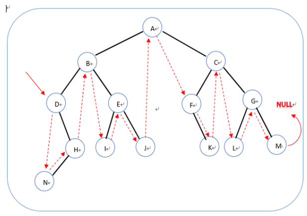

## 剑指offer刷题Java笔记

#### 1 二维数组中的查找 

在一个二维数组中（每个一维数组的长度相同），每一行都按照从左到右递增的顺序排序，每一列都按照从上到下递增的顺序排序。请完成一个函数，输入这样的一个二维数组和一个整数，判断数组中是否含有该整数。 

解题思路：根据数组规律，可将数组右上角的元素作为搜索的起点，如果目标大于当前元素，则下标下移，如果小于当前元素，则目标上移。   PS：也可以将起点定在左下角。

```
public class Solution {
    public boolean Find(int [][] array,int target) {
        int row = array.length, column = array[0].length;
                 int r = 0, c = column - 1;

                 while (r < row && c >= 0) {
                     if (array[r][c] > target) {
                         c--;
                     } else if (array[r][c] < target) {
                         r++;
                     } else {
                         return true;
                     }
                 }
		 
		 return false;
    }
}
```


#### 2 替换空格 

请实现一个函数，将一个字符串中的每个空格替换成“%20”。例如，当字符串为We Are Happy.则经过替换之后的字符串为We%20Are%20Happy。 

思路：先遍历字符串，求出空格的个数，然后计算新字符串需要的数组长度，并分配空间，遍历数组，如果是非空格将将字符放入数组，如果是空格在数组放入 %20.

```
public class Solution {
    public String replaceSpace(StringBuffer str) {
    	StringBuilder res = new StringBuilder();
    	for (int i=0; i<str.length(); i++) {
    		if (str.charAt(i) == ' ') {
    			res.append("%20");
    		}
    		else {
    			res.append(str.charAt(i));
    		}
    	}
    	return res.toString();
    }
}
```


#### 3 从尾到头打印链表 

输入一个链表，按链表值从尾到头的顺序返回一个ArrayList。 

思路： 1. 递归写法，先遍历链表，后打印。 2. 遍历链表，将值插入到List头部。

```
/**
*    public class ListNode {
*        int val;
*        ListNode next = null;
*
*        ListNode(int val) {
*            this.val = val;
*        }
*    }
*
*/
import java.util.ArrayList;
public class Solution {
    public ArrayList<Integer> printListFromTailToHead(ListNode listNode) {
         ArrayList<Integer> list = new ArrayList<>();
        while (listNode != null) {
        	list.add(0, listNode.val);
        	listNode = listNode.next;
        }
        return list;
        

    }
}

//递归法
import java.util.ArrayList;
public class Solution {
    public ArrayList<Integer> printListFromTailToHead(ListNode listNode) {
        ArrayList<Integer> list = new ArrayList<>();
        pList(listNode, list);
        return list;
	}
	
	private void pList(ListNode listNode, ArrayList<Integer> list) {
		if (listNode == null)  return;
		pList(listNode.next, list);
		list.add(listNode.val);
	}
}
```


#### 4 重建二叉树 

输入某二叉树的前序遍历和中序遍历的结果，请重建出该二叉树。假设输入的前序遍历和中序遍历的结果中都不含重复的数字。例如输入前序遍历序列{1,2,4,7,3,5,6,8}和中序遍历序列{4,7,2,1,5,3,8,6}，则重建二叉树并返回。 

思路：根据二叉树的遍历特点重建，二叉树前序遍历 :根节点---左节点---右节点，根节点在前，后面是左子树和右子树； 中序遍历:左节点---根节点---右节点， 后序遍历：左节点---右节点---根节点。 其实前后中的区分就是根节点的位置， 左右节点的相对位置是不变的，左节点一直在前。

对前序序列：{1,2,4,7,3,5,6,8}，可得知根节点是1， 中序遍历序列{4,7,2,1,5,3,8,6}，找到根节点1的位置，1的左边4,7,2, 是左子树，右边5,3,8,6是右子树；对子序列4,7,2，其前序遍历为2,4,7，根节点是2，然后根据前面的规则对子序列递归分割即可。


```
/**
 * Definition for binary tree
 * public class TreeNode {
 *     int val;
 *     TreeNode left;
 *     TreeNode right;
 *     TreeNode(int x) { val = x; }
 * }
 */
public class Solution {
    
	static public TreeNode reConstructBinaryTree(int [] pre,int [] in) {
		 if (pre == null || in == null) return null;
		 return getTreeNode(pre, 0, pre.length - 1, in, 0, in.length - 1);
	}

	//pre:{1,2,4,7,3,5,6,8},  in:{4,7,2,1,5,3,8,6}
	static TreeNode getTreeNode(int [] pre,int preLeft, int preRight, 
						int [] in, int inLeft, int inRight) {
		if (preLeft > preRight) return null;
		
		int root = pre[preLeft];
		TreeNode rootNode = new TreeNode(root);
		int rId = 0; //root在in序列中的下标
		for (int i = inLeft; i <= inRight; i++) {
			if (in[i] == root) {
				rId = i;
				break;
			}
		}
		
		int leftSubLen = rId - inLeft;//左子树的长度
		rootNode.left = getTreeNode(pre, preLeft + 1, preLeft + leftSubLen, 
								   in, inLeft, rId - 1);
		rootNode.right = getTreeNode(pre, preLeft + leftSubLen + 1, preRight,
									in, rId + 1, inRight);
		return rootNode;
	}
}
```


#### 5 用两个栈实现队列 

用两个栈来实现一个队列，完成队列的Push和Pop操作。 队列中的元素为int类型。 

思路：栈的特点是先进后出，FILO， 队列的特点是先进先出FIFO。使用栈A进行入队操作，使用栈B进行出队操作，且当栈B为空时，将栈A的元素依次压如栈B。


```
import java.util.Stack;

public class Solution {
    Stack<Integer> stack1 = new Stack<Integer>();
    Stack<Integer> stack2 = new Stack<Integer>();
    
    public void push(int node) {
        if (stack1 != null) {
        	stack1.push(node);
        }
    }
    
    public int pop() {
    	if (!stack2.isEmpty()) {
    		return stack2.pop();
    	} else {
    		while (!stack1.isEmpty()) {
    			stack2.push(stack1.pop());
    		}
    		return stack2.pop();
    	}
    }
}
```


#### 6 旋转数组的最小数字 

把一个数组最开始的若干个元素搬到数组的末尾，我们称之为数组的旋转。 输入一个非减排序的数组的一个旋转，输出旋转数组的最小元素。 例如数组{3,4,5,1,2}为{1,2,3,4,5}的一个旋转，该数组的最小值为1。 NOTE：给出的所有元素都大于0，若数组大小为0，请返回0。

思路：二分搜索的变化版本，找出数组中递减出现的地方。根据头尾找中间节点，比较中间节点和头尾的大小，{3,4,5,1,2}如果中间值大于左边的节点或者大于右边的节点（考虑到可能会和一端相等）， 则说明最小节点在中间值的右侧，否则在左侧，直到剩下最后2个，返回其中的最小值即可。

1,2,3,3,3,3,3,3,3,4 -----> 3,3,3,3,3,3,4,1,2,3

考虑一种特殊情况， 原数列：1,1,1,1,1,1，2,3，旋转后：1，2,3，1,1,1,1,1。此时，头尾和中间值相等，刚才的算法无法执行，这种情况下要逐个遍历查询，找出第一个递减序列的地方。

```
import java.util.ArrayList;
public class Solution {
    
	static public int minNumberInRotateArray(int [] array) {
		int left = 0, right = array.length - 1;
		int mid = 0;
		
		while (left < right) {
			if (left + 1 == right) return Math.min(array[left], array[right]);
			mid = left + (right - left) / 2;
			
			//先判断特殊情况
			if (array[mid] == array[left] && array[mid] == array[right]){
				return getMinInOrder(array, left, right);
			}
			
			if (array[mid] > array[left] || array[mid] > array[right]) {
				left = mid;
			} else {
				right = mid;
			}  
		}
		return 0;
	}

	//找到第一个递减序列
	private static int getMinInOrder(int[] array, int left, int right) {
		for (int i = left; i + 1 <= right; i++) {
			if (array[i] > array[i + 1]) {
				return array[i+1];
			}
		}
		return 0;
	}

}
```

#### 7 斐波那契数列 

大家都知道斐波那契数列，现在要求输入一个整数n，请你输出斐波那契数列的第n项（从0开始，第0项为0）。

n<=39

数列：0,1,1,2,3,5,8....

思路： F(n) = F(n-1) + F(n-2);

可以使用递归，但是这样如果递归层次太多会出现stackoverflow, 而且效率低，也可以使用一个数组，保存每一次的结果，不用递归计算而是直接从数组中查询，但是这样会比较占用内存空间，所以最佳的策略是使用2个变量保存序列的后2个值，循环求值即可。

```
public class Solution {
    public int Fibonacci(int n) {
    	if (n <= 0) return 0;
    	if (n == 1 || n == 2) return 1;
    	int a1 = 1, a2 = 1, a3 = 0;
    	
    	for (int i = 3; i <= n; i++) {
    		a3 = a2 + a1;
    		a1 = a2;
    		a2 = a3;
    	}
    	return a3;
    }
}
```


#### 8 跳台阶 

一只青蛙一次可以跳上1级台阶，也可以跳上2级。求该青蛙跳上一个n级的台阶总共有多少种跳法（先后次序不同算不同的结果）。 

思路：是一个斐波那契数列，推导过程如下：

1. 有2种跳法，一次跳1阶或者2阶，加入第一次跳1阶，那么剩下n-1阶有F(n-1)种跳法，如果第一次跳2阶，那么剩下的n-2阶有F(n-2)种跳法，所以可推导出：

   F(n) = F(n-1) + F(n-2);

   且 F(1) = 1; F(2) = 2.

```
public class Solution {
    public int JumpFloor(int n) {
		if (n <= 0) return 0;
    	if (n == 1) return 1;
    	if (n == 2) return 2;
    	int a1 = 1, a2 = 2, a3 = 0;
    	
    	for (int i = 3; i <= n; i++) {
    		a3 = a2 + a1;
    		a1 = a2;
    		a2 = a3;
    	}
    	return a3; 
    }
}
```


#### 9 变态跳台阶 

一只青蛙一次可以跳上1级台阶，也可以跳上2级……它也可以跳上n级。求该青蛙跳上一个n级的台阶总共有多少种跳法。

思路：算是数学推导，第一次分别跳1级，2级，3级......n级。

F(n) = F(n-1) + F(n-2) + F(n-3) + .......+ F(0)

F(n-1) = F(n-2) + ..........+ F(0)

所以， F(n) = F(n-1) + F(n-1) = 2 * F(n-1)。

```
public class Solution {
    public int JumpFloorII(int n) {
		if (n == 0 || n == 1) return 1;
		
		int a = 1;
		for (int i = 2; i <= n; i++) {
			a = a * 2;
		}
		return a;
	}
}
```


#### 10 矩形覆盖 

我们可以用2 * 1的小矩形横着或者竖着去覆盖更大的矩形。请问用n个2 * 1的小矩形无重叠地覆盖一个2 * n的大矩形，总共有多少种方法？ 

策略：

1.对于n = 0的大矩形，方法有1种。

2.对于n = 1的大矩形 2 * 1，方法有1种

3.对于n = 2的大矩形 2 * 2，方法有2种，小矩形横着放2 * 1或者竖着放 1 * 2。

4.对于n = n的大矩形 2 * n，如果第一次放 1 * 2，则剩下的有F(n-1)种方法，如果第一次放 2 * 1,则剩下的有F(n-2)种方法。

结论： F(n) = F(n-1) + F(n-2)


#### 11 二进制中1的个数 

输入一个整数，输出该数二进制表示中1的个数。其中负数用补码表示。 

思路：一种直观的方法，对整数的32位依次相与，判断结果是否为1，为1就累加一次。这种需要32次循环；另一种方法是，`n & (n -1)`可实现将整数n的二进制表示的最后一个1清零，例如二进制数：n = 101100，减1后的结果是：n - 1 = 101011，相与后 n & (n - 1) 是：101000，最后一个1以及其后的二进制位在减1后相当于在原来的基础上取反了， 100 ----> 011，这样这一部分相与后就变成了 000，很优雅地将最后一个1转换成0.

```
public class Solution {
	public int  NumberOf1(int n) {
		int count = 0;
		while (n != 0) {
			count++;
			n = n & (n -1);
		}
		return count;
	}
}
```

```
public class Solution {
    public int  NumberOf1(int n) {
		int count = 0;
		int flag = 1;
		while (flag != 0) {
			if ((flag & n) != 0) count++;
			flag = flag << 1;
		}
		return count;
	}   
}
```


#### 12 数值的整数次方 

给定一个double类型的浮点数base和int类型的整数exponent。求base的exponent次方。 


思路：主要需要考虑几种情况，1. exp = 0;     2. exp > 0;     3. exp < 0;     4. base = 0,且exp < 0无效。

求次方的方法，最简单的是对n次方进行n次循环相乘，

也可以这样：

n 为偶数：x（n） =  x (n/2) * x(n/2)

n为奇数：x（n） =  x (n/2) * x(n/2)  * x

时间复杂度logn

```

import java.util.*;
public class Solution {
	static public double Power(double base, int exponent) {
		if (exponent == 0) return 1;
		if ((base < 0.000001 && base > -0.000001) && exponent < 0) {
			throw new RuntimeException("非法参数");
		}
		int absExp = Math.abs(exponent);
		double ret = getP(base, absExp);
		if (absExp % 2 == 1) ret *= base;
		
		if (exponent > 0) return ret;
		return 1 / ret ;
	}
	
	static double getP(double base, int exp) {
		if (exp == 1) return base;
		double ret = getP(base, exp / 2) * getP(base, exp / 2);
		return ret;
	}
}
```


#### 13 调整数组顺序使奇数位于偶数前面 

输入一个整数数组，实现一个函数来调整该数组中数字的顺序，使得所有的奇数位于数组的前半部分，所有的偶数位于数组的后半部分，并保证奇数和奇数，偶数和偶数之间的相对位置不变。 

思路：最直观的算法是创建一个大小n的数组，对原数组遍历2次，第一次依次放入奇数到新数组，第二次放偶数。时间复杂度O(n),空间复杂度O(n)。

 另一种算法，遍历数组，找到奇数，然后判断它前面的数是否为偶数，如果是就交互，如果不是就停止，然后继续遍历数组，类似于插入排序。

```
public class Solution {//使用类似插入排序的算法，将奇数一个个向前移动。
    public void reOrderArray(int [] array) {
		for (int i = 1; i < array.length; i++) {
			int k = i;
			for ( ; k >= 1; k--) {
				if (array[k] % 2 == 1 && array[k-1] % 2 == 0) {
					int t = array[k];
					array[k] = array[k-1];
					array[k-1] = t;
				} else {
					break;
				}
			}
		}
	}
}
```


#### 14 链表中倒数第k个结点 

输入一个链表，输出该链表中倒数第k个结点。 

思路：使用2个指针，初始指向头结点，然后让其中一个先走k-1步，然后2个指针同时向后遍历，直到有一个指针走到头，那么另一个指针指向的位置就是倒数第k个节点。

```
/*
public class ListNode {
    int val;
    ListNode next = null;

    ListNode(int val) {
        this.val = val;
    }
}*/
public class Solution {
    public ListNode FindKthToTail(ListNode head,int k) {
		if (head == null || k <= 0) return null;
		
		ListNode fastNode = head;
		ListNode slowNode = head;
		
		for (int i = 0; i < k - 1; i++) {
			if (fastNode.next == null) return null;
			fastNode = fastNode.next;
		}
		
		//fast指向最后一个节点
		while (fastNode.next != null) {
			fastNode = fastNode.next;
			slowNode = slowNode.next;
		}
		return slowNode;
	}
}
```

#### 15 反转链表 

输入一个链表，反转链表后，输出新链表的表头。 

思路：反转链表需要有3个节点配合，上一节点，当前节点，保存下一节点：pre, cur, next；

1. cur的next指向pre,  这一步之前需要用next保存下cur的next节点。
2. pre 指向cur, cur指向之前保存的next. 其实next指针就是用来暂存当前指针的下一节点。
3. 继续1的步骤。直到cur指向null，那么pre就是新的头节点。

```
public class Solution {
    public ListNode ReverseList(ListNode head) {
        if (head == null) return null;
		ListNode pre = null;
		ListNode cur = head;
		ListNode next = cur.next;
		
		while (cur != null) {
			next = cur.next;
			cur.next = pre;
			pre = cur;
			cur = next;
		}
		
		//此时cur为空，所以pre才是指向原链表的最后一个节点，也就是新链表的头结点
		return pre;
	}
}
```


#### 16 合并两个排序的链表 

输入两个单调递增的链表，输出两个链表合成后的链表，当然我们需要合成后的链表满足单调不减规则。 

思路：分别遍历并比较2个链表的节点，先在新链表中插入值小的节点，如果其中一个链表空了，就直接将另一个链表插入到新链表的结尾。可以使用递归和非递归2种算法。

```
// 递归版本
public class Solution {
    public ListNode Merge(ListNode list1,ListNode list2) {
		if (list1 == null) { //list1已经遍历结束，没有节点了
			return list2;
		}
		if (list2 == null) { //list2已经遍历结束，没有节点了
			return list1;
		}
		
		ListNode head;
		if (list1.val < list2.val) {
			head = list1;
			head.next = Merge(list1.next, list2);
		} else {
			head = list2;
			head.next = Merge(list1, list2.next);
		}
		
		return head;
	}
}
```

```
//递归版本
public class Solution {
    public ListNode Merge(ListNode list1,ListNode list2) {
		if (list1 == null) { //list1为空，返回list2
			return list2;
		}
		if (list2 == null) { 
			return list1;
		}
		
		ListNode head, cur;
		
		//确认头结点
		if (list1.val < list2.val) {
			head = list1;
			list1 = list1.next;
		} else {
			head = list2;
			list2 = list2.next;
		}
		
		cur = head;
		
		//遍历2个链表
		while (list1 != null && list2 != null) {
			if (list1.val < list2.val) {
				cur.next = list1;
				cur = cur.next;
				list1 = list1.next;
			} else {
				cur.next = list2;
				cur = cur.next;
				list2 = list2.next;
			}
		}
		
		//插入剩余非空的链表到新链表结尾
		if (list1 == null) {
			cur.next = list2;
		} else if (list2 == null) {
			cur.next = list1;
		}
		
		return head;
	}
}
```


#### 17 树的子结构 

输入两棵二叉树A，B，判断B是不是A的子结构。（ps：我们约定空树不是任意一个树的子结构） 

思路：首先要有个API（isTree1HasTree2）来判断，tree1是否包含tree2，并且从各种的根节点开始比较，分别遍历其左右子节点，如果遇到不相等的节点，则返回false，如果tree2先遍历完了则说明tree1包含了tree2，返回true, tree1先遍历到空节点则返回false。

之后对TreeA , 遍历各个节点，找到值和TreeB 根节点相等的节点，然后调用API进行判断。

```
public class Solution {
    
	static public boolean HasSubtree(TreeNode root1,TreeNode root2) {
		boolean ret = false;
		// 注意这里的判断算法，之前写错过。对当前节点、左子节点、右子节点 要依次进行判断，不能采用if else的逻辑关系
		if (root1 != null && root2 != null) {
			if (root1.val == root2.val) ret = isTree1HasTree2(root1, root2);
			 
			if (!ret) ret = HasSubtree(root1.left, root2);
			if (!ret) ret = HasSubtree(root1.right, root2);
		}
		
		return ret;
	}
	
	static private boolean isTree1HasTree2(TreeNode tree1, TreeNode tree2) {
		if (tree2 == null) return true;
		if (tree1 == null) return false;
		
		if (tree1.val != tree2.val) return false;
		return isTree1HasTree2(tree1.left, tree2.left)
				&& isTree1HasTree2(tree1.right, tree2.right); 
	}
}
```


#### 18 二叉树的镜像 

题目描述

操作给定的二叉树，将其变换为源二叉树的镜像。

输入描述:

```
二叉树的镜像定义：源二叉树 
    	    8
    	   /  \
    	  6   10
    	 / \  / \
    	5  7 9 11
    	镜像二叉树
    	    8
    	   /  \
    	  10   6
    	 / \  / \
    	11 9 7  5
```
思路：前序遍历树，如果一个节点的左 子树和右子树都不为空，则交换他们。交换完成后就得到了它的镜像。可以使用递归算法和非递归算法。

```
/**
public class TreeNode {
    int val = 0;
    TreeNode left = null;
    TreeNode right = null;

    public TreeNode(int val) {
        this.val = val;
    }

}
*/
//递归算法
public class Solution {
    public void Mirror(TreeNode root) {
		if (root == null) return ;
		if (root.left == null && root.right == null) return;
		
		TreeNode temp = root.left;
		root.left = root.right;
		root.right = temp;
		
		Mirror(root.left);
		Mirror(root.right);
	}
}
```

```
//非递归算法，层次遍历
import java.util.*;
public class Solution {
    public void Mirror(TreeNode root) {
		if (root == null) return;
		Stack<TreeNode> stack = new Stack<>();
		stack.push(root);
		
		while (!stack.isEmpty()) {
			TreeNode cur = stack.pop();
			
			if (cur.left == null && cur.right == null) continue;
			
			TreeNode temp = cur.left;
			cur.left = cur.right;
			cur.right = temp;
			
			if (cur.left != null) stack.push(cur.left);
			if (cur.right != null) stack.push(cur.right);
		}
	}
}
```


#### 19  顺时针打印矩阵

​    输入一个矩阵，按照从外向里以顺时针的顺序依次打印出每一个数字，例如，如果输入如下4 X 4矩阵： 1 2 3 4 5 6 7 8 9 10 11 12 13 14 15 16 则依次打印出数字1,2,3,4,8,12,16,15,14,13,9,5,6,7,11,10. 

思路：可以对顺时针遍历矩阵的4个边，做好边界控制，但这个算法实现起来有点复杂，对边界的控制要求比较高。所以可以换一种方式，

1. 每次只打印矩阵的第一行，然后将第一行删除
2. 对矩阵的剩余部分做逆时针90度的选择，之后重复1,2步骤。

但这种算法的缺点是占用一定的内存，每次矩阵变换都要创建新的矩阵。

```
import java.util.*;

public class Main {
	public static void main(String[] args) {
		print(matrix);
		print(convertMatrix(matrix));
		System.out.println(printMatrix(matrix2));
	}
	
	static int[][] matrix = {{1,2,3},{4,5,6},{7,8,9}};
	static int[][] matrix2 = {{1,2},{3,4}};
	static void print(int[][] matrix) {
		if (matrix == null) return;
		for (int[] row : matrix) {
			System.out.println(Arrays.toString(row));
		}
	}
	
	static ArrayList<Integer> ret;
	static public ArrayList<Integer> printMatrix(int [][] matrix) {
		if (matrix == null || matrix.length == 0) return null;
		
		ret = new ArrayList<>();
		int[][] tempM = matrix;
		while (tempM != null && tempM.length > 0) {
			popFirstRow(tempM);
			tempM = convertMatrix(tempM);
		}
		return ret;
	}
	
	/**
	 * 读取第一行
	 * @param matrix
	 */
	static private void popFirstRow(int [][] matrix) {
		if (matrix == null || matrix.length == 0) return;
		int row = matrix.length;
		int column = matrix[0].length;
		
		if (matrix.length > 0) {
			for (int i = 0; i < column; i++) {
				ret.add(matrix[0][i]);
			}
		}
	}
	
	/**
	 * 矩阵转换：删除第一行，然后将矩阵逆时针旋转90
	 * 1 2 3
	 * 4 5 6
	 * 7 8 9 
	 * 转成
	 * 6 9
	 * 5 8
	 * 4 7
	 * @param matrix
	 * @return
	 */
	static private int[][] convertMatrix(int [][] matrix) {
		if (matrix == null || matrix.length <= 1) return null;
		int row = matrix.length;
		int column = matrix[0].length;
		
		int newColumn = row - 1;
		int[][] retM = new int[column][newColumn];
		
		int id = 0;
		for (int i = column - 1; i >= 0; i--) {//从最后一列开始遍历，忽略第一行
			for (int j = 1; j < row; j++) {
				retM[id/newColumn][id%newColumn] = matrix[j][i];
				id++;
			}
		}
		return retM;
	}	
}
```

上一个算法对空间比较浪费，那么边界遍历算法如下：

```
import java.util.ArrayList;
public class Solution {
    static ArrayList<Integer> ret = new ArrayList<>();
	
    static public ArrayList<Integer> printMatrix(int [][] matrix) {
		if (matrix == null || matrix.length == 0) return null;
		
		ret = new ArrayList<>();
		int row = matrix.length;
		int column = matrix[0].length;
		
		travelMatix(matrix, 0, 0, row-1, column-1);
		return ret;
	}
	
	//注意x并不对应行，column,y也并不对应列row
	static void travelMatix(int[][] matrix, int top, int left,
			 int bottom, int right) {
		if (top > bottom || left > right) return;
		
		//保存行不变，列递增
		for (int i = left; i <= right; i++) ret.add(matrix[top][i]);
		
		//保存列不变，行递增
		for (int i = top + 1; i <= bottom; i++) ret.add(matrix[i][right]);
		
		//保存行不变，列递减, 注意需要加约束条件：top < bottom
		for (int i = right - 1; i >= left && top < bottom; i--) ret.add(matrix[bottom][i]);
		
		//保存列不变，行递减  注意需要加约束条件：left < right
		for (int i = bottom - 1; i >= top + 1 && left < right; i--) ret.add(matrix[i][left]);
		
		travelMatix(matrix, top+1, left+1, bottom-1, right-1);
	}
}
```

其中后面的一个递归可以改成非递归

```
static void travelMatix(int[][] matrix, int top, int left,
		 int bottom, int right) {
	while (top <= bottom && left <= right) {
		//保存行不变，列递增
		for (int i = left; i <= right; i++) ret.add(matrix[top][i]);
		
		//保存列不变，行递增
		for (int i = top + 1; i <= bottom; i++) ret.add(matrix[i][right]);
		
		//保存行不变，列递减, 注意需要加约束条件：top < bottom
		for (int i = right - 1; i >= left && top < bottom; i--) ret.add(matrix[bottom][i]);
		
		//保存列不变，行递减  注意需要加约束条件：left < right
		for (int i = bottom - 1; i >= top + 1 && left < right; i--) ret.add(matrix[i][left]);
		top++; left++; bottom--; right--;
	}
}
```


#### 20 包含min函数的栈

定义栈的数据结构，请在该类型中实现一个能够得到栈中所含最小元素的min函数（时间复杂度应为O（1））。 

 思路：使用2个栈，一个正常使用，另一个放置当前的最小值，push的时候先判断待存入的数值和当前最小栈的栈顶值的关系，如果小于就直接压人，如果大于则将栈顶值重复压入。

```
import java.util.Stack;

public class Solution {
	Stack<Integer> minStack = new Stack<>();
	Stack<Integer> mainStack = new Stack<>();
	
	public void push(int node) {
        mainStack.push(node);

        if (minStack.isEmpty()) {
        	minStack.push(node);
        	return;
        }
        
        int curMin = minStack.peek();
        if (node < curMin) {
        	minStack.push(node);
        } else {
			minStack.push(curMin);
		}
    }
    
    public void pop() {
        if (!mainStack.isEmpty()) {
        	mainStack.pop();
        	minStack.pop();
        }
    }
    
    public int top() {
        return mainStack.peek();
    }
    
    public int min() {
        return minStack.peek();
    }
}
```


#### 21 栈的压入 弹出序列

输入两个整数序列，第一个序列表示栈的压入顺序，请判断第二个序列是否可能为该栈的弹出顺序。假设压入栈的所有数字均不相等。例如序列1,2,3,4,5是某栈的压入顺序，序列4,5,3,2,1是该压栈序列对应的一个弹出序列，但4,3,5,1,2就不可能是该压栈序列的弹出序列。（注意：这两个序列的长度是相等的） 

思路：模拟栈的压入和弹出过程即可，对序列A {1,2,3,4,5}，依次入栈，并每次将栈顶值和序列B {4,5,3,2,1}的首个数字比较，如果不相等则A继续入栈，如果相等，则A的栈顶值出栈，同时将B中刚才判断相等的值从B序列移除。并继续比较栈顶和B序列的值，直到栈为空，如果此时B序列也空了则表示B是弹出序列，否则不是。

举例：

入栈1,2,3,4,5

出栈4,5,3,2,1

首先1入辅助栈，此时栈顶1≠4，继续入栈2

此时栈顶2≠4，继续入栈3

此时栈顶3≠4，继续入栈4

此时栈顶4＝4，出栈4，弹出序列向后一位，此时为5，,辅助栈里面是1,2,3

此时栈顶3≠5，继续入栈5

此时栈顶5=5，出栈5,弹出序列向后一位，此时为3，,辅助栈里面是1,2,3

```
import java.util.*;

public class Solution {
    static public boolean IsPopOrder(int [] pushA, int [] popA) {
		if (pushA == null || popA.length == 0) return false;
		Stack<Integer> stack = new Stack<>();
		
		int idPop = 0;

		for (int i = 0; i < pushA.length; i++) {
			stack.push(pushA[i]);
			
			while (!stack.empty() && stack.peek() == popA[idPop]) {
				idPop++;
				stack.pop();
			}
		}
		return stack.empty();
	} 
}
```

#### 22 从上往下打印二叉树

从上往下打印出二叉树的每个节点，同层节点从左至右打印。 

思路：借助一个队列，

1. 先将根节点入队，然后依次取出队列的头节点，打印

2. 之后将取出头结点的子节点插入到队列后面即可。 重复1,2

```
public class Solution {
    public ArrayList<Integer> PrintFromTopToBottom(TreeNode root) {
		ArrayList<Integer> ret = new ArrayList<>();
		if (root == null) return ret;
		
		Queue<TreeNode> queue = new ArrayDeque<>();
		queue.offer(root);
		while (!queue.isEmpty()) {
			TreeNode node = queue.poll();
			ret.add(node.val);
			
			if (node.left != null) queue.offer(node.left);
			if (node.right != null) queue.offer(node.right);
		}
		
		return ret;
	}
}
```


#### 23 二叉搜索树的后序遍历序列

输入一个整数数组，判断该数组是不是某二叉搜索树的后序遍历的结果。如果是则输出Yes,否则输出No。假设输入的数组的任意两个数字都互不相同。 

树的相关概念：

二叉树（Binary tree）：一种特殊的树类型，每个节点最多有2个子节点，满二叉树，完全二叉树。

满二叉树：一颗深度为n，节点数为2的n次方 - 1 的树是满二叉树。

完全二叉树：树中每个节点的编号和相同深度的满二叉树中节点编号一一对应

二叉搜索树/查找树（BST  binary search tree）的特征：左子节点 <  根节点 < 右子节点，任意2个节点值不相等。

自平衡二叉查找树 （self-balancing Binary search tree）：一种改进的二叉查找树，其左右子树的高度差绝对值不超过1。常用的实现方法用：AVL、红黑树（Red-black tree）。

二叉搜索树的后序遍历序列满足：最后一个值是根节点，根节点之前的序列可分为2个部分，左子树和右子树，其中左子树的值都要小于根节点，而根节点的值小于右子树的值。根据这个条件可以判断是否为合法序列。

实现方：

1. 找出根节点值root
2. 找出根节点前面序列中第一个大于root的值value，即为右子树的第一个值
3. 判断value之后的序列中是否有小于等于root的值，存在则返回false.

```
public class Solution {
    static public boolean VerifySquenceOfBST(int [] sequence) {
        if (sequence == null || sequence.length == 0) return false;
        
        return isSeqOfBst(sequence, 0, sequence.length - 1);
	}
	
	static public boolean isSeqOfBst(int[] seq, int left, int right) {
		if (left >= right) return true;
		int root = seq[right];
		
		int rId = left; //对rId进行自增，如果没有右子树，rId应该指向最后
		for ( ; rId < right; rId++) {
			if (seq[rId] >= root) {
				break;
			}
		}
		
		for (int i = rId; i < right; i++) {
			if (seq[i] <= root) {
				return false;
			}
		}
		
		return isSeqOfBst(seq, left, rId - 1) && isSeqOfBst(seq, rId, right - 1);
	}
}
```


#### 24 二叉树中和为某一值的路径 

输入一颗二叉树的跟节点和一个整数，打印出二叉树中结点值的和为输入整数的所有路径。路径定义为从树的根结点开始往下一直到叶结点所经过的结点形成一条路径。(注意: 在返回值的list中，数组长度大的数组靠前) 

思路：采用dfs算法，递归每一个路径，计算每个路径的和，然后判断是否和目标值相等。

```
public class Solution {
    ArrayList<ArrayList<Integer>> listAll = new ArrayList<>();
	ArrayList<Integer> list = new ArrayList<>();
	
	public ArrayList<ArrayList<Integer>> FindPath(TreeNode root,int target) {
        if (root == null) return listAll;
        list.add(root.val);
        target -= root.val;
        
        if (target == 0 && root.left == null && root.right == null) {
        	listAll.add(new ArrayList<>(list));
        }
        FindPath(root.left, target);
        FindPath(root.right, target);
        list.remove(list.size() - 1);
        return listAll;
    }
}
```

dfs显示算法：

```
public class Solution {
    ArrayList<ArrayList<Integer>> listAll = new ArrayList<>();
	ArrayList<Integer> list = new ArrayList<>();
	
	public ArrayList<ArrayList<Integer>> FindPath(TreeNode root,int target) {
        if (root == null) return listAll;
        dfs(root, target);
        
        return listAll;
    }
	
	void dfs(TreeNode node, int target) {
		if (node == null) return;
		
		target -= node.val;
		list.add(node.val);
		if (target == 0 && node.left == null && node.right == null) {
			if (target == 0) listAll.add(new ArrayList<>(list));
			//这里不能直接return，需要remove叶节点
		}
		
		dfs(node.left, target);
		dfs(node.right, target);
		
		list.remove(list.size() - 1);
	}
}
```


#### 25  复杂链表的复制 

输入一个复杂链表（每个节点中有节点值，以及两个指针，一个指向下一个节点，另一个特殊指针指向任意一个节点），返回结果为复制后复杂链表的head。（注意，输出结果中请不要返回参数中的节点引用，否则判题程序会直接返回空） 

思路：

1. 复制链表中的每个节点，在旧节点后插入一个新节点。
2. 复制每个旧节点的random指针，clone.random = old.random.next；
3. 拆分链表，将1中复制的新节点拆分成一个新的链表。

代码：

```
public class Solution {
    public RandomListNode Clone(RandomListNode pHead)
    {
		if (pHead == null) return null;
		
        //1. 再旧链表中复制新的链表：A ---> A1 ---> B ---> B1,A1 B1为复制的节点
		RandomListNode node = pHead;
		while (node != null) {
			//node复制
			RandomListNode cloneNode = new RandomListNode(node.label);
			RandomListNode tmpNext = node.next;
			
			node.next = cloneNode;
			cloneNode.next = tmpNext;
			
			//node后移，遍历
			node = tmpNext;
		}
		
		//2. 设置 A1 B1的随机节点  A1.random = A.random.next
		node = pHead;
		while (node != null) {
			RandomListNode rNode = node.random;
			
			//随机节点赋值
			node.next.random = (rNode == null ? null : rNode.next);
			
			//node后移，遍历
			node = node.next.next;
		}
		
		
		//3、拆分链表，将链表拆分为原链表和复制后的链表
        node = pHead;
        RandomListNode pNewHead = node.next;
        while (node != null) {
        	RandomListNode cloneNode = node.next;
        	node.next = cloneNode.next;
        	cloneNode.next = (cloneNode.next == null ? null : cloneNode.next.next);
        	
        	node = node.next;
        }
         
        return pNewHead;
    }
}
```


#### 26 二叉搜索树与双向链表 

输入一棵二叉搜索树，将该二叉搜索树转换成一个排序的双向链表。要求不能创建任何新的结点，只能调整树中结点指针的指向。 

思路：对二叉搜索树，进行中序遍历，其序列就是一个递增的排序序列，所以需要对二叉树进行中序遍历，在遍历的同时，将其改成双向链表即可。需要保存上一个链表节点。

```
public class Solution {
    //二分二叉树的中序遍历结果就是一个递增序列，只需要保存上一次节点即可
	TreeNode head,  pre;
	public TreeNode Convert(TreeNode pRootOfTree) {
		if (pRootOfTree == null) return null;
		
		converTree(pRootOfTree);
		return head;
	}
	
	public void converTree(TreeNode node) {
		if (node == null) return;
		
		converTree(node.left);
		if (head == null) {//设定链表头部
			head = node;
			pre = node;
		} else {
			node.left = pre;
			pre.right = node;
			pre = node;
		}
		converTree(node.right);
	}
}
```


#### 27 字符串的排列 

输入一个字符串,按字典序打印出该字符串中字符的所有排列。例如输入字符串abc,则打印出由字符a,b,c所能排列出来的所有字符串abc,acb,bac,bca,cab和cba。  

思路：1.使用经典的回溯算法，每一层代表一次for循环。


2.使用DFS算法。


```
//经典回溯算法
import java.util.*;
public class Solution {
    static Set<String> set ;
	static public ArrayList<String> Permutation(String str) {
		if (str == null) return null;
		
		set = new TreeSet<>();
		permutationHelper(str.toCharArray(), 0, set);
		
		ArrayList<String> ret = new ArrayList<>();
		for (String s : set) {
			ret.add(s);
		}
		
		return ret;
	}
	
	static void permutationHelper(char[] cs, int i, Set<String> set) {
		if (i == cs.length - 1) {
			set.add(String.valueOf(cs));
			return;
		} 
		
		for (int j = i; j < cs.length; j++) {
			swap(cs, i, j);
			permutationHelper(cs, i + 1, set);
			swap(cs, i, j);
		}
	}

	private static void swap(char[] cs, int i, int j) {
		char tmp = cs[i];
		cs[i] = cs[j];
		cs[j] = tmp;
	}
}
```


```
//dfs算法
import java.util.*;
public class Solution {
    static Set<String> set ;
	static char[] cs;
	static public ArrayList<String> Permutation(String str) {
		if (str == null) return null;
		ArrayList<String> ret = new ArrayList<>();
		if (str.length() == 0) return ret;
		
		cs = str.toCharArray();
		set = new TreeSet<>();
		
		char[] csNew = new char[cs.length];
		permutationDfs(csNew, new int[cs.length], 0, set);
		
		
		for (String s : set) {
			ret.add(s);
		}
		
		return ret;
	}
	
	
	static void permutationDfs(char[] csNew, int[] book,  int id, Set<String> set) {
		if (id == book.length) {
			set.add(String.valueOf(csNew));
			return;
		}
		
		for (int i = 0; i < book.length; i++) {
			if (book[i] == 0) {
				book[i] = 1;
				
				csNew[id] = cs[i];//id的值在本次循环中不能被改变
				permutationDfs(csNew, book, id + 1, set);
				
				book[i] = 0;
			}
		}
	}
}
```


#### 28 数组中出现次数超过一半的数字 

数组中有一个数字出现的次数超过数组长度的一半，请找出这个数字。例如输入一个长度为9的数组{1,2,3,2,2,2,5,4,2}。由于数字2在数组中出现了5次，超过数组长度的一半，因此输出2。如果不存在则输出0。 

思路：2种算法，1是hashMap，key为数组中的数字，value是次数，时间复杂度O(n)，但是对空间有一定的浪费；方法2采用快排算法，当pivot的下标等于 len/2时，判断该数字是否出现超过一半。

```
public class Solution {
    public int MoreThanHalfNum_Solution(int [] arr) {
		if (arr == null || arr.length == 0) return 0;
		if (arr.length == 1) return arr[0];
		
		int targetId = arr.length / 2;
		int targetValue = findNum(arr, targetId);
		
		//再次校验出现次数是否超过一半
		int time = 0;
		for (int v : arr) {
			if (v == targetValue) time++;
		}
		
		if (time < arr.length / 2 + 1) targetValue = 0;
		return targetValue;
	}
	
	int findNum(int[] arr, int id) {
		int left = 0; 
		int right = arr.length - 1;
		
		while (left < right) {
			int pivot = partition(arr, left, right);
			 
			if (pivot < id) {
				left = pivot + 1;
			} else if (pivot > id) {
				right = pivot - 1;
			} else {
				return arr[pivot];
			}
		}
		
		return 0; //没有找到
	}
	
	int partition(int[] arr, int left, int right) {
		int pivot = left - 1;
		int base = arr[right];
		for (int i = left; i <= right; i++) {
			if (arr[i] <= base) {
				swap(arr, ++pivot, i);
			}
		}
		return pivot;
	}
	
	private static void swap(int[] arr, int i, int j) {
		int tmp = arr[i];
		arr[i] = arr[j];
		arr[j] = tmp;
	}
}
```


#### 29 最小的K个数

输入n个整数，找出其中最小的K个数。例如输入4,5,1,6,2,7,3,8这8个数字，则最小的4个数字是1,2,3,4,。

思路：

1. 进行K次选择排序，时间复杂度n*K

2. 使用大小为K的最大堆，插入n次，最后的堆就是所求结果，n*logK

```

import java.util.*;
public class Solution {
	public ArrayList<Integer> GetLeastNumbers_Solution(int [] input, int k) {
		ArrayList<Integer> ret = new ArrayList<Integer>();
		if (input == null || input.length < k) return ret;

		for (int i = 0; i < k; i++) {
			int min = i;
			for (int j = i + 1; j < input.length; j++) {
				if (input[j] < input[min]) {
					min = j;
				}
			}
			
			if (min != i) {
				int temp = input[min];
				input[min] = input[i];
				input[i] = temp;
			}
			
			ret.add(input[i]);
		}
		return ret;
	}

}
```

```

import java.util.*;
public class Solution {
    public ArrayList<Integer> GetLeastNumbers_Solution(int [] input, int k) {
        ArrayList<Integer> ret = new ArrayList<Integer>();
        if (input == null || input.length < k || k == 0) return ret;
        PriorityQueue<Integer> maxStack = new PriorityQueue<Integer>(new Comparator<Integer>() {
            @Override
            public int compare(Integer o1, Integer o2) {
                return o2.compareTo(o1);
            }
        });
        

    for (int i = 0; i < input.length; i++) {
        if (i < k) {
            maxStack.add(input[i]);
            continue;
        }
        
        if (input[i] < maxStack.peek()) {
            maxStack.poll();
            maxStack.add(input[i]);
        }
    }
    
    for (Integer v : maxStack) {
        ret.add(v);
    }
    return ret;
}
```

#### 30 连续子数组的最大和

HZ偶尔会拿些专业问题来忽悠那些非计算机专业的同学。今天测试组开完会后,他又发话了:在古老的一维模式识别中,常常需要计算连续子向量的最大和,当向量全为正数的时候,问题很好解决。但是,如果向量中包含负数,是否应该包含某个负数,并期望旁边的正数会弥补它呢？例如:{6,-3,-2,7,-15,1,2,2},连续子向量的最大和为8(从第0个开始,到第3个为止)。给一个数组，返回它的最大连续子序列的和，你会不会被他忽悠住？(子向量的长度至少是1)

思路：使用动态规划，dp[i]表示下标为i的元素结尾处序列的最大和，如果当前和为负数，则不计入之后的序列，下一个序列从新开始累加。

```
public class Solution {
	//计算连续子向量的最大和  {6,-3,-2,7,-15,1,2,2}
	//如果向量和为负数，则下一个元素不需要接着前面的向量了，重新构造子向量
    static public int FindGreatestSumOfSubArray(int[] array) {
        if (array == null || array.length == 0) return 0;
        int[] dp = new int[array.length];

        dp[0] = array[0];
        int max = array[0];

        for (int i = 1; i < array.length; i++) {
            if (dp[i-1] < 0) {
            	//如果当前子向量和为负数，则下一个元素不需要添加到前面的向量了，重新构造子向量
                dp[i] = array[i];
            } else {
                dp[i] = dp[i-1] + array[i];//为正 继续添加
            }
            max = Math.max(max, dp[i]);
        }

        return max;
    }
}
```


#### 31 整数中1出现的次数（从1到n整数中1出现的次数）

求出1~13的整数中1出现的次数,并算出100~1300的整数中1出现的次数？为此他特别数了一下1~13中包含1的数字有1、10、11、12、13因此共出现6次,但是对于后面问题他就没辙了。ACMer希望你们帮帮他,并把问题更加普遍化,可以很快的求出任意非负整数区间中1出现的次数（从1 到 n 中1出现的次数）。

思路：提供一个求单个整数中1出现次数的API即可，有2种方法。

1. 采用直观的算法，对每一个整数求1的个数，依次判断个位，十位，百位等是否为1.
2. 使用数学思维，可参考牛客。

```
public class Solution {
    public int NumberOf1Between1AndN_Solution(int n) {
        int sum = 0;
        for (int i = 1; i <= n; i++) {
            sum += getOneNum(i);
        }
        return sum;

    }

    private static int getOneNum(int num) {
        int ret = 0;
        while (num > 0) {
            if (num % 10 == 1) ret++;
            num /= 10;
        }
        return ret;
    }
}
```


#### 32 把数组排成最小的数

输入一个正整数数组，把数组里所有数字拼接起来排成一个数，打印能拼接出的所有数字中最小的一个。例如输入数组{3，32，321}，则打印出这三个数字能排成的最小数字为321323。

思路：排序算法，只是排序的规则是，看2个数字组合出的数字的大小，使用组合出最小的数字方式。

快排 + 组合数字大小比较

```
import java.util.*;

public class Solution {
    
    public String PrintMinNumber(int [] numbers) {
        qSort(numbers, 0, numbers.length - 1);
        StringBuilder sb = new StringBuilder();
        for (int v : numbers) sb.append(v);
        return sb.toString().trim();
    }

    private static void qSort(int [] numbers, int left, int right) {
        if (left >= right) return;

        int pivot = patition(numbers, left, right);
        qSort(numbers, left, pivot - 1);
        qSort(numbers, pivot + 1, right);
    }

    private static int patition(int[] numbers, int left, int right) {
        int pivot = left - 1;
        int base = numbers[right];
        for (int i = left; i <= right; i++) {
            if (needExchange(base, numbers[i])) {
                swap(numbers, ++pivot, i);
            }
        }
        return pivot;
    }

    private static void swap(int[] numbers, int i, int k) {
        int temp = numbers[i];
        numbers[i] = numbers[k];
        numbers[k] = temp;
    }

    private static boolean needExchange(int base, int number) {
        long baseF = base;
        long numF = number;

        int backNum = number;
        int backBase = base;

        while (backNum > 0) {
            baseF *= 10;
            backNum /= 10;
        }
        baseF += number;

        while (backBase > 0) {
            numF *= 10;
            backBase /= 10;
        }
        numF += base;

//        System.out.println("baseF:" + baseF + ", numF:" + numF);

        if (baseF >= numF) return true;
        return false;
    }
}
```


#### 33 丑数

把只包含质因子2、3和5的数称作丑数（Ugly Number）。例如6、8都是丑数，但14不是，因为它包含质因子7。 习惯上我们把**1当做是第一个丑数**。求按从小到大的顺序的第N个丑数。

对于任何丑数p，那么2*p,3*p,5*p都是丑数，并且2*p<3*p<5*p，暴力的算法是，对于当前的丑数数列，最大值是N，让每个丑数都分别乘以2,3,5，得到比N大的值的集合，找出集合的最小值，就是下一个丑数了。高效的算法是，每次计算下一个丑数时候，找出用于乘以2的最大数M2，乘以3的最大数M3和乘以5的最大数M5，下一个丑数就是

> min (M2\*2,  M3\*3, M5*5)

其中M2的数组下标是I2，应该满足 `arr[I2]*2 <= N 且 arr[I2+1]*2 > N` ,M3 M5也是同理。

```
    public static int GetUglyNumber_Solution(int index) {
        if (index <= 1) return index;
        int i2 = 0, i3 = 0, i5 = 0;

        List<Integer> list = new ArrayList<>();
        list.add(1);

        int id = 1;
        while (id++ < index) { //计算 index - 1 次
            int nextUglyNum = Math.min(list.get(i2) * 2, 
            Math.min(list.get(i3) * 3, list.get(i5) * 5));
            list.add(nextUglyNum);

            while (list.get(i2) * 2 <= nextUglyNum) i2++;
            while (list.get(i3) * 3 <= nextUglyNum) i3++;
            while (list.get(i5) * 5 <= nextUglyNum) i5++;
        }
        return list.get(index-1);
    }
```


#### 34 第一个只出现一次的字符

在一个字符串(0<=字符串长度<=10000，全部由字母组成)中找到第一个只出现一次的字符,并返回它的位置, 如果没有则返回 -1（需要区分大小写）.

思路：使用LinkedHashMap，

```java
public int FirstNotRepeatingChar(String str) {
    Map<Character, Integer> map = new LinkedHashMap<>(32);
    char c = 'a';
    for (int i = 0; i < str.length(); i++) {
        c = str.charAt(i);
        if (map.containsKey(c)) {
            map.put(c, map.get(c) + 1);
        } else {
            map.put(c, 1);
        }
    }

    char res;
    Set<Entry<Character, Integer>> set = map.entrySet();
    for (Entry<Character, Integer> entry : set) {
        if (entry.getValue() == 1) {
             return str.indexOf(entry.getKey());
        }
    }

    return -1;
}

```

```java

使用一个数组book[]，数组的下标是char的值，数组的值是出现次数，这样数组最大值255。
第一次遍历，填充数组，第二次遍历，找到第一个值为1 book，value
	public int FirstNotRepeatingChar(String str) {
		if (str == null) return -1;
		int[] book = new int[256];
		
		for (int i=0; i<str.length(); i++) {
			book[str.charAt(i)]++;
		}
		
		for (int i=0; i<str.length(); i++) {
			if (book[str.charAt(i)] == 1)
				return i;
		}
        return -1;
    }
```


#### 35 数组中的逆序对

在数组中的两个数字，如果前面一个数字大于后面的数字，则这两个数字组成一个逆序对。输入一个数组,求出这个数组中的逆序对的总数P。并将P对1000000007取模的结果输出。 即输出P%1000000007

思路：直观的思路是，设定一个计数值count, 对数组的每个数字，扫描其后面的数字，如果后面的数字大于当前数字，则count加一，这样的时间复杂度是 O(n2)。

优化的算法是对归并排序进行调整，在对2个排序过的子数组重新排序的时候，从子数组右边最大值开始比较，比较结果从右往左插入到临时数组，如果左边数组的值大于右边数组，说明该值大于右边数组中的所有剩余数字，则count值要加上右面数组到其左边界的元素值个数。

如 [6, 7], [4, 5] ,6和5比较，6 > 5，则6大于5,4 ，count值 + 2。

```java
public class Solution {
    public static int InversePairs(int [] arr) {
		count = 0;
		mergeSort(arr, 0, arr.length-1);
//		System.out.println(Arrays.toString(arr));
//		System.out.println(count % 1000000007);
		return count;
    }
	static void mergeSort(int[] arr, int left, int right) {
        if (left >= right) return;
        int mid = (left + right) / 2;
        mergeSort(arr, left, mid);
        mergeSort(arr, mid+1, right);
        merge(arr, left, mid, right);
    }
    
    static void mergeSort2(int[] arr) {
        int len = arr.length;
        int sl = 1, dl = 1;
        while (sl < len) {
            dl = sl * 2;
            int i = 0;
            while (i + dl < len) {
                merge(arr, i, i+sl-1, i+dl-1);
                i += dl;
            }
            if (i + sl < len) {
                merge(arr, i, i+sl-1, len-1);
            }
            sl = dl;
        }
    }
    static int count = 0;
    private static void merge(int[] arr, int left, int mid, int right) {
        int[] temp = new int[right-left+1];
        int id = temp.length - 1;
        int l = mid, r = right;
        while (l >= left && r > mid) {
        	if (arr[l] > arr[r]) {
                
        		count += r - mid;
                if (count > 1000000007) {
        			count = count % 1000000007;
        		}
                
        		temp[id--] = arr[l--];
        	} else {
        		temp[id--] = arr[r--];
        	}
        }
        
        while (l >= left) {
            temp[id--] = arr[l--];
        }
        
        while (r > mid) {
            temp[id--] = arr[r--];
        }
        
        for (int i=0; i<temp.length; i++) {
            arr[i+left] = temp[i];
        }
    }


    private static void swap(int[] arr, int a, int b) {
    	int t = arr[a];
    	arr[a] = arr[b];
    	arr[b] = t;
    }

}


public class Solution {
    static int count = 0;
    public static int InversePairs(int [] arr) {
        count = 0;
        mergeSort(arr, 0, arr.length-1);
        
        return count;
    }

    static void mergeSort(int[] arr, int left, int right) {
        if (left >= right) return;
        int mid = left + (right - left) / 2;
        mergeSort(arr, left, mid);
        mergeSort(arr, mid + 1, right);
        mergePartition(arr, left, mid, right);
    }

    private static void mergePartition(int[] arr, int left, int mid, int right) {
        int subR1 = mid;
        int subR2 = right;
        int len = right - left + 1;

        int[] temp = new int[len];
        int tId = len - 1;

        while (subR1 >= left && subR2 >= mid + 1) {
            if (arr[subR1] > arr[subR2]) {
                count += (subR2 - mid);
                count = count % 1000000007;
                
                temp[tId--] = arr[subR1--];
            } else {
                temp[tId--] = arr[subR2--];
            }
        }

        while (subR1 >= left) temp[tId--] = arr[subR1--];
        while (subR2 >= mid+1) temp[tId--] = arr[subR2--];

        for (int i = 0; i < len; i++) {
            arr[left+i] = temp[i];
        }
    }
}
```


#### 36 两个链表的第一个公共结点

输入两个链表，找出它们的第一个公共结点。

思路： 如果两个链表有公共节点，那么他们的最后的节点是相同的，可以先计算他们的长度，让长的先走几步，使得2个链表接下来的长度相等，然后逐个遍历，找到相同的节点。

```java
/*
public class ListNode {
    int val;
    ListNode next = null;

    ListNode(int val) {
        this.val = val;
    }
}*/
public class Solution {
    public ListNode FindFirstCommonNode(ListNode pHead1, ListNode pHead2) {
        if (pHead1 == null || pHead2 == null) return null;
        int len1 = 0, len2 = 0;
        
        ListNode node = pHead1;
        while (node != null) {
            node = node.next;
            len1++;
        }
        
        node = pHead2;
        while (node != null) {
            node = node.next;
            len2++;
        }
        
        int diff = Math.abs(len1 - len2);
        
        if (len1 > len2) {
            while (diff-- > 0) pHead1 = pHead1.next;
        } else {
            while (diff-- > 0) pHead2 = pHead2.next;
        }
        
        while (pHead1 != null && pHead1.val != pHead2.val) {
            pHead1 = pHead1.next;
            pHead2 = pHead2.next;
        }
        
        if (pHead1 != null) {
            return pHead1;
        }
        return null;
    }
}
```


#### 37 数字在排序数组中出现的次数

统计一个数字在排序数组中出现的次数。

思路：类似2分查找，找到待统计的数字，然后向左向右探索，但是这种算法在统计数字出现次数很多时效率比较低，所有可以使用2分查找来选择统计数字最左边的下标left和最右边的下标right，然后相减即可。

```java
public static int GetNumberOfK(int [] arr , int k) {
        if (arr == null || arr.length == 0) return 0;
        int leftId = findIdbyValue(arr, k, true);
        int rightId = findIdbyValue(arr, k, false);
        if (leftId != -1 && leftId <= rightId) {
            return rightId - leftId + 1;
        }
        return 0;
    }

    //求k 在arr中出现的下标，假设k出现多次，isLeft=true,求最左边k的下标，false为最右下标
    private static int findIdbyValue(int[] arr, int k, boolean isLeft) {
        int left = 0, right = arr.length - 1;
        int mid;

        while (left <= right) {
            mid = left + (right - left) / 2;
            
            if (arr[mid] > k) {
                right = mid - 1;
            } else if (arr[mid] < k) {
                left = mid + 1;
            } else {
//                return mid;
                if (isLeft) {
                    if (mid == 0 || arr[mid-1] != arr[mid]) {
                        //已经到最左边了
                        return mid;
                    } else {
                        right = mid - 1;
                    }
                } else {
                    if (mid == arr.length - 1 || arr[mid] != arr[mid+1]) {
                        return mid;
                    } else {
                        left = mid + 1;
                    }
                }
            }
        }
        return -1;
    }
```


#### 38 二叉树的深度

输入一棵二叉树，求该树的深度。从根结点到叶结点依次经过的结点（含根、叶结点）形成树的一条路径，最长路径的长度为树的深度。

思路： 递归，如果节点是null, 返回0，不为null,则返回左右子树深度加一的最大值。

```java
	public static int TreeDepth(TreeNode root) {
        if (root == null) return 0;
        int leftDepth = TreeDepth(root.left);
        int rightDepth = TreeDepth(root.right);
        
        return Math.max(leftDepth, rightDepth) + 1;
    }
```


非递归思路：借助队列，按层次遍历，这是树的常见遍历方法。

```java
	public static int TreeDepth(TreeNode root) {
        if (root == null) return 0;

        Queue<TreeNode> queue = new LinkedList<>();
        queue.add(root);
        int outCount = 0; //遍历当前层时，输出的节点个数，
        // 等于curAddCount时表明当前层遍历完成，换层
        int curAddCount = 1; //当前层add到队列的节点个数, 第一次为1

        int depth = 0;
        while (!queue.isEmpty()) {
            TreeNode node = queue.poll();
            outCount++;

            //添加下一层的节点
            if (node.left != null) queue.add(node.left);
            if (node.right != null) queue.add(node.right);

            //当前层的节点输出完了，准备切到下一层
            if (outCount == curAddCount) {
                outCount = 0;
                curAddCount = queue.size();
                depth++;
            }
        }

        return depth;
    }
```


#### 39 平衡二叉树

输入一棵二叉树，判断该二叉树是否是平衡二叉树。

思路：递归，最直接的做法，遍历每个结点，借助一个获取树深度的递归函数，根据该结点的左右子树高度差判断是否平衡，然后递归地对左右子树进行判断。

```java
	public boolean IsBalanced_Solution(TreeNode root) {
        if (root == null) return true;

        int leftDepth = getDepth(root.left);
        int rightDepth = getDepth(root.right);

        if (Math.abs(leftDepth - rightDepth) > 1) return false;
        return IsBalanced_Solution(root.left) && IsBalanced_Solution(root.right);
    }

    private int getDepth(TreeNode node) {
        if (node == null) return 0;
        int left = getDepth(node.left);
        int right = getDepth(node.right);
        return Math.max(left, right) + 1;
    }
```

这种做法有很明显的问题，在判断上层结点的时候，会多次重复遍历下层结点，增加了不必要的开销。如果改为从下往上遍历，如果子树是平衡二叉树，则返回子树的高度；如果发现子树不是平衡二叉树，则直接停止遍历，这样至多只对每个结点访问一次。 

```java
	public boolean IsBalanced_Solution(TreeNode root) {
        return getDepth(root) != -1;
    }

    private int getDepth(TreeNode node) {
        if (node == null) return 0;
        int left = getDepth(node.left);
        if (left == -1) return -1;
        int right = getDepth(node.right);
        if (right == -1) return -1;
        
        return Math.abs(left - right) > 1 ? -1 : Math.max(left, right) + 1;
    }
```


#### 40 数组中只出现一次的数字 

一个整型数组里除了两个数字之外，其他的数字都出现了偶数次。请写程序找出这两个只出现一次的数字。

思路：常规思路，排序，遍历数组，找到出现一次的数字，时间复杂度 O(NlogN) + O(N)

还有一种借助异或算法，相同的数字进行异或后为0，不同数字异或等1.

1. 将数组所有数字进行异或，得到一个非0值v
2. 将数组分成2组，判断条件是 arr[i] & v == 0
3. 对这2组的数字分别进行异或，得到所求的2个数字。

```java
//num1,num2分别为长度为1的数组。传出参数
//将num1[0],num2[0]设置为返回结果
import java.util.*;
public class Solution {
    public void FindNumsAppearOnce(int [] array,int num1[] , int num2[]) {
        int ret = 0;
        for (int val: array) {
            ret = ret ^ val;
        }
        List<Integer> zeroArr = new ArrayList<>();
        List<Integer> nonZeroArr = new ArrayList<>();
        for (int val : array) {
            if ((val & ret) == 0) {
                zeroArr.add(val);
            } else {
                nonZeroArr.add(val);
            }
        }

        num1[0] = 0;
        for (Integer val : zeroArr) {
            num1[0] ^= val;
        }

        num2[0] = 0;
        for (Integer val : nonZeroArr) {
            num2[0] ^= val;
        }
    }
}
```


#### 41 和为S的连续正数序列

小明很喜欢数学,有一天他在做数学作业时,要求计算出9~16的和,他马上就写出了正确答案是100。但是他并不满足于此,他在想究竟有多少种连续的正数序列的和为100(至少包括两个数)。没多久,他就得到另一组连续正数和为100的序列:18,19,20,21,22。现在把问题交给你,你能不能也很快的找出所有和为S的连续正数序列? Good Luck!

```
输出所有和为S的连续正数序列。序列内按照从小至大的顺序，序列间按照开始数字从小到大的顺序
```

思路：双指针问题，当总和小于sum，大指针继续+，否则小指针+。

```java
	public static ArrayList<ArrayList<Integer>> FindContinuousSequence(int sum) {
        ArrayList<ArrayList<Integer>> ret = new ArrayList<>();

        //两个起点，相当于动态窗口的两边
        int pLow = 1, pHigh = 2;
        
        while (pLow < pHigh) {
            //求和，等差数列，相差1, (a0 + an) * n / 2
            int curSum = (pLow + pHigh) * (pHigh - pLow + 1) / 2;

            if (curSum == sum) {
                //组装数列
                ArrayList<Integer> list = new ArrayList<>();
                for (int i = pLow; i <= pHigh; i++) {
                    list.add(i);
                }
                ret.add(list);
                pLow++;//窗口移动，求下一组
            } else if (curSum < sum) {//当前和小于目标值，窗口右移动
                pHigh++;
            } else {//当前和大于目标值，窗口左移动
                pLow++;
            }
        }

        return ret;
    }
```


#### 42 左旋转字符串

汇编语言中有一种移位指令叫做循环左移（ROL），现在有个简单的任务，就是用字符串模拟这个指令的运算结果。对于一个给定的字符序列S，请你把其循环左移K位后的序列输出。例如，字符序列S=”abcXYZdef”,要求输出循环左移3位后的结果，即“XYZdefabc”。是不是很简单？OK，搞定它！

原理：


分别翻转2个子串，然后翻转整个字符串，考察对字符串的操作能力。

```java
public class Solution {
    public String LeftRotateString(String str,int n) {
        if (str == null || str.length() == 0 || n == 0) return str;
        int len = str.length();
        n = n % len;
        char[] cs = str.toCharArray();
        reverse(cs, 0, n - 1);
        reverse(cs, n, len - 1);
        reverse(cs, 0, len - 1);
        return String.valueOf(cs);
    }

    private void reverse(char[] cs, int left, int right) {
        while (left <= right) {
            char temp = cs[left];
            cs[left] = cs[right];
            cs[right] = temp;
            left++;
            right--;
        }
    }
}
```


#### 43 翻转单词顺序列

牛客最近来了一个新员工Fish，每天早晨总是会拿着一本英文杂志，写些句子在本子上。同事Cat对Fish写的内容颇感兴趣，有一天他向Fish借来翻看，但却读不懂它的意思。例如，“student. a am I”。后来才意识到，这家伙原来把句子单词的顺序翻转了，正确的句子应该是“I am a student.”。Cat对一一的翻转这些单词顺序可不在行，你能帮助他么？

思路：分别翻转每个单词，然后翻转整个句子。

```java
public class Solution {
    public String ReverseSentence(String str) {
        if (str == null || str.length() == 0) return str;
        char[] cs = str.toCharArray();
        
        int preBlankId = -1;
        int curBlankId = -1;

        for (int i = 0; i < cs.length; i++) {
            if (cs[i] == ' ') {
                curBlankId = i;
            }

            // 翻转空格之间的内容
            reverse(cs, preBlankId + 1, curBlankId - 1);
            preBlankId = curBlankId;
        }

        //翻转最后一个单词
        reverse(cs, curBlankId+1, cs.length - 1);
        
        reverse(cs, 0, cs.length - 1);
        return String.valueOf(cs);
    }

    private void reverse(char[] cs, int left, int right) {
        while (left <= right) {
            char temp = cs[left];
            cs[left] = cs[right];
            cs[right] = temp;
            left++;
            right--;
        }
    }
}
```


#### 44 扑克牌顺子

LL今天心情特别好,因为他去买了一副扑克牌,发现里面居然有2个大王,2个小王(一副牌原本是54张^_^)...他随机从中抽出了5张牌,想测测自己的手气,看看能不能抽到顺子,如果抽到的话,他决定去买体育彩票,嘿嘿！！“红心A,黑桃3,小王,大王,方片5”,“Oh My God!”不是顺子.....LL不高兴了,他想了想,决定大\小 王可以看成任何数字,并且A看作1,J为11,Q为12,K为13。上面的5张牌就可以变成“1,2,3,4,5”(大小王分别看作2和4),“So Lucky!”。LL决定去买体育彩票啦。 现在,要求你使用这幅牌模拟上面的过程,然后告诉我们LL的运气如何， 如果牌能组成顺子就输出true，否则就输出false。为了方便起见,你可以认为大小王是0。

思路：考察抽象建模能力和理解能力，要求满足2个条件

1. 除0外没有相等的数字

2. 最大最小值相差小于5

   ```java
   	public boolean isContinuous(int [] numbers) {
           if (numbers == null || numbers.length < 5) return false;
   
           Arrays.sort(numbers);
           
           int rightId = numbers.length - 1;
           int leftNonZeroId = 0; //最左边的非0元素下标
           for (int i = 0; i <= rightId; i++) {
               if (numbers[i] != 0) {
                   leftNonZeroId = i;
                   break;
               }
           }
           
           if (numbers[rightId] - numbers[leftNonZeroId] >= 5) return false;
           for (int i = leftNonZeroId; i < rightId; i++) {
               if (numbers[i] == numbers[i+1]) {
                   return false;
               }
           }
           return true;
       }
   ```


#### 45 孩子们的游戏(圆圈中最后剩下的数)

每年六一儿童节,牛客都会准备一些小礼物去看望孤儿院的小朋友,今年亦是如此。HF作为牛客的资深元老,自然也准备了一些小游戏。其中,有个游戏是这样的:首先,让小朋友们围成一个大圈。然后,他随机指定一个数m,让编号为0的小朋友开始报数。每次喊到m-1的那个小朋友要出列唱首歌,然后可以在礼品箱中任意的挑选礼物,并且不再回到圈中,从他的下一个小朋友开始,继续0...m-1报数....这样下去....直到剩下最后一个小朋友,可以不用表演,并且拿到牛客名贵的“名侦探柯南”典藏版(名额有限哦!!^_^)。请你试着想下,哪个小朋友会得到这份礼品呢？(注：小朋友的编号是从0到n-1)

思路：约瑟夫环问题，但是公式不好记，可以使用链表模拟游戏过程。

```java
public class Solution {
    public int LastRemaining_Solution(int n, int m) {
        if (n == 0 || m == 0) return -1;

        LinkedList<Integer> list = new LinkedList<>();
        for (int i = 0; i < n; i++) {
            list.add(i);
        }

        int count = 0;
        while (list.size() > 1) {
            count = (count + m - 1) % list.size();
            list.remove(count);
        }

        return list.get(0);
    }
}
```


#### 46 求1+2+3+...+n

求1+2+3+...+n，要求不能使用乘除法、for、while、if、else、switch、case等关键字及条件判断语句（A?B:C）。

思路：利用逻辑与的短路特效进行递归终止条件限定

```java
public class Solution {
    public int Sum_Solution(int n) {
        int sum = n;
        boolean b = (n > 0) && (sum += Sum_Solution(n-1)) > 0;
        return sum;
    }
}
```


#### 47 不用加减乘除做加法

写一个函数，求两个整数之和，要求在函数体内不得使用+、-、*、/四则运算符号。

首先看十进制是如何做的： 5+7=12，

三步走 第一步：相加各位的值，不算进位，得到2。 第二步：计算进位值，得到10. 如果这一步的进位值为0，那么第一步得到的值就是最终结果。  第三步：重复上述两步，只是相加的值变成上述两步的得到的结果2和10，得到12。  

同样我们可以用三步走的方式计算二进制值相加： 5-101，7-111 第一步：相加各位的值，不算进位，得到010，二进制每位相加就相当于各位做异或操作，101^111。  第二步：计算进位值，得到1010，相当于各位做与操作得到101，再向左移一位得到1010，(101&111)<<1。  第三步重复上述两步， 各位相加 010^1010=1000，进位值为100=(010&1010)<<1。      继续重复上述两步：1000^100 = 1100，进位值为0，跳出循环，1100为最终结果。  

```java
public class Solution {
    public int Add(int num1,int num2) {
        int n1,n2;
        do {
            n1 = num1 ^ num2;
            n2 = (num1 & num2) << 1;
            
            num1 = n1;
            num2 = n2;
        } while (num2 != 0);
        return num1;
    }
}
```


#### 48 把字符串转换成整数

将一个字符串转换成一个整数(实现Integer.valueOf(string)的功能，但是string不符合数字要求时返回0)，要求不能使用字符串转换整数的库函数。 数值为0或者字符串不是一个合法的数值则返回0。

思路：主要是判断第一个符号位

```java
public class Solution {
    public static int StrToInt(String str) {
        if (str == null || str.length() == 0) return 0;
        char[] arr = str.toCharArray();

        int firstDigitId = 0;
        boolean isNeg = false;
        if (!Character.isDigit(arr[0])) {
            firstDigitId = 1;
            if (arr[0] == '-') isNeg = true;
        }

        int num = 0;
        for (int i = firstDigitId; i < arr.length; i++) {
            if (!Character.isDigit(arr[i])) return 0;
            num = num * 10 + arr[i] - '0';
        }
        return isNeg ? -1 * num : num;
    }
}
```


#### 49 数组中重复的数字

在一个长度为n的数组里的所有数字都在0到n-1的范围内。 数组中某些数字是重复的，但不知道有几个数字是重复的。也不知道每个数字重复几次。请找出数组中任意一个重复的数字。 例如，如果输入长度为7的数组{2,3,1,0,2,5,3}，那么对应的输出是第一个重复的数字2。

思路：暴力解法是对每一个数字，遍历数组，判断是否重复出现O(n2) ；题目说数字范围在0到n-1，所以可以用一个book数组，key是数字值，value是该数字值出现的次数。

还有一个技巧是：遍历数组，当一个数字val被访问过后，对以该数字为下标的值arr[val] + len ，如果val是唯一的，那么arr[val]在第一次访问的时候是 < len的, 如果发现 arr[val] > len，说明它已经被加过，表明该val是重复出现了。 如果一个数组值val大于len,则说明它被加过，它的原始值是当前值 - len.

```java
	public boolean duplicate(int numbers[],int length,int [] duplication) {
        if (numbers == null || numbers.length == 0) return false;
        for (int i = 0; i < numbers.length; i++) {
            int val = numbers[i]; // 1

            if (val >= length) val -= length; // 3 说明经历了操作2，还原val

            if (numbers[val] >= length) { // 4 如果val是唯一的，那么第一次访问的numbers[val] 
                duplication[0] = val;     // 肯定小于length
                return true;
            }

            numbers[val] += length; // 2
        }
        return false;
    }
```


#### 50 构建乘积数组

给定一个数组A[0,1,...,n-1],请构建一个数组B[0,1,...,n-1],其中B中的元素B[i]=A[0]*A[1]*...*A[i-1]*A[i+1]*...*A[n-1]。不能使用除法。

思路：如果不使用除法，暴力相乘，则每个数乘以N-1次，N个数就是N\*(N-1).

改机：使用2个数组相乘，对于i, 左边数组构造 leftMultiArr[i] = A[0]*A[1]*...*A[i-1]*, 

右边数组构造rightMultiArr[i] = A[i+1]*...*A[n-1]，时间复杂度O(N)

```java
import java.util.ArrayList;
public class Solution {
    public int[] multiply(int[] A) {
        if (A == null || A.length == 0) return null;

        int len = A.length;
        int[] leftMultiArr = new int[len];
        int[] rightMultiArr = new int[len];
        int[] retArr = new int[len];

        leftMultiArr[0] = 1;
        for (int i = 1; i < len; i++) {
            leftMultiArr[i] = leftMultiArr[i-1] * A[i-1];
        }

        rightMultiArr[len-1] = 1;
        for (int i = len-2; i >= 0; i--) {
            rightMultiArr[i] = rightMultiArr[i+1] * A[i+1];
        }

        for (int i = 0; i < len; i++) {
            retArr[i] = leftMultiArr[i] * rightMultiArr[i];
        }

        return retArr;
    }
}
```


#### 51 正则表达式匹配

`请实现一个函数用来匹配包括'.'和'*'的正则表达式。模式中的字符'.'表示任意一个字符，而'*'表示它前面的字符可以出现任意次（包含0次）。 在本题中，匹配是指字符串的所有字符匹配整个模式。例如，`

`字符串"aaa"与模式"a.a"和"ab*ac*a"匹配，但是与"aa.a"和"ab*a"均不匹配`

```java
public class Solution {
    public boolean match(char[] str, char[] pattern)
    {
        return match2(str, pattern);
    }
    
    static public boolean match2(char[] str, char[] pattern) {
		if(str==null&&pattern==null)
            return true;
        if(str==null||pattern==null)
            return false;
          
        return helper(str,0,str.length,pattern,0,pattern.length);
    }

	static private boolean helper(char[] str, int i, int length,
            char[] pattern,int j, int length2) {
        if(i==length&&j==length2)//主串完事，匹配串也完事
            return true;
        if(i!=length&&j==length2)//主串没有完事，匹配串完事
            return false;
        if(j+1<length2 && pattern[j+1]=='*'){
            if(i<length && (str[i]==pattern[j] || pattern[j]=='.')){//主串和模式串当前字符匹配
                return helper(str, i+1, length, pattern,j, length2)|| //主串向后移动，匹配串不变aaa和a*
                       helper(str, i+1, length, pattern,j+2, length2)|| //主串向后移动，匹配串跳过a*
                       helper(str, i, length, pattern,j+2, length2);  //主串不变，匹配模式串后2个字符，跳过a*
            }else
                return helper(str, i, length, pattern,j+2, length2);//主串和模式串不匹配，略过c和*
        }
        if(i<length&&(str[i]==pattern[j]||(pattern[j]=='.'))){//主串当前字符不为空，要么和模式串匹配，要么模式串为.
            return helper(str, i+1, length, pattern,j+1, length2);
        }
        return false;
    }
    
}
```


#### 52 表示数值的字符串

请实现一个函数用来判断字符串是否表示数值（包括整数和小数）。例如，字符串"+100","5e2","-123","3.1416"和"-1E-16"都表示数值。 但是"12e","1a3.14","1.2.3","+-5"和"12e+4.3"都不是。

思路1 使用正则表达式

```java
public class Solution {
    public static boolean isNumeric(char[] str) {
//        return new String(str).matches("[\\+-]?[0-9]*");
        return new String(str).matches("[\\+\\-]?[0-9]*(\\.[0-9]*)?([Ee][\\+\\-]?[0-9]+)?");
    }
}
```

思路2 

条件筛选： 

e后面一定要接数字，不能出现2次e

第一次出现+-符号，且不是在字符串开头，则也必须紧接在e之后，第二次出现+-符号，则必须紧接在e之后

 e后面不能接小数点，小数点不能出现两次

不合法字符

```C++
链接：https://www.nowcoder.com/questionTerminal/6f8c901d091949a5837e24bb82a731f2
来源：牛客网

class Solution {
public:
    bool isNumeric(char* str) {
        // 标记符号、小数点、e是否出现过
        bool sign = false, decimal = false, hasE = false;
        for (int i = 0; i < strlen(str); i++) {
            if (str[i] == 'e' || str[i] == 'E') {
                if (i == strlen(str)-1) return false; // e后面一定要接数字
                if (hasE) return false;  // 不能同时存在两个e
                hasE = true;
            } else if (str[i] == '+' || str[i] == '-') {
                // 第二次出现+-符号，则必须紧接在e之后
                if (sign && str[i-1] != 'e' && str[i-1] != 'E') return false;
                // 第一次出现+-符号，且不是在字符串开头，则也必须紧接在e之后
                if (!sign && i > 0 && str[i-1] != 'e' && str[i-1] != 'E') return false;
                sign = true;
            } else if (str[i] == '.') {
              // e后面不能接小数点，小数点不能出现两次
                if (hasE || decimal) return false;
                decimal = true;
            } else if (str[i] < '0' || str[i] > '9') // 不合法字符
                return false;
        }
        return true;
    }
};
```


53 字符流中第一个不重复的字符

请实现一个函数用来找出字符流中第一个只出现一次的字符。例如，当从字符流中只读出前两个字符"go"时，第一个只出现一次的字符是"g"。当从该字符流中读出前六个字符“google"时，第一个只出现一次的字符是"l"。

```
如果当前字符流没有存在出现一次的字符，返回#字符。
```

思路：只出现一次 + 第一个，使用linkedHashMap, key是字符，value是出现次数，遍历完字符流以后找到第一个value=1的key。

高级：

使用哈希表保存，key为字符的ascii码，value为字符的插入**次序下标**。
使用数组，初始值为-1，如果对应数组值为-1，则保存插入下标值，如果不为-1，
说明出现过一次了，将其值设置成-2. 最后，数组中非-1，-2的值就是只出现一次的字符下标值，
查找数组中的最小值，这个最小值对应的数组下标就是所求字符的ASCII码

```java
public class Solution {
   int[] book;
    int insertId = 0;
    {
        book = new int[255];
        for (int i = 0; i < 255; i++) {
            book[i] = -1;
        }
    }

    public void Insert(char ch) {
        insertId++;
        if (book[ch] > -1) {
            book[ch] = -2;
        } else if (book[ch] == -1) {
            book[ch] = insertId;
        }
    }

    public char FirstAppearingOnce() {
        int mixValue = Integer.MAX_VALUE;
        int mixId = -1;
        for (int i = 0; i < 255; i++) {
            if (book[i] != -1 && book[i] != -2) {
                if (book[i] < mixValue) {
                    mixValue = book[i];
                    mixId = i;
                }
            }
        }
        if (mixId != -1) return (char) mixId;
        return '#';
    }
}
```


#### 53 链表中环的入口结点

给一个链表，若其中包含环，请找出该链表的环的入口结点，否则，输出null。

//1.设置两个指针(fast, slow)，初始值都指向头，slow每次前进一步，fast每次前进二步，如果链表存在环，
//则fast必定先进入环，而slow后进入环，两个指针必定在环内相遇。
//2.从链表头、与相遇点分别设一个指针，每次各走一步，两个指针必定相遇，且相遇第一点为环入口点。

```java
	public ListNode EntryNodeOfLoop(ListNode pHead) {
        if (pHead == null) return null;
        ListNode slow = pHead, fast = pHead;
        
        while (true) {
            if (slow == null || fast.next == null) return null;

            slow = slow.next;
            fast = fast.next.next;
            if (slow == fast) break;
        }
        
        fast = pHead;
        
        while (fast != slow) {
            slow = slow.next;
            fast = fast.next;
        }
        
        return slow;
    }
```


#### 54 删除链表中重复的结点

在一个排序的链表中，存在重复的结点，请删除该链表中重复的结点，重复的结点不保留，返回链表头指针。 例如，链表1->2->3->3->4->4->5 处理后为 1->2->5

思路：得到以该结点起始的无重复结点的起始结点，如果发现重复，则删除（跳过）重复结点

```java
public class Solution {
    public ListNode deleteDuplication(ListNode pHead) {
        ListNode head = getHead(pHead);//头节点也可能会重复
        ListNode cur = head;
        while (cur != null) {
            cur.next = getHead(cur.next);
            cur = cur.next;
        }
        return head;
    }

    //得到以该结点起始的无重复结点的起始结点，如果发现重复，则删除（跳过）重复结点
    static ListNode getHead(ListNode pHead) {
        int count = 0;
        while (pHead != null && pHead.next != null
                && pHead.val == pHead.next.val) {
            count++;
            pHead = pHead.next;
        }
        
        if (count == 0) {
            return pHead;
        } else {
            return getHead(pHead.next);
        }
    }
}
```

```java
//借助一个辅助节点，找到第一个不相同的节点，递归
public class Solution {
    public ListNode deleteDuplication(ListNode pHead) {
        if (pHead == null || pHead.next == null) return pHead;

        if (pHead.val == pHead.next.val) {//2个节点相等，找到第一个不相等的节点
            ListNode node = pHead.next;
            while (node!= null && node.val == pHead.val) {
                node = node.next;
            }
            return deleteDuplication(node); //从第一个与当前结点不同的结点开始递归
        } else {
            pHead.next = deleteDuplication(pHead.next);//保留当前结点，从下一个结点开始递归
            return pHead;
        }
    }
}
```


#### 55 二叉树的下一个结点

给定一个二叉树和其中的一个结点，请找出中序遍历顺序的下一个结点并且返回。注意，树中的结点不仅包含左右子结点，同时包含指向父结点的指针。



首先知道中序遍历的规则是：左根右

我们可发现分成两大类：1、有右子树的，那么下个结点就是右子树最左边的点；（eg：D，B，E，A，C，G）     2、没有右子树的，也可以分成两类，a)是父节点左孩子（eg：N，I，L） ，那么父节点就是下一个节点 ； b)是父节点的右孩子（eg：H，J，K，M）找他的父节点的父节点的父节点...直到当前结点是其父节点的左孩子位置。如果没有eg：M，那么他就是尾节点。  

```java
public class TreeLinkNode {
    int val;
    TreeLinkNode left = null;
    TreeLinkNode right = null;
    TreeLinkNode next = null;

    TreeLinkNode(int val) {
        this.val = val;
    }
}

public class Solution {
    public TreeLinkNode GetNext(TreeLinkNode pNode) {
        if (pNode == null) return null;
        
        //如果有右子树，则下一结点为右子树的最左子结点
        if (pNode.right != null) {
        	pNode = pNode.right;
        	while (pNode.left != null) pNode = pNode.left;
        	return pNode;
        }
        //如果没有右子树，则找到第一个是它父节点的左孩子的节点，返回此节点的父节点
        while (pNode.next != null) {
        	if (pNode == pNode.next.left) return pNode.next;
        	pNode = pNode.next;
        }
        
        //退到了根结点，仍没有找到，返回null
        return null;
    }
}
```


#### 56 对称的二叉树

请实现一个函数，用来判断一颗二叉树是不是对称的。注意，如果一个二叉树同此二叉树的镜像是同样的，定义其为对称的。

