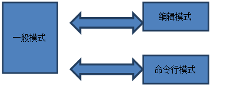
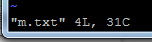

## Linux

#### 1 文件目录结构

[Unix目录结构的来历- 阮一峰的网络日志](http://www.ruanyifeng.com/blog/2012/02/a_history_of_unix_directory_structure.html)

最早的Unix系统使用了一种叫做RK05的储存盘，一盘的容量大约是1.5MB，没过多久，操作系统（根目录）变得越来越大，一块盘已经装不下了。于是，他们加上了第二盘RK05，并且**规定第一块盘专门放系统程序，第二块盘专门放用户自己的程序**，因此挂载的目录点取名为/usr。也就是说，根目录"/"挂载在第一块盘，"/usr"目录挂载在第二块盘。除此之外，两块盘的目录结构完全相同，第一块盘的目录（/bin, /sbin, /lib, /tmp...）都在/usr目录下重新出现一次。

后来，第二块盘也满了，他们只好又加了**第三盘**RK05，挂载的目录点取名为/home，并且规定**/usr用于存放用户的程序**，**/home用于存放用户的数据**。

总结，根目录存放系统程序，/usr和/home服务于用户，分别存放用户的程序和数据。

usr:Unix Software Resource

| 目录  | 内容                                               | 举例               |
| ----- | -------------------------------------------------- | ------------------ |
| /bin  | 供**所有用户使用**的完成**基本维护任务的命令**     | ls, cp             |
| /etc  | 系统和应用软件的**配置文件**                       | bashrc, passwd     |
| /home | 普通用户的家目录                                   | /home/msh          |
| /lib  | 系统最基本的共享**链接库和内核模块**               | libc-2.17.so       |
| /root | root用户的家目录                                   | .bashrc, .ssh      |
| /sbin | 超级用户使用的**可执行文件**，里面多是系统管理命令 | ifconfig, iptables |
| /tmp  | 存储临时文件                                       |                    |

`/usr`目录的目录结构与根目录相似，但根目录中的文件多是系统级的文件，而`/usr`目录中是用户级的文件，一般与具体的系统无关。

CentOS 7.2中，`/bin`等所谓“系统级目录”都被软链到了`/usr/bin`等所谓“用户级目录”。其他发行版如Debian可能差别更大。

一般建议将_所有用户共享的软件安装到`/usr/local`目录_（结构与`/usr`目录相似）下，*将用户私有的软件安装到用户自己的家目录*。

[比起 Windows，怎样解读 Linux 的文件系统与目录结构？](https://www.infoq.cn/article/how-to-read-linux-file-system-and-directory-structure)


#### 2 用户管理和权限

[root@zhtHost ~]#:root表示当前用户账号，zhtHost表示主机名，~表示当前所在目录，#是提示符。

~代表用户的主文件夹，root用户的主文件夹在/root，使用~表示/root。user用户的的主文件夹在/home/user,所以当使用user账号登录时，~就表示/home/user。

至于提示符，root用户的提示符是#，一般身份用户的提示符是$。exit退出账号。

**bash**：登录后的命令行操作是在Linux中的bash中进行的，bash是一个命令行终端软件，是Linux下默认的shell。shell的中文是“外壳”，里面是操作系统内核，用户无法直接接触操作系统，必须通过最外层的shell来和系统内核通信。shell的功能是提供给用户一个操作系统的借口，可以调用其他软件，如man，chown，vi,这些独立的应用程序。因此，只要能够操作应用程序的接口都能成为shell。

**权限管理**：Linux中使用用户组和多用户来进行文件的权限管理。一个系统上可以有多个**用户组**，一个用户组中可以有多个**用户**，用户组的作用是在同一用户组的用户们可以共同享有一些文件，其他用户组的成员无法访问。同一用户组的每个用户也可以拥有自己的私有文件，同一组内的其他用户无法访问。任何一个文件都有**“user group other”**3种身份的权限限制。


如上图所示，每个文件说明从左到右依次是：

文件权限——连接——所属用户——所属用户组——文件大小，单位：B——创建或者最后修改日期——文件名（前面带.的表示隐藏文件）。

其中表示文件权限的有10个字母，第一个字母代表文件类型，后面9个分为3组rwx，依次代表user group other的访问权限（所有者、同用户组、非本用户组）。

第一个字母：d：表示文件夹，—：表示文件，l：表示连接文件。b：可供存储接口设备，c：串行接口设备，如键盘、鼠标（一次性读取）。

后面的3组为rwx的组合，r表示可读，read；w可读write，x可以执行。

对文件夹来说，**不具备x执行权限就表示无法进入该文件夹**。

`drwxr-xr-x`dev是一个文件夹，属于root用户组中的root用户，root用户对其可读可写可执行，root组的其他用户对其可读可执行，非root组的用户对其可读可执行。

**Linux 用户的管理**：

su zht：切换到zht用户。

sudo:以root身份执行命令，后面需要输入密码

su为switch user，即切换用户的简写

su - USERNAME切换用户后，同时切换到新用户的工作环境中

su USERNAME切换用户后，不改变原用户的工作目录，及其他环境变量目录

sudo COMMAND 即意为sudo以root用户执行

默认情况下，系统只有root用户可以执行sudo命令。需要root用户通过使用visudo命令编辑sudo的配置文件/etc/sudoers，才可以授权其他普通用户执行sudo命令。

sudo的配置文件为：/etc/sudoers。

sudoers文件中允许指定用户在不需要知道root用户的登陆密码的情况下，可以以root用户身份运行各种命令。此文件必须使用visudo命令编辑配置。


groups:查看当前用户所在的用户组。

使用cat  /etc/group 可以查看本系统上所有的用户组合用户信息。


上面每一行的信息表示的分别是：用户组——用户组口令（密码）——GID——用户组用户列表。

groupadd zhts:添加zhts用户组

groupdel zhts:删除zhts用户组

adduser zht:添加zht用户，会自动生成一个zht用户组，且zht的用户主目录在/home/zht 下。如果之间加 –G groupname 就表示将该用户添加到groupname 用户组去。

passwd zht:给zht用户添加密码，这个一定要添加。


#### 3 常用命令

**tab**：按一下，在命令行第一个命令后表示补全命令，第二个命令后，补全文件。在第一个命令未完成时，按2下，则会显示所有已当前输出内容为开头的命令，即提示所有命令。

**ctrl+c**:停止执行当前命令。即终止命令的执行。**强制**终止当前进程

**ctrl+ｚ**:强制当前进程转换为后台，并在**后台挂起**（暂停）。

**ctrl+d**:代表EOF（end of file），等同exit。退出

**clear**:清屏

**man**:帮助命令，如：man ls 输出ls的指令说明，空格翻页，q退出。pgup/pgdn也可以上下翻页。end尾页/home首页。/string（或者?string） 匹配查找string字符，n继续向下查找（next），N继续向上查找。

**pwd**：查看当前路径

**ls**:list 列出目录清单，ls 参数 目录，按照相应的设置参数列出文件目录。如：

**ls** –al  / 列出根目录下的所有文件，包括隐藏的文件，其中 –al 可以省略，没有/ 则表示列出当前路径下的文件目录。

**ll**:ls -l的缩写

**cd**:切换当前路径，cd .. 回到上一级目录，cd / 回到系统根目录，cd path 切换到path目录，cd ~ 切换到当前用户主目录，cd – 返回到此目录之前所在目录。

**mkdir**:新建一个目录

**rmdir**:删除一个空目录，目录下有文件不能删除。

**rm**:删除文件，如果删除带有文件的文件夹，需要-r 参数，递归删除。-f 强制删除，不会出现警告，-i 删除前询问是否要删除。

**mv**：移动文件 mv 源文件  目标文件，也可以更改文件名,mv dir1 dir2修改文件夹名。

**cp**:文件复制，cp 源文件 目标文件

**cat**:查看文档命令 。

**less**：查看文档命令，可以上下翻页。


**chmod**:改变文件权限，如chmod 775 t.txt 将t.txt文件权限修改为所有者同一用户组可读可写可执行，其他用户组可读可执行。快捷的权限修改：

chmod +x t.txt, 为文件添加执行权限。 -x ，去除执行权限。


**wget**:下载文件命令，后接http地址可以下载文件到当前目录下。

PATH:当前用户路径临时设定可以使用`echo $PATH` 来查看，添加PATH路径

`PATH=” $PATH”:/home/zht/temp` 

或者 

`export PATH=$PATH:/home/zht/tmp`

上面的方法只能临时更改path，重启后更改失效。

查看设定的JAE_HOME 使用指令：echo $JRE_HOME

**which**:查看命令所在目录 ，或者使用type

#**whereis**  软件名  -->查看软件安装路径
#**which**  软件名     -->软件软件的运行路径

**find**:查找指令。find 指定目录  指定名字

如：`find  /  -name  “java*”`  ：最后一个参数不加“”也可以

**touch**：命令不常用，一般在使用make的时候可能会用到，用来修改文件时间戳，或者新建一个不存在的文件。

实例一：创建不存在的文件命令：touch log2012.log log2013.log

实例二：更新log.log的时间和log2012.log时间戳相同

实例三：设定文件的时间戳命令：touch -t 201211142234.50 log.log

**export** 设置或者显示 环境变量

**grep**是Linux命令行下常用于查找过滤文本文件内容的命令。最简单的用法是： 

grep apple fruitlist.txt 

grep**会返回“fruitlist.txt”中所有包含“apple”的文本行**。要注意的是，grep不会返回匹配“Apple”（A字母大写）的文本行，因为grep默认情况下是大小写敏感的。

如果想忽略大小写，可以用-i参数： 

grep -i apple fruitlist.txt 

如果想搜索目录里所有文件，包括子目录的话，并且在结果中显示行号，可以用以下命令： 

grep -nr apple * 

grep的语法支持正则表达式，正则表达式有些复杂，以后再讲解。

·      -i, --ignore-case: 忽略大小写

·      -n, --line-number: 显示行号

·      -R, -r, --recursive: 递归搜索子目录

·      -v, --invert-match: 输出**没有匹配**的行

我们可以通过管道操作来让grep变得更强大，**管道操作就是把前面一条命令的输出作为后面一条命令的输入**，从而把很多简单的命令组合起来完成复杂的功能。例如，如果我们想查找包含apple的行，但又想过滤掉pineapple，可以用下面的命令： 

grep apple fruitlist.txt | grep -v pineapple 

如果我们想把搜索结果保存起来，那么可以把命令的标准输出重定向到文件： 

grep apple fruitlist.txt | grep -v pineapple > apples.txt 

**重定向符号>**和**管道操作符号|**的区别是，重定向后面接的是一个文件，它后面不能再接任何文件或命令了；而管道操作后面接的是命令，可以无限地接下 去。如果想以**追加方式**写到文件，可以用**>>**。管道操作是Linux命令行的一种哲学，它是计算机技术中少有的能沿用几十年的技术之一。通过管 道操作，一行命令可以完成Windows下上千行程序也不能完成的文本处理功能。 

**Linux tee命令**

在执行Linux命令时，我们可以把输出重定向到文件中，比如 ls >a.txt，这时我们就不能看到输出了，如果我们既想把输出保存到文件中，又想在屏幕上看到输出内容，就可以使用tee命令了。tee命令读取标准输入，把这些内容同时输出到标准输出和（多个）文件中.

tee file: 输出到标准输出的同时，保存到文件file中。如果文件不存在，则创建；如果已经存在，则覆盖之。

tee -a file: 输出到标准输出的同时，追加到文件file中。如果文件不存在，则创建；如果已经存在，就在末尾追加内容，而不是覆盖。


**压缩命令**

在Linux中采用gzip和bzig2作为压缩命令，其中bzip2使用的压缩算法相比gzip更加先进，采用gzip命令压缩的文件以.gz为后缀名，采用bzip2压缩的文件以.bz2为文件后缀名。其使用方法是：gzip 参数 待压缩文件名 -v参数常用来显示压缩工程中的压缩比。

压缩：`gzip -v m.java`

解压： `gzip -dv m.java.gz`

bzip2的使用方式和gzip是一样的。

由于gzip和bzip2命令只能针对单一文件进行压缩或解压，所以不能同时对多个文件或文件夹进行压缩，这时就需要使用打包命令tar来进行辅助，tar是将多个文件打包成一个文件的命令，同时在打包的过程中也可以使用压缩算法。如果只是打包不 压缩，则文件后缀名为.tar，如果打包后采用gzip命令压缩，则后缀名为.tar.gz，如果采用bzip2命令压缩，则后缀名为.tar.bz2。

1. 只打包：`tar -cv -f j.jar *.java`

   -c:新建打包文件

   -v:将正在处理的文件名显示出来。

   -f:后面接待处理的文件名，如是打包操作就是打包后生产的新文件名，如果是压缩操作 -f后接的就是压缩后生产的新文件名，如果是解压操作，后面接的是待解压的文件名。很多地方喜欢将-f和前面的参数写在一起，不过还是建议单独写出来。

   最后 *.java表示将所有以.java结尾的文件打包成一个j.tar文件。

2. 

2. 解打包： tar -xv -f j.tar -C ./tmp/

   -x：解打包或者解压缩功能

   -C：待解打包的目录

    -t:查看打包的文件内容，主要用来查看文件名。

   注意，在tar命令，-c -x -t每次只能出现其中的一个。

-j：表示采用bzip2命令对打包的文件进行压缩。
-z：表示采用gzip命令对打包的文件进行压缩。

使用-xzv  -f参数后为待解压缩文件名。最后面-C接解压后的文件存放目录，如果没有-C参数，则默认解压到当前文件夹。另外同-x -v -t同级别的参数还有-r：向压缩文件中追加文件， -u更新压缩包中的指定文件：

使用**pscp** 远程给主机传输文件

pscp  [options]   source    user@ host:target 

`pscp  -pw zht111111 C:\a.txt   root@104.11.22.33:/tmp` 类似于push动作

从linux获取文件，只需要将目标和源反过来即可

`pscp  -pw zht111111  root@104.11.22.33:/tmp  C:\a.txt`  

-p 拷贝文件的时候保留源文件建立的时间。
 -q 执行文件拷贝时，不显示任何提示消息。
 -r 拷贝整个目录
 -v 拷贝文件时，显示提示信息。

-pw passwd 指定登录时所用的口令为 passwd

**ps**命令  常用 `ps -ef`

-e 显示所有进程,环境变量
-f 全格式

a：与终端相关的进程；

x：与终端无关的进程；

u：显示用户

aux：常用组合选项；

**kill** -9 PID ，杀死该PID进程。（-9 表示强制终止。）

**jobs**查看当前作业，

**bg** 1 或者bg %1均可以将对应id为1进程调回前台。

**网络通信命令：**

- 查看当前系统的网卡信息：ifconfig
- 查看与某台机器的连接情况：ping
- 查看当前系统的端口使用：netstat -an

假如我们装了一个zookeeper，我们每次开机到要求其**自动启动**该怎么办？

1. 新建一个脚本zookeeper
2. 为新建的脚本zookeeper添加可执行权限，命令是:`chmod +x zookeeper`
3. 把zookeeper这个脚本添加到开机启动项里面，命令是：` chkconfig --add zookeeper`
4. 如果想看看是否添加成功，命令是：`chkconfig --list`


#### 4 shell 脚本

Linux的shell脚本相当于Windows下的.bat批处理文件，并且比批处理更加强大，可以进行变量赋值，流程控制。

第一行：“#!”是一个约定的标记，它告诉系统这个脚本需要什么解释器来执行。/bin/sh默认链接到bin目录下的bash。#后面接的是注释。 

注意：如果 a="hello world" 在等号两边加空格的话，就好报错`command not found`

```shell
vim hello.sh

#!/bin/sh
a="hello world"
echo "a is:"
echo $a

#运行
chmod u+x hello.sh
./hello.sh

```

echo命令用来打印信息，是一个最常用的命令。

-n 打印信息之后不换行。

-e 对字符串转义。

扩展名为sh（sh代表shell），扩展名并不影响脚本执行，见名知意就好，如果你用php写shell 脚本，扩展名就用php好了。

`/bin/sh hello.sh`

这种方式运行的脚本，不需要在第一行指定解释器信息，写了也没用。

有时候变量名很容易与其他文字混淆，比如：

```sh
num=2

echo "this is the $numnd"
```

这并不会打印出"this is the 2nd"，而仅仅打印"this is the "，因为shell会去搜索变量numnd的值，但是这个变量时没有值的。可以使用花括号来告诉shell我们要打印的是num变量：

num=2

`echo "this is the ${num}nd"`

这将打印： this is the 2nd

由export关键字处理过的变量叫做环境变量。


条件表达式：

**if**  条件表达式   **then** 处理语句

**else** 处理语句

**fi**


使用脚本切换当前路径：

在linux环境下，常有通过shell脚本进入指定目录的操作，例如有一段脚本chdir.sh：     

```sh
#!/bin/sh  

cd /home/user/Downloads  

pwd  
```

在shell环境下通过./chdir.sh执行这段脚本是无法进入Downloads目录的

这是因为shell在执行脚本时，会创建一个子shell，并在子shell中逐个执行脚本中的指令； 而子shell中从父shell中继承了环境变量，但是执行后不会改变父shell的环境变量；


如果想要代码中切换目录的操作生效，只需要通过 source 命令执行即可：

`source  ./chdir.sh`   

​      source 命令是在当前的shell环境下执行脚本 ，不会创建子shell;  

​      每次都要输入source是一件烦琐的事情，其实source命令又叫点命令，在需要用到source的情况下，直接换成'.'即可： 

`.  ./chdir.sh`  


**cat**命令的用途是连接文件或标准输入并打印。这个命令常用来显示文件内容，或者将几个文件连接起来显示，或者从标准输入读取内容并显示，它常与重定向符号配合使用。

cat主要有三大功能：

1.一次显示整个文件:cat filename

2.从键盘创建一个文件:cat > filename 只能创建新文件,不能编辑已有文件.

3.将几个文件合并为一个文件:cat file1 file2 > file


**数据流重定向**

那么什么时数据流重定向呢？从字面上理解就是改变数据流的流向，使之流向指定的文件或设备。

例如，把执行命令所回传的正确信息（标准输出信息）流向一个文 件，而将所回传的错误信息（标准错误输出）流向别一个文件，并把这两个文件的信息保存下来，而在屏幕上不出现任何该命令执行所回传的信息。
格式：
command-line  [1~n] > file： file为或文件操作符或设备
上面命令意思是：将一条命令执行结果（标准输出，或者错误输出，本来都要打印到屏幕上面的）  重定向其它输出设备（文件，打开文件操作符，或打印机等等）1,2分别是标准输出，错误输出。

1.将标准输出重定义，>前面的1代表标准输出，是可以省略的，省略后默认为1。

2.将错误输出重定义

1、 shell遇到”>”操作符，会判断右边文件是否存在，如果存在就先删除，并且创建新文件。不存在直接创建。 无论左边命令执行是否成功。右边文件都会变为空。“>>”操作符，数据追加到该文件的末尾。先判断右边文件，如果不存在，先创建。以添加方式打开文件，会分配一个文件描述符[不特别指定，默认为1,2]然后，与左边的标准输出（1）或错误输出（2） 绑定。

当命令：执行完，绑定文件的描述符也自动失效。0,1,2又会空闲。


**test**的用法：
test 命令最短的定义可能是评估一个表达式；如果条件为真，则返回一个 0 值。如果表达式不为真，则返回一个大于 0 的值 — 也可以将其称为假值。检查最后所执行命令的状态的最简便方法是使用 $? 值。

1. 关于某个文件名的『类型』侦测(存在与否)，如 test -e filename  
    -e 该『文件名』是否存在？(常用)  
    -f 该『文件名』是否为文件(file)？(常用)  
    -d 该『文件名』是否为目录(directory)？(常用)  


#### 5 Vim学习笔记

Vi是一个简单的文档编辑器，vim是vi的高级版，可以使用颜色高亮显示程序源文件，可以认为是程序编辑器。

vi m.txt 打开m.txt文档，如果当前目录下有这个文件则打开该文件，如果没有这个文件就会新建一个文件。

观察窗口最后一行，这个是**状态栏**，不属于文档的编辑区，显示内容表示m.txt是一个新建的文件。此时，vim编辑区处于一般模式，**按i进入编辑**模式**，左下角显示，表示进入编辑模式。编辑文本后，按Esc退回到一般模式，**输入：**，即Ctrl+； 进入命**令行模式**，然后键入wq保存文档并退出(write quit)。在一般模式下按ＺＺ也可保存文件退出。

 可以看到，vim一共有3种模式，其中打开文档时，处于一般模式，此时不能编辑文档，但可以在文档中移动光标，并对文档进行**删除字符（x）**、**删除整行（dd）**，复制和粘贴操作。按下i后进入编辑模式，此时可以对文档进行任何编辑、删除、复制粘贴操作。命令行模式就是执行一些保存和退出指令的命令。这3种模式中命令行模式和编辑模式之间无法相互切换，只能如下切换。  

|      |                                  |
| ---- | -------------------------------- |
|      |  |


再次vi m.txt,表面此时文档有4行，31个字符。

尽量使用h j k l这几个字母来移动光标。


下面是一些命令，可以让你在 *Normal* 模式下幸存下来：

> - `i` → *Insert* 模式，按 `ESC` 回到 *Normal* 模式.
> - `x` → 删当前光标所在的一个字符。
> - `:wq` → 存盘 + 退出 (`:w` 存盘, `:q` 退出)   （陈皓注：:w 后可以跟文件名）
> - `dd` → 删除当前行，并把删除的行存到剪贴板里
> - `p` → 粘贴剪贴板
>
> **推荐**:
>
> - `hjkl` (强例推荐使用其移动光标，但不必需) →你也可以使用光标键 (←↓↑→). 注: `j` 就像下箭头。
> - `:help <command>` → 显示相关命令的帮助。你也可以就输入 `:help` 而不跟命令。（陈皓注：退出帮助需要输入:q）

**感觉良好**

上面的那些命令只能让你存活下来，现在是时候学习一些更多的命令了，下面是我的建议：（陈皓注：所有的命令都需要在Normal模式下使用，如果你不知道现在在什么样的模式，你就狂按几次ESC键）

1. 各种插入模式

   > - `a` → 在光标后插入
   > - `o` → 在当前行后插入一个新行
   > - `O` → 在当前行前插入一个新行
   > - `cw` → 替换从光标所在位置后到一个单词结尾的字符

2. 简单的移动光标

   > - `0` → 数字零，到行头
   > - `^` → 到本行第一个不是blank字符的位置（所谓blank字符就是空格，tab，换行，回车等）
   > - `$` → 到本行行尾
   > - `g_` → 到本行最后一个不是blank字符的位置。
   > - `/pattern` → 搜索 `pattern` 的字符串（陈皓注：如果搜索出多个匹配，可按n键到下一个）

3. 拷贝/粘贴

   （陈皓注：p/P都可以，p是表示在当前位置之后，P表示在当前位置之前）

   > - `P` → 粘贴
   > - `yy` → 拷贝当前行当行于 `ddP`

4. Undo/Redo

   > - `u` → undo
   > - `<C-r>` → redo

5. 打开/保存/退出/改变文件

   (Buffer)

   > - `:e <path/to/file>` → 打开一个文件
   > - `:w` → 存盘
   > - `:saveas <path/to/file>` → 另存为 `<path/to/file>`
   > - `:x`， `ZZ` 或 `:wq` → 保存并退出 (`:x` 表示仅在需要时保存，ZZ不需要输入冒号并回车)
   > - `:q!` → 退出不保存 `:qa!` 强行退出所有的正在编辑的文件，就算别的文件有更改。
   > - `:bn` 和 `:bp` → 你可以同时打开很多文件，使用这两个命令来切换下一个或上一个文件。（陈皓注：我喜欢使用:n到下一个文件）

花点时间熟悉一下上面的命令，一旦你掌握他们了，你就几乎可以干其它编辑器都能干的事了。但是到现在为止，你还是觉得使用vim还是有点笨拙，不过没关系，你可以进阶到第三级了。

参考：<https://coolshell.cn/articles/5426.html>


nx：n是数字，即删除光标后的n个字符

yy:复制光标所在行，y0复制光标到所在行行首的所有字符，y$复制到行尾。

u:撤销上一次操作。

ctrl+r：重复上一次操作。

ctrl+u/d：翻半页 f/b全页

i:i插入到光标前，I插入到本行第一个非空字符前。

a：插入到光标后，A插入到本行最后一个非空字符后。

o：在光标所在行后另起一行插入，O前一行。

/patten: 查找文本中的patten字符，n/N为将光标移到下一处或者上一处。 

本行移动光标：

0：本行第一个字符

^:第一个非空字符处

$:本行最后一个字符处

g_：本行最后一个非空字符处

f m：快速定位到本行的m字符位置，f是命令，m是参数。类似F t T。

 

以变量为参考移动：

e：移动到光标所在变量的最后一个字符。E变量以空白字符为间隔划分。

w：移动到下一个变量的起始字符处，W以空白字符为间隔划分变量。

 

变量匹配移动：

%：匹配括号移动，包括 `(`, `{`, `[`. （陈皓注：你需要把光标先移到括号上）#/*：移动到当前光标所在单词的.

`*` 和 `#`:  匹配光标当前所在的单词，移动光标到下一个（或上一个）匹配单词（*是下一个，#是上一个）

 

以行为单位移动光标：

N enter：向下移动N行

NG：移动到第N行

gg:移动到第一行

G:移动到最后一行

 

常用命令：以下N表示任意数字

x：删除当前字符，X删除前一个字符

y：复制，不能单独使用，配合yy复制本行，y0,复制光标所在处至本行第一个字符，y$复制当前位置至最后一个字符。

p:从光标后开始粘贴，P从光标前开始粘贴。

dd：删除一行，d0 d$,同y

u: undo 撤销操作

v:选择操作，进入选择模式。V选中当前行。N v 选中N行。

. :重复上一次操作。

J：将光标所在行与下一行数据合并成一行。

h j k l ：4个方向移动光标，Nj，向上移动N行

使用的命令行均可以N command，执行Ｎ此操作。

有些操作需要最后按　Esc，如连续10次输入lucky：10ilucky Esc

 

#### 6 linux下软件的安装与卸载

使用yum安装jdk:

1.执行命令`yum -y list java*`查看可安装java版本。

2.yum install -y java-1.8.0-openjdk-devel.x86_64


我的总结：

大多数Linux应用软件包的命名也有一定的规律，它遵循：名称-版本-修正版-类型

例如：1）software-1.2.3-1.tar.gz 意味着：软件名称：software ，版本号：1.2.3

修正版本：1 ，类型：tar.gz，说明是一个tar包。

常见的安装软件是以 *.rmp或者*.tar.gz为名的已经编译好的二进制软件包，对于*.rmp文件可以使用rpm命令安装，对于已经编译好的二进制形式的 *.tar.gz软件包，可以直接解压使用，相当于Windows中的绿色软件。

rpm RPM(RedHat PackgeManager)是RedHat公司出的软件包管理器，使用它可以很容易地对rpm形式的软件包进行安装、升级、卸载、验证、查询等操作，安装简单，而卸载时也可以将软件安装在多处目录中的文件删除干净。

Yum（ Yellow dog Updater, Modified）是一个在Fedora和RedHat以及SUSE中的Shell前端**软件包管理器**。基于RPM包管理，能够从指定的服务器自动下载RPM包并且安装，可以自动处理依赖性关系，并且一次安装所有依赖的软体包，无须繁琐地一次次下载、安装。 

在系统中添加删除软件是常事，yum同样可以胜任这一任务，只要软件是rpm安装的。安装的命令是，yum install xxx，yum会查询数据库，有无这一软件包，如果有，则检查其依赖冲突关系，如果没有依赖冲突，那么最好，下载安装;如果有，则会给出提示，询问是否要同时安装依赖，或删除冲突的包，你可以自己作出判断。删除的命令是，yum remove xxx，同安装一样，yum也会查询数据库，给出解决依赖关系的提示。

用YUM安装软件包

　　命令：yum install xxx

用YUM删除软件包

　　命令：yum remove xxx

我们常会碰到这样的情况，想要安装一个软件，只知道它和某方面有关，但又不能确切知道它的名字。这时yum的查询功能就起作用了。你可以用 yum  search keyword这样的命令来进行搜索

使用YUM查找软件包

　　命令：yum search

　　列出所有可安装的软件包

　　命令：yum list 

　　列出所有可更新的软件包

　　命令：yum list updates

　	列出所有已安装的软件包

　	命令：yum list installed

列出所指定的软件包

　命令：yum list | grep keywords

 `wget 下载地址`：将文件下载到当前目录。


#### mysql安装

yum**安装**

```sh
#check hostname
hostname

#Install MySQL and tell it which runlevels to start on
sudo yum install mysql-server
sudo /sbin/chkconfig --levels 235 mysqld on

#Then to start the MySQL server ,MySQL will bind to localhost (127.0.0.1) by default
sudo service mysqld start

#You will be given the choice to change the MySQL root password,etc
sudo mysql_secure_installation
Set root password? [Y/n] Y
Remove anonymous users? [Y/n] Y
Disallow root login remotely? [Y/n] Y
Remove test database and access to it? [Y/n] Y
Reload privilege tables now? [Y/n] Y

#login
mysql -u root -p

#The following steps will describe creating a new database named appdb and granting the appuser full access to the new database. Adjust the hostname from which the user will be connecting and password as necessary.
mysql> CREATE DATABASE appdb;
mysql> GRANT ALL ON appdb.* TO 'appuser'@'localhost' IDENTIFIED BY 'password';
mysql> QUIT;

# localhost是远程连接的主机IP，运行任意主机的话使用 % ，特定IP地址的话就限定IP地址了 
GRANT ALL ON zhtdb.* TO 'zht'@'%' IDENTIFIED BY 'zht';
```


**下面的安装方法验证失败**

先检查是否已经安装过了，如果安装过了就要删除掉，可以使用`yum list installed`来看有没有`yum`安装过`MySQL`，如果是不是`yum`安装，那可以按照文件名全局`find`搜索试试。

注意，`mariadb`（MySQL的纯开源版）也不能有，要删除；

例如，阿里云上新建的CentOS7.0默认就有

使用`yum remove mariadb-libs.x86_64`删除之。

有可能还遗留有配置文件等也删除了，比如`/etc/my.cnf`或者`/etc/mysql`等


接下来，因为MySQL依赖`libaio`库，所以这个也必须有，也是跟1一样看装过没，如果没有就`yum install libaio`安装。

创建一个专门管理数据库的Linux用户组和一个用户：

```
# 创建组，名字叫mysql吧

[root@i123321Z local]# groupadd mysql 

# 创建用户，名叫mysql,这个用户没有自己的目录，登录后不能执行shell命令。useradd 是添加用户到/etc/passwd中；-r是系统账号；-g 指定组；-s /bin/false 指定登录后使用的shell为这个（通常是/bin/bash），所以不能执行shell命令；

[root@i123321Z local]# useradd -r -g mysql -s /bin/false mysql
```

使用wget下载二进制包

```
wget http://dev.mysql.com/get/Downloads/MySQL-5.6/mysql-5.6.32-linux-glibc2.5-x86_64.tar.gz
```

解压：首先将`tar`包解压在`/apps`下，然后将那么长的文件名替换为`mysql`

```
[root@i123321Z local]# tar -zxf mysql-5.6.32-linux-glibc2.5-x86_64.tar.gz -C /apps
[root@i123321Z local]# cd /apps
[root@i123321Z apps]# mv mysql-5.6.32-linux-glibc2.5-x86_64 mysql 
```

配置文件

去`/apps/mysql/support-files/my-default.cnf`拷贝一份放在系统需要的目录并重命名，我这里是`/etc/my.cnf`，修改如下选项：

```
[mysqld]
 #安装目录
 basedir = /apps/mysql
 #数据目录：这里看大家自己的需要了
 datadir = /data/mysql

 # 下面是一些可选项

 # 支持emoji,server编码为utf8mb4
 # 这里设置之后，新建database、table也会将其作为默认
 character_set_server = utf8mb4

 # result set和error message返回给客户端时编码
 # character_set_results = utf8mb4

 # character_set_database和collation_database不要设置，创建database时手动指定最好
 # character_set_database=
 # collation_database=
```

安装

```
[root@i123321Z apps]# cd mysql

##因为想要让用户mysql来安装MySQL，所以改变mysql目录的所有者、所属组
[root@i123321Z mysql]# chown -R mysql .
[root@i123321Z mysql]# chgrp -R mysql .

##安装强调内容：必须在scripts上层目录安装！！！（如果有报错，看博客最下边TIPS）
[root@i123321Z mysql]# scripts/mysql_install_db --user=mysql

##安装完后，再让当前目录(.即mysql目录)属于root，然后只让数据目录属于用户mysql
[root@i123321Z mysql]# chown -R root .
[root@i123321Z mysql]# chown -R mysql /data/mysql
```

启动

```
#不要使用mysqld而使用mysqld_safe来启动（启动报错，看博客最后的TIPS）

[root@i123321Z mysql]# bin/mysqld_safe --user=mysql &

./support-files/mysql.server start
```

重要可选项

```
#1. 随机启动：：：将mysql的启动shell文件放在OS启动目录，并加入chkconfig配置启动(脚本中默认2345级别)
[root@i123321Z mysql]# cp support-files/mysql.server /etc/init.d/mysql.server
[root@i123321Z mysql]# chkconfig --add mysql.server


#2. 设置root用户的密码
[root@i123321Z mysql]# bin/mysqladmin -u root password 'root'


#3. 将`mysql可执行文件`做一份软链接放入/usr/bin/，以使我们可以在任意位置使用mysql来连接mysql服务器
ln -s /apps/mysql/bin/mysql /usr/bin/mysql


#另外，如果在生产环境安装MySQL，可以使用mysql_secure_installation来安装，可以让你使用很多初始化参数、不创建测试database等
[root@i123321Z mysql]# bin/mysql_secure_installation
```

